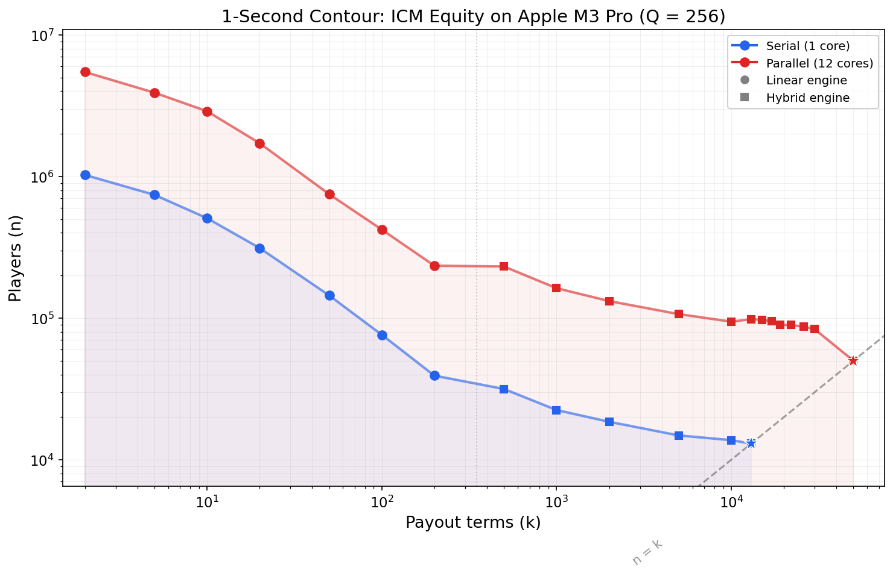
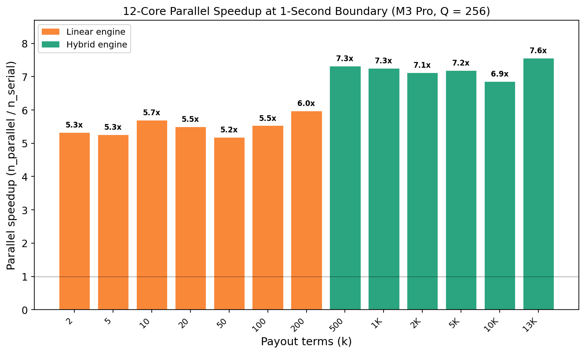
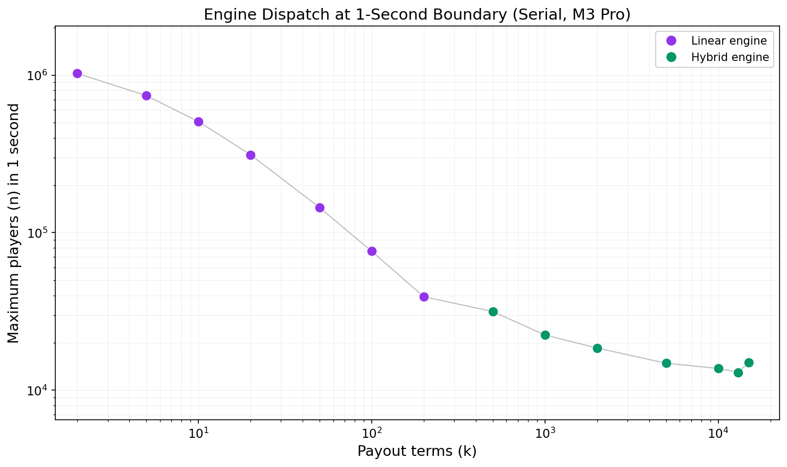
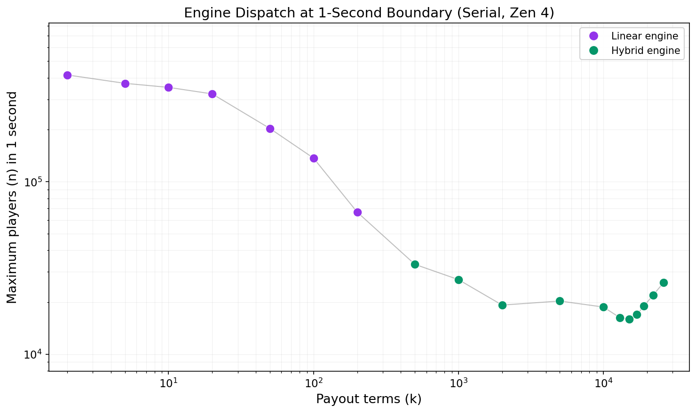
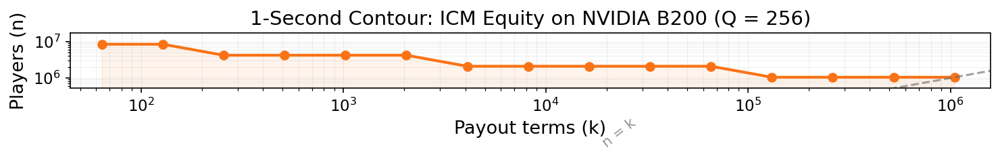

[](https://github.com/Sarose550/ICM/actions/workflows/ci.yml)
[](LICENSE)

# ICM -- Independent Chip Model Equity Computation

High-performance C library for computing tournament placement equities using generating-function quadrature. Computes exact ICM equities for poker tournaments with up to ~17,216 players / payouts in 1 second*.

## What is ICM?

The Independent Chip Model (ICM) is a tournament equity model that converts
chip stacks into real-money expected payouts by accounting for the payout
structure. In a poker tournament, chips do not have a fixed dollar value
- your last chip is worth far less than your first - and ICM computes each
player's fair expected share of the prize pool. For a general introduction,
see the [ICM Wikipedia page](https://en.wikipedia.org/wiki/Independent_Chip_Model).

## Quick Start

```bash
# Build (requires FFTW3)
make

# Verify correctness
./bench_grid verify

# Full benchmark grid
./bench_grid
```

## API

```c
#include "icm.h"

// Initialize (call once -- loads FFTW wisdom, builds lookup tables)
icm_init("fftw_wisdom.dat");

// Compute equities for all n players
//   S[n]       -- chip stacks
//   Q          -- quadrature points (typically 256)
//   payout[k]  -- payout coefficients
//   equity[n]  -- output (caller-allocated)
double ns = icm_equity(n, S, Q, payout, k, equity);

// Compute equities for a subset of players
double ns = icm_equity_subset(n, S, Q, payout, k, equity, targets, n_targets);
```

Returns wall-clock time in nanoseconds. All correctness tests pass at < 5e-12 relative error.

**Python bindings.** `python/` provides a ctypes wrapper (`icm.equity(stacks, payouts)`)
that calls straight into the same compiled shared library the C API uses.
See [python/README.md](python/README.md) for setup (`make libicm`, then
`import icm`).

## How It Works

**1. The problem.** A tournament has $n$ players with chip stacks
$S_1, \ldots, S_n$ and a payout vector $\boldsymbol{\pi} = (\pi_0, \pi_1, \ldots, \pi_{k-1})$
where $k \leq n$ positions receive nonzero prizes ($\pi_0$ is the prize for 1st
place). ICM computes each player's expected payout - the sum over finishing
positions of the prize for that position times the probability the player
finishes there. The naive answer enumerates
all $n!$ elimination orderings, weights each by its probability under the
Malmuth–Harville model (Harville, 1973; Malmuth, 2001), and sums the
resulting payouts.

**2. Why naive enumeration is dead almost immediately.** $n!$ grows
catastrophically fast: $15! \approx 1.3 \times 10^{12}$, $20! \approx 2.4 \times 10^{18}$. As the
HoldemResources.net blog post ["High Accuracy ICM Calculations for Large
Fields"](https://www.holdemresources.net/blog/high-accuracy-mtt-icm/)
notes, "Naive implementations of ICM can handle about 15 players, and even
optimized versions can't calculate exact Malmuth-Harville values beyond
25-30 players." The naive enumeration wall is around $n \approx 15$ - any attempt
to enumerate all orderings for 16+ players runs into years of compute time.

**3. The industry-standard exact method: bitmask dynamic programming.**
Rather than enumerating orderings, one can track the set of players who
have busted so far. Let $dp_{\text{mask}}$ be the probability that exactly the
players in the set $\text{mask}$ have been eliminated. From each state, for
each surviving player $j$, the transition adds $dp_{\text{mask}} \cdot (S_j / \text{total remaining stack})$
to $dp_{\text{mask} \cup \{j\}}$. There are $2^n$ states and up to
$n$ candidate transitions per state, giving $O(n \cdot 2^n)$ total work - the
per-state cost comes from looping over surviving players, not from the
payout structure. This is the method used by real poker tools; see GTO
Wizard's ["Theoretical Breakthroughs in
ICM"](https://blog.gtowizard.com/theoretical-breakthroughs-in-icm/) post
for a practical discussion and Helmuth Melcher's 2015 TU Wien diploma
thesis ["Evaluation of Equity Models for Tournament
Poker"](https://repositum.tuwien.at/handle/20.500.12708/79991) for the
academic writeup. The practical wall is roughly 25–30 players - at
$n = 30$, $2^{30}$ states already pushes into gigabytes of memory.

**4. How real tools scale past 30 players: Monte Carlo via the "exponential
clock" framing.** The Malmuth–Harville elimination rule ("at each step, the
probability any surviving player busts next is proportional to their
stack") has an equivalent continuous-time formulation. Assign each player
$j$ an independent exponential random variable $T_j$ with rate equal to
their chip stack $S_j$ (an "elimination clock"), and eliminate players in
order of increasing $T_j$. The memoryless property of the exponential
distribution guarantees this recovers exactly the same stack-proportional
elimination rule at every step. Concretely, for any subset of players, the
probability that a particular player $i$ finishes best within that subset
- i.e., has the smallest $T$ - is $S_i$ divided by the subset's total stack.
(Proof: $T_i$ and the minimum of everyone else's $T$'s are independent; the
minimum of independent exponentials is itself exponential with rate equal
to the sum of their rates; and for two independent exponentials with rates
$a, b$, $P(T_a < T_b) = a / (a + b)$.) This gives a simple, unbiased way to
*sample* a full elimination order in one shot - draw $n$ exponentials, sort
- instead of simulating step-by-step. Tysen Streib introduced this
technique in a TwoPlusTwo forum thread, ["New Algorithm: Calculate ICM
Large
Tournaments"](https://forumserver.twoplustwo.com/15/poker-theory-amp-gto/new-algorithm-calculate-icm-large-tournaments-1098489/).
Error shrinks as $O(1/\sqrt{N})$ in the number of sampled tournaments $N$, so
high precision gets expensive. (A refinement uses [Quasi-Monte Carlo
sampling](https://en.wikipedia.org/wiki/Quasi-Monte_Carlo_method) -
deterministic low-discrepancy point sequences instead of independent random
draws, giving closer to $O(1/N)$ convergence for smooth integrands - but
this repo does not build on that approach.)

**5. This repo's approach: make the Monte Carlo estimate exact.** Start
from step 4's construction: $T_1, \ldots, T_n$ independent,
$T_j \sim \text{Exponential}(\text{rate} = S_j)$, and the finishing order is
the order of increasing $T_j$.

Fix player $i$ and condition on $T_i = t$. For each other player $j \neq i$,
independently: $j$ finishes *before* $i$ iff $T_j < t$, which happens with
probability $b_j(t) = 1 - e^{-S_j t}$ (the $\text{Exponential}(S_j)$ CDF at $t$);
$j$ finishes *after* $i$ with probability $a_j(t) = e^{-S_j t}$. Because the
$T_j$ are independent, the probability of any specific pattern of "who
finishes before $i$" is the product of the individual probabilities. Now
build the polynomial

$$Q_i(x; t) = \prod_{j \neq i} \bigl(a_j(t) + b_j(t) \cdot x\bigr).$$

Expanding this product, each factor contributes either $a_j(t)$ (player $j$
finishes after $i$, contributes $x^0$) or $b_j(t) \cdot x$ (player $j$
finishes before $i$, contributes $x^1$). The coefficient of $x^r$ in
$Q_i(x; t)$ is therefore exactly $P(\text{exactly } r \text{ of the other
players finish before } i \mid T_i = t)$ - i.e.
$P(i \text{ finishes in position } r \mid T_i = t)$.

Uncondition: $T_i$ has density $S_i e^{-S_i t}$, so

$$P(i \text{ finishes in position } r) = \int_0^\infty S_i e^{-S_i t} \cdot [x^r] Q_i(x; t) dt$$

where $[x^r] Q$ denotes the coefficient of $x^r$ in $Q$. This is the
integral representation the exponential-clock model promised.

Now change variables: let $v = e^{-t}$. Then $a_j(t) = e^{-S_j t} = v^{S_j}$
and $b_j(t) = 1 - v^{S_j}$, so define

$$a_j(v) = v^{S_j}, \quad b_j(v) = 1 - v^{S_j},$$
$$Q_i(x; v) = \prod_{j \neq i} \bigl(a_j(v) + b_j(v) \cdot x\bigr).$$

For the measure, $dv = -e^{-t} dt = -v dt$, so $dt = -dv/v$, and
$e^{-S_i t} = v^{S_i}$. Substituting and flipping the integration bounds
($t: 0 \to \infty$ becomes $v: 1 \to 0$, and the minus sign from $dt = -dv/v$
cancels the bound flip):

$$P(i \text{ finishes in position } r) = \int_0^1 S_i  v^{S_i - 1} \cdot [x^r] Q_i(x; v) dv.$$

The coefficient of $x^r$ in $Q_i(x; v)$ captures exactly the combinatorial
term that Monte Carlo would otherwise have to sample - the sum over all
subsets of $r$ other players of the product of their elimination
probabilities times the remaining players' survival probabilities.

Finally, player $i$'s equity is the sum over positions:
$\text{Equity}_ i = \sum_r \pi_r \cdot P(i \text{ finishes in position } r)$.
Pulling the finite sum inside the integral and recognizing
$\sum_r \pi_r \cdot [x^r] Q_i(x; v) = \langle \boldsymbol{\pi}, Q_i(x; v) \rangle$
(the dot product used in the subproduct-tree section below):

$$\text{Equity}_ i = \int_0^1 S_i v^{S_i - 1} \langle \boldsymbol{\pi}, Q_i(x; v) \rangle dv.$$

So instead of drawing $N$ random samples of the exponential race and
averaging, this repo evaluates the exact 1-D integral over $v$ via
quadrature (after a change of variables $v = \Phi(y)$ using the standard
normal CDF to make the integrand decay rapidly). With $Q = 256$
Gauss-Legendre nodes, this yields deterministic double-precision accuracy
(relative error $< 5 \times 10^{-12}$; see Accuracy section below).

The remaining computational challenge is evaluating, for *every* player $i$
simultaneously, the coefficients of $Q_i(x; v)$ - the product of everyone
else's per-player factor. Computed naively, one player at a time, that's $n$
separate degree-$(n-1)$ products: $O(n^2)$ factors to multiply. The
subproduct tree computes all $n$ of them together in $O(n \log n)$
multiplications (each accelerated further by FFT convolution, which
multiplies two degree-$d$ polynomials in $O(d \log d)$ time instead of the
schoolbook $O(d^2)$; see Wikipedia's article on the [Fast Fourier
Transform](https://en.wikipedia.org/wiki/Fast_Fourier_transform) for why
that's faster). Here's how.

**6. Computing all $n$ leave-one-out products at once: the subproduct tree.**
Restated in linear-algebra terms, this is a dot-product problem. Represent a
truncated polynomial by its coefficient vector, and define the pairing
$\langle f, g \rangle = \sum_m f_m \cdot g_m$ (an ordinary dot product). What every player $i$
actually needs is $\langle \boldsymbol{\pi}, Q_i(x; v) \rangle$ - the payout vector $\boldsymbol{\pi}$ dotted against
the product of everyone else's factor. Built one player at a time, that
requires $n$ separate $O(n)$-degree products before the dot product is even
possible: $O(n^2)$ total.

Here is the shortcut. "Multiply by a fixed polynomial $P$", $T_P(f) = P \cdot f$
(truncated), is a *linear* operator on coefficient vectors. Under the
dot-product pairing above, its adjoint - the operator $T_P^{\ast}$ satisfying
$\langle T_P(f), g \rangle = \langle f, T_P^{\ast}(g) \rangle$ for every $f, g$ - is exactly a
*cross-correlation* with $P$: $(T_P^{\ast}(g))_ m = \sum_j P_j \cdot g_{m+j}$. This falls
straight out of writing $T_P$ as a matrix: it's a convolution (Toeplitz-style)
matrix, and the transpose of a convolution matrix is a correlation matrix.

Arrange the $n$ players' factors $P_j(x) = a_j(v) + b_j(v) \cdot x$ as the leaves
of a balanced binary tree. Building the tree bottom-up is just composing a
chain of these $T_P$ operators, one per level. $Q_i$ - "everyone except leaf
$i$" - is what that chain computes if you skip every $T_P$ on leaf $i$'s own
root-to-leaf path. Adjoints reverse the order of composition
($(A \circ B)^{\ast} = B^{\ast} \circ A^{\ast}$), so applying the *adjoints* of that same chain, starting
from $\boldsymbol{\pi}$ at the root and walking downward, computes $\langle \boldsymbol{\pi}, Q_i \rangle$
directly - one adjoint per level, shared across every leaf, branching only
where paths diverge. Concretely: at each node, the walk is about to descend
into one child (call it the *own* subtree); the part it still needs to
account for is the *other* child - the sibling. So the adjoint applied at
each step down is $T_{P_{\text{sibling}}}^{\ast}$ - correlation with the sibling's
polynomial - which is exactly the mechanism below:

- *Build (bottom-up).* Each internal node's polynomial is the product of its
  two children's polynomials, truncated to whatever degree bound is actually
  needed downstream (never more than $k$, since the payout vector has only
  $k$ nonzero terms and nothing past that degree can ever be read out).
  After this pass, every node holds the product of all the leaf factors in
  its subtree - this is the $T_P$ chain being composed.

- *Propagate (top-down).* Seed the root with the payout vector itself,
  $\boldsymbol{\pi} = (\pi_0, \pi_1, \ldots, \pi_{k-1})$, treated as the coefficients of a polynomial $g_{\text{root}}(x)$.
  Then walk back down the tree, applying $T_{P_{\text{sibling}}}^{\ast}$ at each level:
  each child's new coefficients are
  $g_{\text{child}, m} = \sum_j P_{\text{sibling}, j} \cdot g_{\text{parent}, m+j}$ - the cross-correlation
  derived above, computable via FFT the same way convolution is. Descend
  all the way to the leaves.

$g_{\text{leaf}_ i, 0}$ is then $\langle \boldsymbol{\pi}, Q_i(x; v) \rangle$, truncated to its constant term:
exactly the coefficient the generating-function argument in step 5 needs,
for every $i$, without ever having built $Q_i(x; v)$ on its own. One build
pass, one propagate pass, not $n$ separate $O(n)$ products (the exact
complexity is derived below).

The hybrid engine (below) runs this same two-pass algorithm over *blocks*
of $B$ players rather than individual players: a block's leaf polynomial
is the product of its $B$ players' factors, multiplied directly
(schoolbook, not FFT - $B$ is small). That collapses $n$ tree leaves down
to $n/B$, shrinking the tree's depth and per-level FFT count. The cost is
one extra step at the very end: a block's leave-one-out $g$-vector describes
"everything outside this block," not any individual player inside it, so
recovering a single player's coefficient means dividing the block's
*complete* (non-truncated) polynomial product by that player's own factor,
polynomial division, done only on this small, complete, $B$-degree product,
where the resulting numerical amplification is bounded by $|c|^B$ and safe
in double precision for $B$ up to 64. (Division elsewhere in this codebase
is deliberately avoided because doing the same thing on the full,
*truncated* $n$-player product is numerically unstable.)

**Complexity: $O(Q \cdot n \cdot \log^2 k)$.** Derive this by summing the cost of
each tree level directly. There are $L = \log_2 n$ levels; at level $\ell$ there
are $n/2^\ell$ nodes, and every node's polynomial (and every $g$-vector during
propagate) is truncated to size $s_\ell = \min(2^\ell, k)$ - nothing past $k$
terms of the payout can ever matter downstream. Each node's FFT-based
multiply/correlate at level $\ell$ costs $O(s_\ell \log s_\ell)$, so the total cost
at level $\ell$ is $(n/2^\ell) \cdot O(s_\ell \log s_\ell)$. Two regimes:

- *Below saturation* ($2^\ell \leq k$, so $s_\ell = 2^\ell$): cost at level $\ell$ is
  $(n/2^\ell) \cdot O(2^\ell \cdot \ell) = O(n \cdot \ell)$. Summed over $\ell = 1, \ldots, \log k$, this
  is $O(n \cdot (\log k)^2)$ (a triangular sum).
- *Above saturation* ($2^\ell > k$, so $s_\ell = k$, capped): cost at level $\ell$
  is $(n/2^\ell) \cdot O(k \log k)$. The node count $n/2^\ell$ shrinks geometrically
  going up the tree, so the entire remaining tail of levels sums to just
  $O(n \log k)$ - not an extra factor of $\log n$.

Adding both regimes: $O(n \log^2 k) + O(n \log k) = O(n \log^2 k)$ for the build
pass; propagate is the same shape of operation (same FFT sizes), so it's
the same order. That's the per-quadrature-point cost; multiplying by $Q$
quadrature points gives $O(Q \cdot n \cdot \log^2 k)$ overall.

**Space complexity: $O(n \log k)$.** - actually just $O(n \log k)$ per
quadrature point, same as the time complexity's leading spatial factor, and
here's why.

The build phase constructs the subproduct tree bottom-up: level $\ell$
(counting from the leaves) has $n/2^\ell$ nodes, each holding a polynomial
truncated to degree $\min(2^\ell, k)$ (never more than $k$, since the payout
vector only has $k$ nonzero terms to read out later). The top-down propagate
pass needs every level's build-phase polynomials available as it descends,
so - unlike a pass you could discard as you go - the whole tree has to be
held in memory simultaneously, not just one level at a time.

Summing storage across levels: for levels where $2^\ell \leq k$, each level
costs $(n/2^\ell) \cdot 2^\ell = n$, and there are $\log k$ such levels - that
alone contributes $O(n \log k)$. For levels where $2^\ell > k$ (i.e., past the
point where a node's polynomial saturates at degree $k$), the per-level cost
is $(n/2^\ell) \cdot k$, which shrinks geometrically as $\ell$ increases, so
those levels collectively contribute only $O(n)$ more - dominated by the
first (smallest $\ell$) term in that regime. So the total is
$O(n \log k) + O(n) = O(n \log k)$ per quadrature point. Since quadrature
points are processed sequentially and reuse the same memory, the overall
space requirement remains $O(n \log k)$ - it does not multiply by $Q$.

**Three CPU engines with cost-based dispatch.** The library picks the
fastest engine per $(n, k)$ pair via `select_engine()`, which compares a
roofline linear-cost estimate against a calibrated hybrid-cost model - no
hand-tuned crossover thresholds:

1. **Linear (batched):** $O(nk)$ forward-backward pass. Interleaves BQ=8
   quadrature points for SIMD (NEON on Apple Silicon, AVX-512 on Zen 4).
   Best for small $k$.
2. **Hybrid (block + tree):** Partitions $n$ players into cost-model-selected
   blocks, builds block products sequentially, then runs an FFT-accelerated
   binary subproduct tree over the blocks. Best for large $k$.
3. **Tree (pure FFT):** FFT-accelerated subproduct tree without blocking.
   Slightly slower than hybrid in serial but wins in parallel.

**GPU path (cuFFTDx fused-kernel).** On NVIDIA B200/H200, `src/gpu/`
implements a planner, execution engine, and API. The planner assigns each
tree level to one of three tiers - schoolbook (small degrees), cuFFTDx
fused kernels (medium), or batched cuFFT (large) - and executes via CUDA
graph capture for near-zero launch overhead. See the Performance tables
below for current throughput numbers.

## Accuracy

The library is validated against exact closed-form reference values for two
special payout structures, not against a slow general-purpose reference
(which would cap validation at ~20–30 players). These closed forms are exact
for *any* $n$ because they follow from linearity of expectation over pairs
and triples of players, not from enumerating elimination orderings:

Both derivations follow from the exponential-clock model established in
step 4. Applied to a pair $\{i, j\}$: $P(i \text{ beats } j) =
S_i / (S_i + S_j)$. Applied to a triple $\{i, j, k\}$: $P(i \text{ beats both}) =
S_i / (S_i + S_j + S_k)$.

Now write player $i$'s actual finishing position as $M$ other players
finishing ahead of them ($M = 0$ is 1st place) - $M$ is a random variable,
determined by the realized elimination order. For any $t$, the number of
ways to choose $t$ of the players who finish *behind* $i$ is $C(n-1-M, t)$
- an exact combinatorial identity on the realized outcome, no probability
involved yet: it's just choosing $t$ players from the $n-1-M$ who rank
below $i$. Equivalently, it's a sum of indicators over every $t$-subset $T$
of the other $n-1$ players, counting the ones $i$ beats entirely:

$$C(n-1-M, t) = \sum_{\substack{T \subseteq \text{others} \\ |T| = t}} \mathbf{1}[i \text{ finishes better than every player in } T]$$

**V1 (linear payout, $\pi_M = n - M$):** Since $n - M = C(n-1-M, 0) +
C(n-1-M, 1)$, apply the identity at $t = 0$ (always 1, trivially - the
empty subset) and $t = 1$ (one term per opponent $j$). By linearity of
expectation:

$$\begin{aligned}
\text{Equity}_ i &= E[1] + E\left[\sum_{j \neq i} \mathbf{1}[i \text{ beats } j]\right] \\
&= 1 + \sum_{j \neq i} P(i \text{ beats } j) \\
&= 1 + \sum_{j \neq i} \frac{S_i}{S_i + S_j}
\end{aligned}$$

This is exactly `v1_exact()`'s formula, $O(n^2)$ to compute directly.

**V2 (quadratic payout, $\pi_M = C(n-1-M, 2)$):** Apply the identity
at $t = 2$ - one term per opponent *pair* $\{j, k\}$. By linearity of
expectation:

$$\begin{aligned}
\text{Equity}_ i &= E\left[\sum_{\substack{j < k \\ j,k \neq i}} \mathbf{1}[i \text{ beats } j \text{ and } k]\right] \\
&= \sum_{\substack{j < k \\ j,k \neq i}} P(i \text{ beats both } j \text{ and } k) \\
&= \sum_{\substack{j < k \\ j,k \neq i}} \frac{S_i}{S_i + S_j + S_k}
\end{aligned}$$

since "$i$ beats both $j$ and $k$" is exactly "$i$ has the smallest $T$
among the trio," which is the competing-exponentials fact above applied
to $\{i, j, k\}$. This is exactly `v2_exact()`'s formula, $O(n^3)$ to
compute directly.

In both cases the move from a *combinatorial identity on one realized
outcome* to an *exact formula for the expectation* is linearity of
expectation, applied term-by-term to a sum of indicator variables: it
costs nothing to push the expectation through a sum, no matter how the
individual indicator events are correlated with each other. Higher payout
schedules follow the same pattern for larger $t$; V1 and V2 are the $t \leq 2$
cases used here as exact, closed-form, arbitrary-$n$ ground truth.

These are implemented as `v1_exact()` and `v2_exact()` in `src/icm.c`
(publicly exposed as `icm_v1_exact()` / `icm_v2_exact()` in `icm.h`).
The tool `tools/accuracy_bench.c` sweeps the quadrature node count `Q`
and reports convergence against both closed forms across four stack
distributions: uniform (all stacks equal), adversarial (100:1 ratio),
geometric, and an extreme 1e9:1 adversarial case.

**Why Gauss-Legendre, not tanh-sinh?** The same tool also runs every case
through tanh-sinh (double-exponential) quadrature under the identical $v = \Phi(y)$
substitution, for a direct side-by-side comparison. Both converge well on
easy distributions, but on the 1e9:1 adversarial case (the practical worst
case for stack-ratio tails) tanh-sinh plateaus instead of converging:

| Q | Gauss-Legendre | tanh-sinh |
|---|---|---|
| 256 | $1.54 \times 10^{-10}$ | $6.53 \times 10^{-6}$ |
| 512 | $4.87 \times 10^{-13}$ | $5.89 \times 10^{-8}$ |
| 1024 | $5.30 \times 10^{-13}$ | $8.27 \times 10^{-8}$ |

($n=4$, $k=4$, V1 payout; full data in `results/accuracy_convergence.csv`,
`scheme` column.) Gauss-Legendre keeps converging toward machine precision;
tanh-sinh stalls around 1e-7-1e-8 on this tail case and doesn't improve
further from `Q = 512` to `Q = 1024`. This is what motivated using
Gauss-Legendre in production rather than tanh-sinh.

**Headline result:** Gauss-Legendre quadrature converges to ~$5 \times 10^{-13}$
relative error by `Q = 1024` against both V1 and V2 closed forms across all
tested distributions. The convergence is rapid - here are representative
rows from `results/accuracy_convergence.csv` for the `gauss` scheme on
uniform stacks (V1 payout):

| Q | max_rel_err ($n=4$, uniform, V1) |
|---|-------------------------------|
| 4 | $4.10 \times 10^{0}$ |
| 8 | $4.36 \times 10^{-1}$ |
| 16 | $1.32 \times 10^{-1}$ |
| 64 | $3.08 \times 10^{-8}$ |
| 128 | $6.79 \times 10^{-13}$ |
| 256 | $8.87 \times 10^{-13}$ |
| 1024 | $1.07 \times 10^{-12}$ |

At `Q = 1024`, the maximum relative error across *all* tested configurations
($n$ up to 20, all four stack distributions, both V1 and V2) stays below
~$2 \times 10^{-12}$ for uniform stacks and below ~$6 \times 10^{-13}$ for the adversarial
and 1e9:1 cases. The production default is `Q = 256`, which already delivers
sub-$2 \times 10^{-12}$ relative error - sufficient for any practical poker
application.


## Performance

Three engines with cost-based automatic dispatch:

| Engine | Strategy | Best for |
|--------|----------|----------|
| **Linear** (batched) | $O(nk)$, BQ=8 quad-point batching, interleaved layout, L2-aware checkpointing | Small k |
| **Hybrid** (B=auto) | Block build + FFT tree + bidirectional divide, calibrated block size | Large k |
| **Tree** (pure FFT) | FFT-accelerated subproduct tree | Parallel workloads |

`select_engine(n, k)` chooses the optimal engine for each (n, k) pair based on calibrated FFT costs and hardware parameters. No manual tuning required.

### Single-threaded (ms, Q=256)

| n | k=10 | k=100 | k=n/2 | k=n | | k=10 | k=100 | k=n/2 | k=n |
|---|------|-------|-------|-----|-|------|-------|-------|-----|
| | **M3 Pro** |||| | **Zen 4 7950X** ||||
| 1024 | 1.71 | 13.2 | 28.9 | 34.8 | | 1.28 | 7.61 | 29.1 | 34.0 |
| 4096 | 8.18 | 52.6 | 214 | 232 | | 7.32 | 28.3 | 161 | 168 |
| 8192 | 16.2 | 104 | 483 | 516 | | 14.5 | 53.4 | 376 | 382 |
| 16384 | 32.5 | 208 | 1090 | 1480 | | 29.6 | 112 | 866 | 835 |
| 65536 | 130 | 836 | 9710 | 10000 | | 117 | 419 | 4170 | 4490 |

*M3 Pro: Apple M3 Pro (6P+6E, 12 logical cores). Zen 4: AMD Ryzen 9 7950X (16 cores).*

### 12-thread parallel (ms, Q=256)

| n | k=10 | k=100 | k=n/2 | k=n | | k=10 | k=100 | k=n/2 | k=n |
|---|------|-------|-------|-----|-|------|-------|-------|-----|
| | **M3 Pro** |||| | **Zen 4 7950X** ||||
| 1024 | 0.341 | 2.27 | 3.87 | 4.96 | | 0.125 | 0.562 | 2.23 | 2.48 |
| 4096 | 1.59 | 9.09 | 29.9 | 31.1 | | 0.604 | 2.35 | 11.4 | 11.9 |
| 8192 | 2.71 | 17.7 | 67.3 | 73.3 | | 1.18 | 4.86 | 26.6 | 26.9 |
| 16384 | 5.36 | 34.5 | 148 | 202 | | 2.39 | 10.4 | 67.5 | 81.2 |
| 65536 | 21.1 | 138 | 1270 | 1310 | | 19.5 | 45.2 | 530 | 631 |

*M3 Pro: OMP_NUM_THREADS=12 (6 performance + 6 efficiency cores). Zen 4: OMP_NUM_THREADS=16 (16 physical cores).*












See [RESULTS.md](RESULTS.md) for complete performance tables across platforms.

## Building

### macOS (Apple Silicon)

```bash
# Serial
make

# Parallel (requires: brew install libomp)
make parallel
```

Uses Accelerate framework (vDSP) for FFT dispatch at supported sizes.

### Linux

```bash
# Install FFTW3
sudo apt-get install libfftw3-dev    # Debian/Ubuntu
sudo dnf install fftw-devel          # Fedora/RHEL

# Serial
make

# Parallel
make parallel
```

Automatically detects MKL (via dlopen) for dual-dispatch FFT when available.

### Linux with AOCL-FFTW (AMD)

```bash
# Install AOCL-FFTW to /usr/local/aocl-fftw
make DEVICE=zen4
make DEVICE=zen4 parallel
```

Auto-detected if installed at `/usr/local/aocl-fftw`.

### GPU (NVIDIA)

```bash
make bench_gpu_fused CUDA_ARCH=sm_100    # B200/B100
make bench_gpu_fused CUDA_ARCH=sm_90     # H100/H200
```

Requires CUDA toolkit and cuFFTDx.

**B200 performance** (Q=256, fused cuFFTDx kernels):

| n | k=n | Time |
|---|-----|------|
| 65,536 | 65,536 | 24.75 ms |
| 262,144 | 262,144 | 117.90 ms |
| 1,441,792 | 1,441,792 | 866 ms |
| 1,572,864 | 1,572,864 | 1,148 ms |

See `devices/b200/gpu_fft_config.h` for calibration data.

## Calibrating for a New Device

If your hardware matches an already-calibrated device (`devices/m3_pro`, `devices/zen4`), you don't need to run `./calibrate` at all - build straight against the shipped wisdom and config:

```bash
make DEVICE=m3_pro   # or zen4 - whichever matches your machine
./bench_grid verify
./bench_grid crossover   # confirm dispatch decisions match measured winners on YOUR unit
```

`fftw_wisdom.dat` and the `calib_times_ns[]` table are measured on one specific physical machine. FFTW will happily load wisdom from a different unit of the same CPU model - it just isn't guaranteed to have picked the fastest codelet for *your* silicon, and the nanosecond timings the cost model reads for FFT-vs-schoolbook and engine-dispatch decisions won't necessarily match your machine's actual behavior (different DIMM speed, microcode revision, thermal/boost profile, or memory bandwidth can all shift these numbers). `./bench_grid crossover` is the check that catches this: if every cell's dispatch decision agrees with the measured winner, the shipped calibration is good enough and you're done. Only recalibrate from scratch (below) if it disagrees - and definitely recalibrate if you're on hardware unlike anything already in `devices/`.

One command runs the whole pipeline (FFTW calibration, hybrid-engine timing,
and cost-model constant fitting) and finishes with a `verify` + `crossover`
check:

```bash
./tools/calibrate_full.sh mydevice   # add --quick for a faster, less precise FFTW pass
```

If you want to see (or run) each step by hand
instead:

```bash
# Generate calibration data
# macOS: add -I/opt/homebrew/include -L/opt/homebrew/lib (Homebrew FFTW)
gcc -O3 -march=native -o calibrate tools/calibrate.c -lfftw3 -lm
./calibrate

# Copy to device directory
mkdir -p devices/mydevice
cp fft_config.h fftw_wisdom.dat devices/mydevice/

# Build and verify
make DEVICE=mydevice
./bench_grid verify
./bench_grid profile    # measure FMA_NS, FFT_OVERHEAD_NS, etc.
```

Update the `#define` constants in `fft_config.h` with measured values from `./bench_grid profile`. See [OPTIMIZATION_GUIDE.md](OPTIMIZATION_GUIDE.md) for details on each constant.

## Python Bindings

Python bindings are in `python/`. Build the shared library first:

```bash
make libicm.a
```

## Project Structure

```
src/icm.h                    -- public CPU API
src/icm.c                    -- all CPU engines + FFT infrastructure
src/linear_batched_impl.inc  -- batched linear engine template
src/icm_gpu.h                -- GPU API header
src/gpu/                     -- GPU implementation (split modules)
  gpu_internal.h             -- shared GPU types and helpers
  gpu_kernels.cu             -- CUDA kernels
  gpu_plan.cu                -- GPU planner and cost model
  gpu_exec.cu                -- GPU execution engine
  gpu_api.cu                 -- GPU public API
bench/bench.c                -- CPU benchmark + verification harness
bench/bench_gpu.cu           -- GPU benchmark + verification harness
tools/calibrate.c            -- FFTW calibration tool
tools/calibrate_gpu.cu       -- GPU FFT calibration tool
devices/                     -- per-device calibration data
python/                      -- Python ctypes bindings
```

## Documentation

- [OPTIMIZATION_GUIDE.md](OPTIMIZATION_GUIDE.md) -- detailed optimization notes, porting guide, and algorithm descriptions
- [RESULTS.md](RESULTS.md) -- complete performance tables, head-to-head comparisons, and phase-split analysis

## License

MIT. See [LICENSE](LICENSE).

---
\* Single-threaded, AMD Ryzen 9 7950X.
