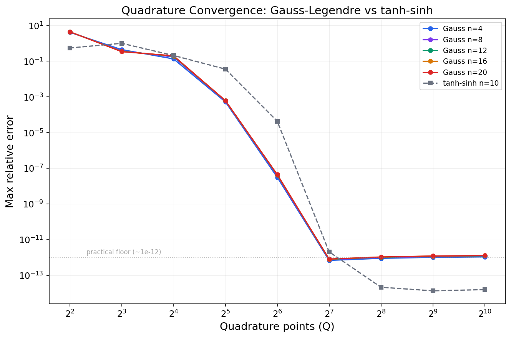

[](https://github.com/Sarose550/ICM/actions/workflows/ci.yml)
[](LICENSE)

# ICM -- Independent Chip Model Equity Computation

High-performance C library for computing tournament placement equities using generating-function quadrature. Computes exact ICM equities for poker tournaments with up to ~25,000 players / payouts in 1 second*. A CUDA backend extends this to over 1.5 million players in about a second on an NVIDIA B200. Python bindings (ctypes, calling straight into the compiled shared library) are included for the CPU library.

> 📄 **Paper:** [Fast Tournament Equity Computation via Generating-Function Quadrature and FFT-Accelerated Subproduct Trees](paper/icm_paper.pdf) - full derivation, proofs, and performance evaluation.
>
> **Status:** arXiv submission pending.

## What is ICM?

The Independent Chip Model (ICM) is a tournament equity model that converts
chip stacks into real-money expected payouts by accounting for the payout
structure. In a poker tournament, chips do not have a fixed dollar value - your last chip is worth far less than your first - and ICM computes each
player's fair expected share of the prize pool. For a general introduction,
see the [ICM Wikipedia page](https://en.wikipedia.org/wiki/Independent_Chip_Model).

## Quick Start

```bash
# Build (requires FFTW3)
make

# Verify correctness
./bench_grid verify

# Full benchmark grid
./bench_grid
```

## API

```c
#include "icm.h"

// Initialize (call once -- loads FFTW wisdom, builds lookup tables)
icm_init("fftw_wisdom.dat");

// Compute equities for all n players
//   S[n]       -- chip stacks
//   Q          -- quadrature points (typically 256)
//   payout[k]  -- payout coefficients
//   equity[n]  -- output (caller-allocated)
icm_equity(n, S, Q, payout, k, equity);

// Compute equities for a subset of players
icm_equity_subset(n, S, Q, payout, k, equity, targets, n_targets);
```

All correctness tests pass at < 2e-10 relative error.

**Subset equity.** `icm_equity_subset()` computes equities for only a chosen
subset of players (`targets`) instead of all `n`. It prunes the hybrid
engine's propagate pass with a per-level hot/cold bitmask marking which
tree branches can contain a target player, skipping cold branches entirely - the sort order used by the rest of the engine is untouched, so this is
purely a pruning optimization, not a different algorithm. Worthwhile when
you only need a handful of players' equities out of a large field; the
speedup is workload-dependent (larger `n`, smaller target fraction helps
most).

**Python bindings.** `python/` provides a ctypes wrapper (`icm.equity(stacks, payouts)`)
that calls straight into the same compiled shared library the C API uses.
See [python/README.md](python/README.md) for setup (`make libicm`, then
`import icm`). These bindings cover the CPU library only -- no Python
wrapper exists for the CUDA API below.

## CUDA API

```c
#include "icm_gpu.h"

// Initialize (call once -- selects the CUDA device)
icm_gpu_init(/* device_id */ 0);

// Compute equities for all n players; opts=NULL uses defaults.
// Returns 0 on success, -1 on failure (check icm_gpu_last_error()).
// Timing is opt-in: pass a non-NULL stats to read stats.total_ns
// afterward, or NULL to skip it.
IcmGpuRunStats stats;
int status = icm_gpu_equity(n, S, Q, payout, k, equity, /* opts */ NULL, &stats);

icm_gpu_shutdown();
```

All correctness tests pass at < 1e-8 relative error against the CPU reference
(`bench_gpu verify`). See [src/icm_gpu.h](src/icm_gpu.h) for the full API,
including the reusable `IcmGpuPlan` (amortizes planning cost across repeated
calls at the same `n`/`k`) and calibration/diagnostics helpers.

## How It Works

The algorithm reformulates ICM equity as a one-dimensional integral over
generating-function coefficients, evaluated by Gaussian quadrature
($Q = 256$ nodes, relative error $< 5 \times 10^{-12}$). The central
challenge---computing leave-one-out polynomial products for all $n$ players
simultaneously---is solved by an FFT-accelerated binary subproduct tree
whose propagation phase is the adjoint of its build phase, reducing cost
from $O(nk)$ to $O(n \log^2 k)$ per quadrature point.

A roofline cost model dispatches automatically between a batched linear
engine (optimal for small $k$) and a hybrid block-tree engine (optimal for
large $k$). The GPU path (NVIDIA B200) uses cuFFTDx fused device-side
kernels with CUDA graph capture, computing 6.3 million player equities
($k = 100$) in 626 ms.

**For the full derivation, complexity analysis, correctness proofs, and
performance evaluation, see the paper:**
[**paper/icm_paper.pdf**](paper/icm_paper.pdf)

## Accuracy

Validated against exact closed-form reference equities (`v1_exact()`,
`v2_exact()` in `src/icm.c`) for two payout structures -- linear and
quadratic -- that are exact for *any* $n$ via linearity of expectation over
player pairs/triples, not by enumerating elimination orderings. This avoids
capping validation at the ~20-30 players a slow general-purpose reference
would allow.

`tools/accuracy_bench.c` sweeps the quadrature node count `Q` against both
closed forms across four stack distributions (uniform, 100:1 adversarial,
geometric, and an extreme 1e9:1 case). Gauss-Legendre quadrature (the
production choice) converges to $\sim 5 \times 10^{-13}$ relative error by
`Q = 1024` on all of them; tanh-sinh (double-exponential) quadrature converges
faster on easy distributions but stalls around $10^{-7}$ - $10^{-8}$ on the
1e9:1 case and doesn't improve from `Q = 512` to `Q = 1024`, which is why
Gauss-Legendre is used in production rather than tanh-sinh. The production
default `Q = 256` already delivers under $2 \times 10^{-12}$ relative error on
uniform stacks and under $1.6 \times 10^{-10}$ at the 1e9:1 bound.

Full derivation (the V1/V2 closed forms, the exponential-clock argument they
rely on, and the complete Gauss-Legendre vs. tanh-sinh convergence tables)
is in the paper; raw sweep data is in `results/accuracy_convergence.csv`.



## Performance

**CPU, single-threaded (ms, Q=256, uniform stacks, median of 5):**

| n | k=10 | k=50 | k=100 | k=n/4 | k=n/2 | k=n | | k=10 | k=50 | k=100 | k=n/4 | k=n/2 | k=n |
|---|------|------|-------|-------|-------|-----|-|------|------|-------|-------|-------|-----|
| | **M3 Pro** |||||| | **Zen 4 7950X** (AOCL-FFTW) |||||
| 1024  | 1.72 | 7.08 | 13.1 | 17.7 | 20.8 | 23.2 | | 1.44 | 4.04 | 7.90 | 15.7 | 16.7 | 17.6 |
| 2048  | 4.10 | 14.2 | 26.2 | 48.5 | 51.5 | 55.8 | | 3.21 | 6.87 | 13.7 | 36.2 | 38.6 | 40.9 |
| 4096  | 8.17 | 28.2 | 52.4 | 108  | 122  | 135  | | 6.58 | 14.1 | 29.3 | 83.4 | 92.5 | 93.6 |
| 8192  | 16.3 | 56.4 | 105  | 255  | 298  | 319  | | 13.1 | 28.2 | 53.4 | 188  | 203  | 213  |
| 16384 | 32.4 | 113  | 208  | 632  | 700  | 749  | | 26.4 | 66.3 | 106  | 433  | 479  | 508  |
| 32768 | 64.7 | 225  | 417  | 1470 | 1640 | 1750 | | 52.3 | 127  | 228  | 980  | 1080 | 1230 |
| 65536 | 129  | 451  | 835  | 3440 | 3820 | 4100 | | 115  | 225  | 414  | 2580 | 2970 | 3330 |

**GPU, NVIDIA B200 (ms, Q=256):**

| n | k=64 | k=1024 | k=n/2 | k=n |
|---|------|--------|-------|-----|
| 4,096 | 0.37 | 0.75 | 0.82 | 0.86 |
| 16,384 | 1.19 | 2.86 | 4.07 | 4.37 |
| 65,536 | 4.40 | 10.83 | 19.85 | 20.64 |
| 262,144 | 17.14 | 42.21 | 97.60 | 101.3 |
| 1,048,576 | 68.09 | 167.34 | 683.06 | 687.67 |
| 4,194,304 | 273.28 | 873.28 | 2475.64 | 2500.45 |

See the paper for the full grids, contour plots, and dispatch analysis.

## Building

### macOS (Apple Silicon)

```bash
# Serial
make

# Parallel (requires: brew install libomp)
make parallel
```

Uses Accelerate framework (vDSP) for FFT dispatch at supported sizes.

### Linux

```bash
# Install FFTW3
sudo apt-get install libfftw3-dev    # Debian/Ubuntu
sudo dnf install fftw-devel          # Fedora/RHEL

# Serial
make

# Parallel
make parallel
```

Uses system FFTW3. For AMD platforms, AOCL-FFTW is recommended — see below.

### Linux with AOCL-FFTW (AMD Zen 4)

```bash
# Install AOCL-FFTW to /usr/local/aocl-fftw
make DEVICE=zen4
make DEVICE=zen4 parallel
```

AOCL-FFTW is the sole FFT backend for Zen 4 — a direct A/B test confirmed it is
cleanly faster than plain FFTW at every calibrated size. Auto-detected if
installed at `/usr/local/aocl-fftw`.

### GPU (NVIDIA)

```bash
make bench_gpu_fused CUDA_ARCH=sm_100    # B200/B100
make bench_gpu_fused CUDA_ARCH=sm_90     # H100/H200
```

Requires CUDA toolkit and cuFFTDx. See the [Performance](#performance) section
above for B200 timings, and `devices/b200/gpu_fft_config.h` for calibration
data.

## Calibrating for a New Device

If your hardware matches an already-calibrated device (`devices/m3_pro`, `devices/zen4`), you don't need to run `./calibrate` at all - build straight against the shipped wisdom and config:

```bash
make DEVICE=m3_pro   # or zen4 - whichever matches your machine
./bench_grid verify
./bench_grid crossover   # confirm dispatch decisions match measured winners on YOUR unit
```

`fftw_wisdom.dat` and the `calib_times_ns[]` table are measured on one specific physical machine. FFTW will happily load wisdom from a different unit of the same CPU model - it just isn't guaranteed to have picked the fastest codelet for *your* silicon, and the nanosecond timings the cost model reads for FFT-vs-schoolbook and engine-dispatch decisions won't necessarily match your machine's actual behavior (different DIMM speed, microcode revision, thermal/boost profile, or memory bandwidth can all shift these numbers). `./bench_grid crossover` is the check that catches this: if every cell's dispatch decision agrees with the measured winner, the shipped calibration is good enough and you're done. Only recalibrate from scratch (below) if it disagrees - and definitely recalibrate if you're on hardware unlike anything already in `devices/`.

One command runs the whole pipeline (FFTW calibration, hybrid-engine timing,
and cost-model constant fitting) and finishes with a `verify` + `crossover`
check:

```bash
./tools/calibrate_full.sh mydevice   # add --quick for a faster, less precise FFTW pass
```

If you want to see (or run) each step by hand
instead:

```bash
# Generate calibration data
# macOS: add -I/opt/homebrew/include -L/opt/homebrew/lib (Homebrew FFTW)
gcc -O3 -march=native -o calibrate tools/calibrate.c -lfftw3 -lm
./calibrate

# Copy to device directory
mkdir -p devices/mydevice
cp fft_config.h fftw_wisdom.dat devices/mydevice/

# Build and verify
make DEVICE=mydevice
./bench_grid verify
./bench_grid profile    # measure FMA_NS, FFT_OVERHEAD_NS, etc.
```

Update the `#define` constants in `fft_config.h` with measured values from `./bench_grid profile`. See [OPTIMIZATION_GUIDE.md](OPTIMIZATION_GUIDE.md) for details on each constant.

## Python Bindings

Python bindings are in `python/`. Build the shared library first:

```bash
make libicm.a
```

## Project Structure

```
src/icm.h                    -- public CPU API
src/icm.c                    -- all CPU engines + FFT infrastructure
src/linear_batched_impl.inc  -- batched linear engine template
src/icm_gpu.h                -- GPU API header
src/gpu/                     -- GPU implementation (split modules)
  gpu_internal.h             -- shared GPU types and helpers
  gpu_kernels.cu             -- CUDA kernels
  gpu_plan.cu                -- GPU planner and cost model
  gpu_exec.cu                -- GPU execution engine
  gpu_api.cu                 -- GPU public API
bench/bench.c                -- CPU benchmark + verification harness
bench/bench_gpu.cu           -- GPU benchmark + verification harness
tools/calibrate.c            -- FFTW calibration tool
tools/calibrate_gpu.cu       -- GPU FFT calibration tool
devices/                     -- per-device calibration data
python/                      -- Python ctypes bindings
```

## Documentation

- [OPTIMIZATION_GUIDE.md](OPTIMIZATION_GUIDE.md) -- detailed optimization notes, porting guide, and algorithm descriptions
- [RESULTS.md](RESULTS.md) -- complete performance tables, head-to-head comparisons, and phase-split analysis

## License

MIT. See [LICENSE](LICENSE).

---
\* Single-threaded, AMD Ryzen 9 7950X (AOCL-FFTW).
