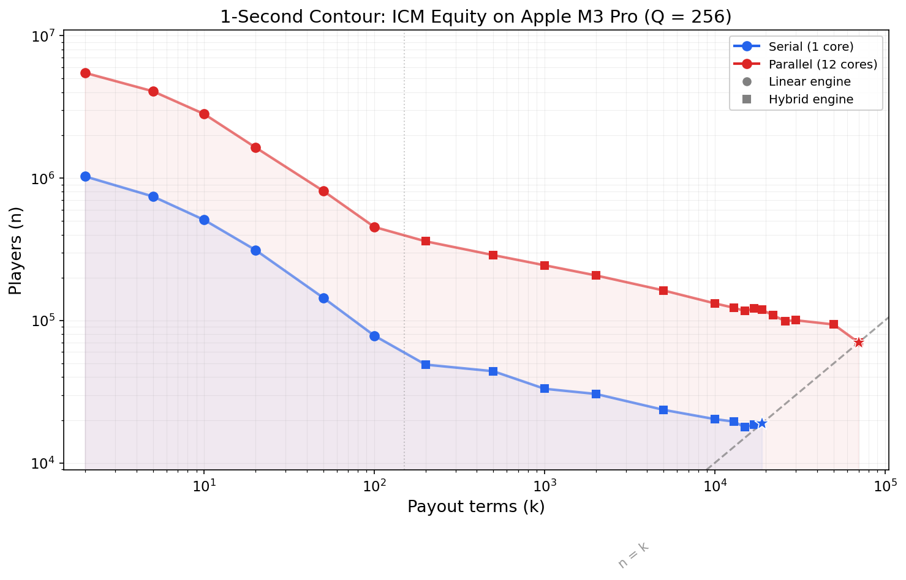
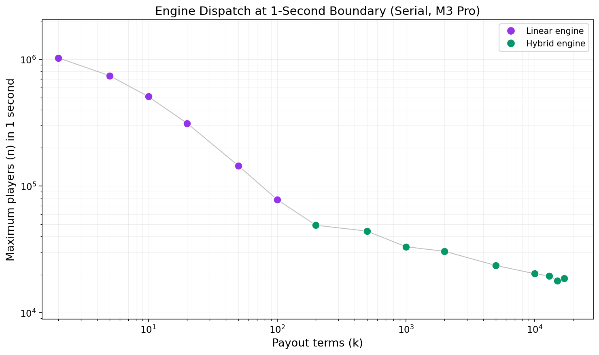
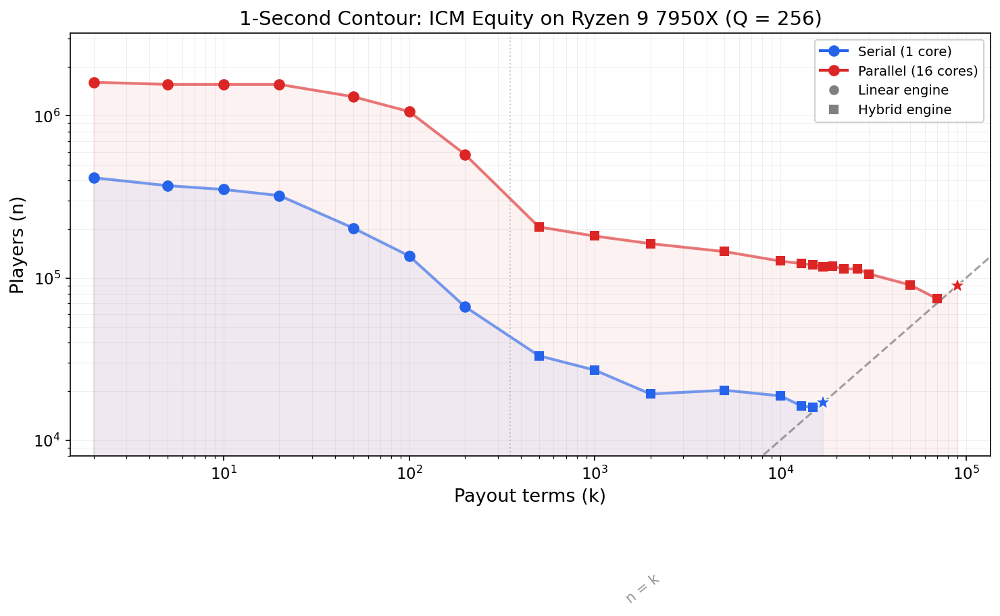
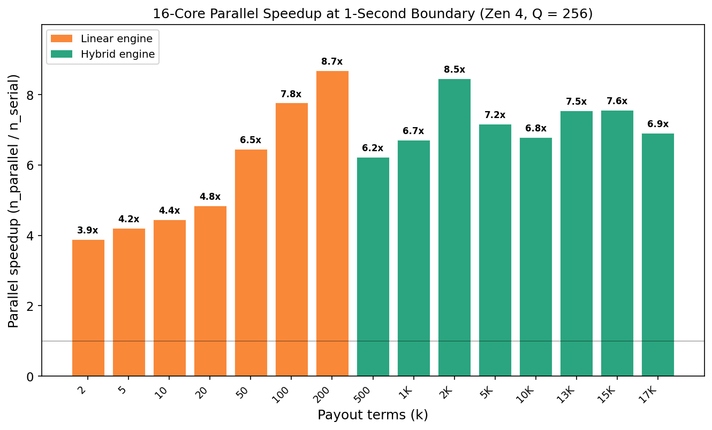
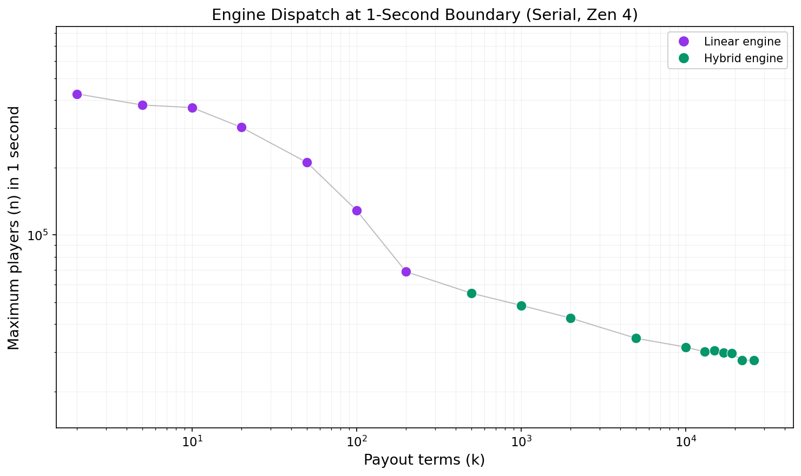
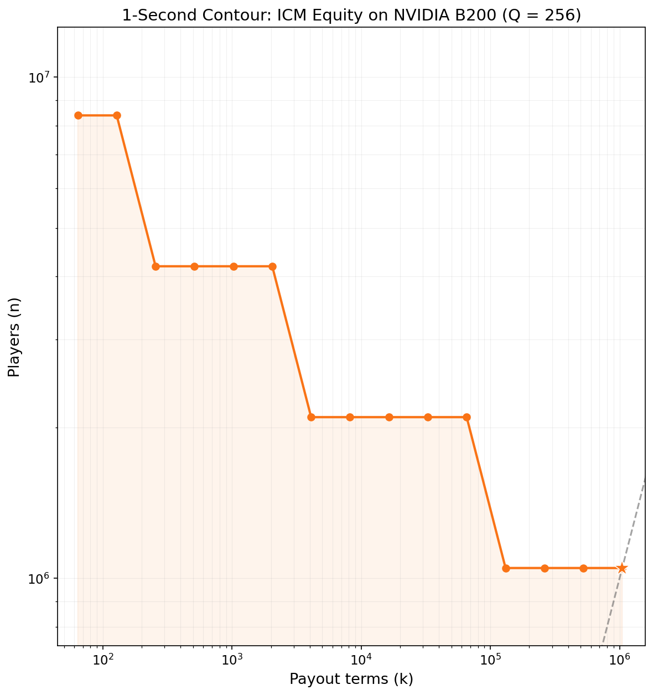
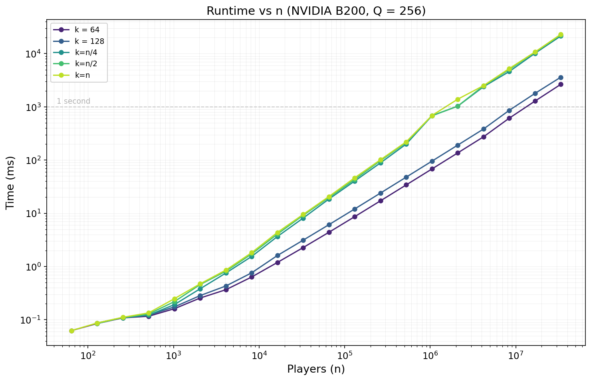

[](https://github.com/Sarose550/ICM/actions/workflows/ci.yml)
[](LICENSE)

# ICM -- Independent Chip Model Equity Computation

High-performance C library for computing tournament placement equities using generating-function quadrature. Computes exact ICM equities for poker tournaments with up to ~17,216 players / payouts in 1 second*. A CUDA backend extends this to over 1.5 million players in about a second on an NVIDIA B200. Python bindings (ctypes, calling straight into the compiled shared library) are included for the CPU library.

> 📄 **Paper:** [Fast Tournament Equity Computation via Generating-Function Quadrature and FFT-Accelerated Subproduct Trees](paper/icm_paper.pdf) — full derivation, proofs, and performance evaluation.

## What is ICM?

The Independent Chip Model (ICM) is a tournament equity model that converts
chip stacks into real-money expected payouts by accounting for the payout
structure. In a poker tournament, chips do not have a fixed dollar value - your last chip is worth far less than your first - and ICM computes each
player's fair expected share of the prize pool. For a general introduction,
see the [ICM Wikipedia page](https://en.wikipedia.org/wiki/Independent_Chip_Model).

## Quick Start

```bash
# Build (requires FFTW3)
make

# Verify correctness
./bench_grid verify

# Full benchmark grid
./bench_grid
```

## API

```c
#include "icm.h"

// Initialize (call once -- loads FFTW wisdom, builds lookup tables)
icm_init("fftw_wisdom.dat");

// Compute equities for all n players
//   S[n]       -- chip stacks
//   Q          -- quadrature points (typically 256)
//   payout[k]  -- payout coefficients
//   equity[n]  -- output (caller-allocated)
icm_equity(n, S, Q, payout, k, equity);

// Compute equities for a subset of players
icm_equity_subset(n, S, Q, payout, k, equity, targets, n_targets);
```

All correctness tests pass at < 2e-10 relative error.

**Subset equity.** `icm_equity_subset()` computes equities for only a chosen
subset of players (`targets`) instead of all `n`. It prunes the hybrid
engine's propagate pass with a per-level hot/cold bitmask marking which
tree branches can contain a target player, skipping cold branches entirely - the sort order used by the rest of the engine is untouched, so this is
purely a pruning optimization, not a different algorithm. Worthwhile when
you only need a handful of players' equities out of a large field; the
speedup is workload-dependent (larger `n`, smaller target fraction helps
most).

**Python bindings.** `python/` provides a ctypes wrapper (`icm.equity(stacks, payouts)`)
that calls straight into the same compiled shared library the C API uses.
See [python/README.md](python/README.md) for setup (`make libicm`, then
`import icm`). These bindings cover the CPU library only -- no Python
wrapper exists for the CUDA API below.

## CUDA API

```c
#include "icm_gpu.h"

// Initialize (call once -- selects the CUDA device)
icm_gpu_init(/* device_id */ 0);

// Compute equities for all n players; opts=NULL uses defaults.
// Returns 0 on success, -1 on failure (check icm_gpu_last_error()).
// Timing is opt-in: pass a non-NULL stats to read stats.total_ns
// afterward, or NULL to skip it.
IcmGpuRunStats stats;
int status = icm_gpu_equity(n, S, Q, payout, k, equity, /* opts */ NULL, &stats);

icm_gpu_shutdown();
```

All correctness tests pass at < 1e-8 relative error against the CPU reference
(`bench_gpu verify`). See [src/icm_gpu.h](src/icm_gpu.h) for the full API,
including the reusable `IcmGpuPlan` (amortizes planning cost across repeated
calls at the same `n`/`k`) and calibration/diagnostics helpers.

## How It Works

The algorithm reformulates ICM equity as a one-dimensional integral over
generating-function coefficients, evaluated by Gaussian quadrature
($Q = 256$ nodes, relative error $< 5 \times 10^{-12}$). The central
challenge---computing leave-one-out polynomial products for all $n$ players
simultaneously---is solved by an FFT-accelerated binary subproduct tree
whose propagation phase is the adjoint of its build phase, reducing cost
from $O(nk)$ to $O(n \log^2 k)$ per quadrature point.

A roofline cost model dispatches automatically between a batched linear
engine (optimal for small $k$) and a hybrid block-tree engine (optimal for
large $k$). The GPU path (NVIDIA B200) uses cuFFTDx fused device-side
kernels with CUDA graph capture, computing 6.3 million player equities
($k = 100$) in 626 ms.

**For the full derivation, complexity analysis, correctness proofs, and
performance evaluation, see the paper:**
[**paper/icm_paper.pdf**](paper/icm_paper.pdf)

## Accuracy

The library is validated against exact closed-form reference values for two
special payout structures, not against a slow general-purpose reference
(which would cap validation at ~20–30 players). These closed forms are exact
for *any* $n$ because they follow from linearity of expectation over pairs
and triples of players, not from enumerating elimination orderings:

Both derivations follow from the exponential-clock model established in
step 4. Applied to a pair $\lbrace i, j\rbrace$: $P(i \text{ beats } j) =
S_i / (S_i + S_j)$. Applied to a triple $\lbrace i, j, k\rbrace$: $P(i \text{ beats both}) =
S_i / (S_i + S_j + S_k)$.

Now write player $i$'s actual finishing position as $M$ other players
finishing ahead of them ($M = 0$ is 1st place) - $M$ is a random variable,
determined by the realized elimination order. For any $t$, the number of
ways to choose $t$ of the players who finish *behind* $i$ is $C(n-1-M, t)$ - an exact combinatorial identity on the realized outcome, no probability
involved yet: it's just choosing $t$ players from the $n-1-M$ who rank
below $i$. Equivalently, it's a sum of indicators over every $t$-subset $T$
of the other $n-1$ players, counting the ones $i$ beats entirely:

$$C(n-1-M, t) = \sum_{\substack{T \subseteq \text{others} \\ |T| = t}} \mathbf{1}[i \text{ finishes better than every player in } T]$$

**V1 (linear payout, $\pi_M = n - M$):** Since $n - M = C(n-1-M, 0) +
C(n-1-M, 1)$, apply the identity at $t = 0$ (always 1, trivially - the
empty subset) and $t = 1$ (one term per opponent $j$). By linearity of
expectation:

$$\begin{aligned}
\text{Equity}_ i &= E[1] + E\left[\sum_{j \neq i} \mathbf{1}[i \text{ beats } j]\right] \\
&= 1 + \sum_{j \neq i} P(i \text{ beats } j) \\
&= 1 + \sum_{j \neq i} \frac{S_i}{S_i + S_j}
\end{aligned}$$

This is exactly `v1_exact()`'s formula, $O(n^2)$ to compute directly.

**V2 (quadratic payout, $\pi_M = \mathit{C(n-1-M, 2)}$):** Apply the identity
at $t = 2$ - one term per opponent *pair* $\lbrace j, k\rbrace$. By linearity of
expectation:

$$\begin{aligned}
\text{Equity}_ i &= E\left[\sum_{\substack{j < k \\ j,k \neq i}} \mathbf{1}[i \text{ beats } j \text{ and } k]\right] \\
&= \sum_{\substack{j < k \\ j,k \neq i}} P(i \text{ beats both } j \text{ and } k) \\
&= \sum_{\substack{j < k \\ j,k \neq i}} \frac{S_i}{S_i + S_j + S_k}
\end{aligned}$$

since " $i$ beats both $j$ and $k$" is exactly " $i$ has the smallest $T$
among the trio," which is the competing-exponentials fact above applied
to $\lbrace i, j, k\rbrace$. This is exactly `v2_exact()`'s formula, $O(n^3)$ to
compute directly.

In both cases the move from a *combinatorial identity on one realized
outcome* to an *exact formula for the expectation* is linearity of
expectation, applied term-by-term to a sum of indicator variables: it
costs nothing to push the expectation through a sum, no matter how the
individual indicator events are correlated with each other. Higher payout
schedules follow the same pattern for larger $t$; V1 and V2 are the $t \leq 2$
cases used here as exact, closed-form, arbitrary- $n$ ground truth.

These are implemented as `v1_exact()` and `v2_exact()` in `src/icm.c`
(publicly exposed as `icm_v1_exact()` / `icm_v2_exact()` in `icm.h`).
The tool `tools/accuracy_bench.c` sweeps the quadrature node count `Q`
and reports convergence against both closed forms across four stack
distributions: uniform (all stacks equal), adversarial (100:1 ratio),
geometric, and an extreme 1e9:1 adversarial case.

**Why Gauss-Legendre, not tanh-sinh?** The same tool also runs every case
through tanh-sinh (double-exponential) quadrature under the identical $v = \Phi(y)$
substitution, for a direct side-by-side comparison. Both converge well on
easy distributions, but on the 1e9:1 adversarial case (the practical worst
case for stack-ratio tails) tanh-sinh plateaus instead of converging:

| Q | Gauss-Legendre | tanh-sinh |
|---|---|---|
| 256 | $1.54 \times 10^{-10}$ | $6.53 \times 10^{-6}$ |
| 512 | $4.87 \times 10^{-13}$ | $5.89 \times 10^{-8}$ |
| 1024 | $5.30 \times 10^{-13}$ | $8.27 \times 10^{-8}$ |

($n=4$, $k=4$, V1 payout; full data in `results/accuracy_convergence.csv`,
`scheme` column.) Gauss-Legendre keeps converging toward machine precision;
tanh-sinh stalls around 1e-7-1e-8 on this tail case and doesn't improve
further from `Q = 512` to `Q = 1024`. This is what motivated using
Gauss-Legendre in production rather than tanh-sinh.

**Headline result:** Gauss-Legendre quadrature converges to $\sim 5 \times 10^{-13}$
relative error by `Q = 1024` against both V1 and V2 closed forms across all
tested distributions. The convergence is rapid - here are representative
rows from `results/accuracy_convergence.csv` for the `gauss` scheme on
uniform stacks (V1 payout):

| Q | max_rel_err ($n=4$, uniform, V1) |
|---|-------------------------------|
| 4 | $4.10 \times 10^{0}$ |
| 8 | $4.36 \times 10^{-1}$ |
| 16 | $1.32 \times 10^{-1}$ |
| 64 | $3.08 \times 10^{-8}$ |
| 128 | $6.79 \times 10^{-13}$ |
| 256 | $8.87 \times 10^{-13}$ |
| 1024 | $1.07 \times 10^{-12}$ |

At `Q = 1024`, the maximum relative error across *all* tested configurations
($n$ up to 20, all four stack distributions, both V1 and V2) stays below
$\sim 2 \times 10^{-12}$ for uniform stacks and below $\sim 6 \times 10^{-13}$ for the adversarial
and 1e9:1 cases. The production default is `Q = 256`, which already delivers
sub- $2 \times 10^{-12}$ relative error - sufficient for any practical poker
application.


## Performance

Three engines with cost-based automatic dispatch:

| Engine | Strategy | Best for |
|--------|----------|----------|
| **Linear** (batched) | $O(nk)$, BQ=8 quad-point batching, interleaved layout, L2-aware checkpointing | Small k |
| **Hybrid** (B=auto) | Block build + FFT tree + bidirectional divide, calibrated block size | Large k |
| **Tree** (pure FFT) | FFT-accelerated subproduct tree | Parallel workloads |

`select_engine(n, k)` chooses the optimal engine for each (n, k) pair based on calibrated FFT costs and hardware parameters. No manual tuning required.

### Single-threaded (ms, Q=256)

| n | k=10 | k=100 | k=n/2 | k=n | | k=10 | k=100 | k=n/2 | k=n |
|---|------|-------|-------|-----|-|------|-------|-------|-----|
| | **M3 Pro** |||| | **Zen 4 7950X** ||||
| 1024 | 1.71 | 13.2 | 28.9 | 34.8 | | 1.28 | 7.61 | 29.1 | 34.0 |
| 4096 | 8.18 | 52.6 | 214 | 232 | | 7.32 | 28.3 | 161 | 168 |
| 8192 | 16.2 | 104 | 483 | 516 | | 14.5 | 53.4 | 376 | 382 |
| 16384 | 32.5 | 208 | 1090 | 1480 | | 29.6 | 112 | 866 | 835 |
| 65536 | 130 | 836 | 9710 | 10000 | | 117 | 419 | 4170 | 4490 |

*M3 Pro: Apple M3 Pro (6P+6E, 12 logical cores). Zen 4: AMD Ryzen 9 7950X (16 cores).*

### 12-thread parallel (ms, Q=256)

| n | k=10 | k=100 | k=n/2 | k=n | | k=10 | k=100 | k=n/2 | k=n |
|---|------|-------|-------|-----|-|------|-------|-------|-----|
| | **M3 Pro** |||| | **Zen 4 7950X** ||||
| 1024 | 0.341 | 2.27 | 3.87 | 4.96 | | 0.125 | 0.562 | 2.23 | 2.48 |
| 4096 | 1.59 | 9.09 | 29.9 | 31.1 | | 0.604 | 2.35 | 11.4 | 11.9 |
| 8192 | 2.71 | 17.7 | 67.3 | 73.3 | | 1.18 | 4.86 | 26.6 | 26.9 |
| 16384 | 5.36 | 34.5 | 148 | 202 | | 2.39 | 10.4 | 67.5 | 81.2 |
| 65536 | 21.1 | 138 | 1270 | 1310 | | 19.5 | 45.2 | 530 | 631 |

*M3 Pro: OMP_NUM_THREADS=12 (6 performance + 6 efficiency cores). Zen 4: OMP_NUM_THREADS=16 (16 physical cores).*
















**GPU scaling.** The B200 pushes well past the CPU ceiling: where the CPU
engines handle up to ~17,000 players in one second (single-threaded), the B200
computes 1,572,864 players (k=n) in 1,148 ms - roughly 1.5 million players in
about a second, a ~90× increase in problem size at comparable latency. See the
[GPU build section](#gpu-nvidia) for the full B200 performance table.

See [RESULTS.md](RESULTS.md) for complete performance tables across platforms.

## Building

### macOS (Apple Silicon)

```bash
# Serial
make

# Parallel (requires: brew install libomp)
make parallel
```

Uses Accelerate framework (vDSP) for FFT dispatch at supported sizes.

### Linux

```bash
# Install FFTW3
sudo apt-get install libfftw3-dev    # Debian/Ubuntu
sudo dnf install fftw-devel          # Fedora/RHEL

# Serial
make

# Parallel
make parallel
```

Automatically detects MKL (via dlopen) for dual-dispatch FFT when available.

### Linux with AOCL-FFTW (AMD)

```bash
# Install AOCL-FFTW to /usr/local/aocl-fftw
make DEVICE=zen4
make DEVICE=zen4 parallel
```

Auto-detected if installed at `/usr/local/aocl-fftw`.

### GPU (NVIDIA)

```bash
make bench_gpu_fused CUDA_ARCH=sm_100    # B200/B100
make bench_gpu_fused CUDA_ARCH=sm_90     # H100/H200
```

Requires CUDA toolkit and cuFFTDx.

**B200 performance** (Q=256, fused cuFFTDx kernels, n=k):

| n | Time |
|---|------|
| 65,536 | 24.75 ms |
| 262,144 | 117.90 ms |
| 1,441,792 | 866 ms |
| 1,572,864 | 1,148 ms |

See `devices/b200/gpu_fft_config.h` for calibration data.

## Calibrating for a New Device

If your hardware matches an already-calibrated device (`devices/m3_pro`, `devices/zen4`), you don't need to run `./calibrate` at all - build straight against the shipped wisdom and config:

```bash
make DEVICE=m3_pro   # or zen4 - whichever matches your machine
./bench_grid verify
./bench_grid crossover   # confirm dispatch decisions match measured winners on YOUR unit
```

`fftw_wisdom.dat` and the `calib_times_ns[]` table are measured on one specific physical machine. FFTW will happily load wisdom from a different unit of the same CPU model - it just isn't guaranteed to have picked the fastest codelet for *your* silicon, and the nanosecond timings the cost model reads for FFT-vs-schoolbook and engine-dispatch decisions won't necessarily match your machine's actual behavior (different DIMM speed, microcode revision, thermal/boost profile, or memory bandwidth can all shift these numbers). `./bench_grid crossover` is the check that catches this: if every cell's dispatch decision agrees with the measured winner, the shipped calibration is good enough and you're done. Only recalibrate from scratch (below) if it disagrees - and definitely recalibrate if you're on hardware unlike anything already in `devices/`.

One command runs the whole pipeline (FFTW calibration, hybrid-engine timing,
and cost-model constant fitting) and finishes with a `verify` + `crossover`
check:

```bash
./tools/calibrate_full.sh mydevice   # add --quick for a faster, less precise FFTW pass
```

If you want to see (or run) each step by hand
instead:

```bash
# Generate calibration data
# macOS: add -I/opt/homebrew/include -L/opt/homebrew/lib (Homebrew FFTW)
gcc -O3 -march=native -o calibrate tools/calibrate.c -lfftw3 -lm
./calibrate

# Copy to device directory
mkdir -p devices/mydevice
cp fft_config.h fftw_wisdom.dat devices/mydevice/

# Build and verify
make DEVICE=mydevice
./bench_grid verify
./bench_grid profile    # measure FMA_NS, FFT_OVERHEAD_NS, etc.
```

Update the `#define` constants in `fft_config.h` with measured values from `./bench_grid profile`. See [OPTIMIZATION_GUIDE.md](OPTIMIZATION_GUIDE.md) for details on each constant.

## Python Bindings

Python bindings are in `python/`. Build the shared library first:

```bash
make libicm.a
```

## Project Structure

```
src/icm.h                    -- public CPU API
src/icm.c                    -- all CPU engines + FFT infrastructure
src/linear_batched_impl.inc  -- batched linear engine template
src/icm_gpu.h                -- GPU API header
src/gpu/                     -- GPU implementation (split modules)
  gpu_internal.h             -- shared GPU types and helpers
  gpu_kernels.cu             -- CUDA kernels
  gpu_plan.cu                -- GPU planner and cost model
  gpu_exec.cu                -- GPU execution engine
  gpu_api.cu                 -- GPU public API
bench/bench.c                -- CPU benchmark + verification harness
bench/bench_gpu.cu           -- GPU benchmark + verification harness
tools/calibrate.c            -- FFTW calibration tool
tools/calibrate_gpu.cu       -- GPU FFT calibration tool
devices/                     -- per-device calibration data
python/                      -- Python ctypes bindings
```

## Documentation

- [OPTIMIZATION_GUIDE.md](OPTIMIZATION_GUIDE.md) -- detailed optimization notes, porting guide, and algorithm descriptions
- [RESULTS.md](RESULTS.md) -- complete performance tables, head-to-head comparisons, and phase-split analysis

## License

MIT. See [LICENSE](LICENSE).

---
\* Single-threaded, AMD Ryzen 9 7950X.
