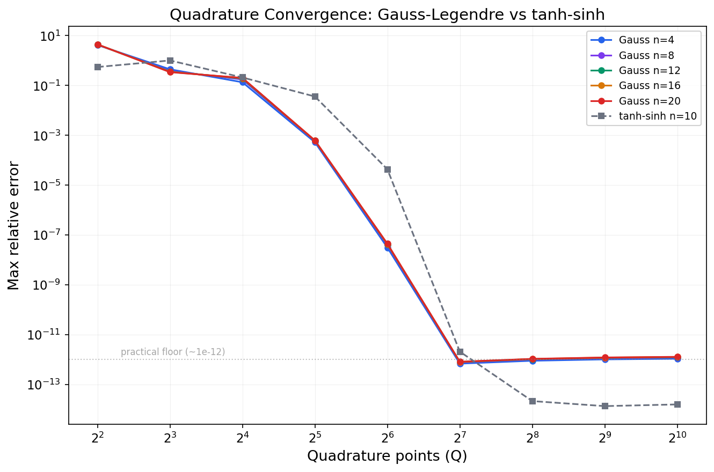

[](https://github.com/Sarose550/ICM/actions/workflows/ci.yml)
[](LICENSE)

# ICM: Independent Chip Model Equity Computation

High-performance C library for computing tournament placement equities using generating-function quadrature. Computes exact ICM equities for poker tournaments with up to 26,816 players / payouts in 1 second single-threaded, or 65,536 across 16 threads, on the AMD Zen 4 reference box (18,368 / 88,064 on Apple M3 Pro; see [RESULTS.md](RESULTS.md) for per-device figures). All are direct binary-search measurements, not interpolations. A CUDA backend extends this to up to 1.49 million players in under a second on an NVIDIA B200 (full field, `k=n`). Python bindings (ctypes, calling straight into the compiled shared library) are included for the CPU library.

> 📄 **Paper:** [Fast Tournament Equity Computation via Generating-Function Quadrature and FFT-Accelerated Subproduct Trees](paper/icm_paper.pdf): full derivation, proofs, and performance evaluation.
>
> **Status:** arXiv submission pending.

**Try it in your browser:** [https://sarose550.github.io/ICM/](https://sarose550.github.io/ICM/), same library, generic calibration profile, computed client-side in WebAssembly.

## What is ICM?

The Independent Chip Model (ICM) is a tournament equity model that converts
chip stacks into real-money expected payouts by accounting for the payout
structure. In a poker tournament, chips do not have a fixed dollar value
(your last chip is worth far less than your first), and ICM computes each
player's fair expected share of the prize pool. For a general introduction,
see the [ICM Wikipedia page](https://en.wikipedia.org/wiki/Independent_Chip_Model).

## Quick Start

```bash
# Build (requires FFTW3)
make

# Verify correctness
./bench_grid verify

# Full benchmark grid
./bench_grid
```

## API

```c
#include "icm.h"

// Initialize (call once; loads FFTW wisdom, builds lookup tables)
icm_init("fftw_wisdom.dat");

// Compute equities for all n players
//   S[n]       : chip stacks
//   Q          : quadrature points (typically 256)
//   payout[k]  : payout coefficients
//   equity[n]  : output (caller-allocated)
icm_equity(n, S, Q, payout, k, equity);

// Compute equities for a subset of players
icm_equity_subset(n, S, Q, payout, k, equity, targets, n_targets);
```

All correctness tests pass at < 1.6e-10 relative error.

**Subset equity.** `icm_equity_subset()` computes equities for only a chosen
subset of players (`targets`) instead of all `n`. It prunes the hybrid
engine's propagate pass with a per-level hot/cold bitmask marking which
tree branches can contain a target player, skipping cold branches entirely.
The sort order used by the rest of the engine is untouched, so this is
purely a pruning optimization, not a different algorithm. Worthwhile when
you only need a handful of players' equities out of a large field; the
speedup is workload-dependent (larger `n`, smaller target fraction helps
most).

**Python bindings.** `python/` provides a ctypes wrapper (`icm.equity(stacks, payouts)`)
that calls straight into the same compiled shared library the C API uses.
See [python/README.md](python/README.md) for setup (`make libicm`, then
`import icm`). These bindings cover the CPU library only; no Python
wrapper exists for the CUDA API below.

## CUDA API

```c
#include "icm_gpu.h"

// Initialize (call once; selects the CUDA device)
icm_gpu_init(/* device_id */ 0);

// Compute equities for all n players; opts=NULL uses defaults.
// Returns 0 on success, -1 on failure (check icm_gpu_last_error()).
// Timing is opt-in: pass a non-NULL stats to read stats.total_ns
// afterward, or NULL to skip it.
IcmGpuRunStats stats;
int status = icm_gpu_equity(n, S, Q, payout, k, equity, /* opts */ NULL, &stats);

icm_gpu_shutdown();
```

The CUDA device is selected once, by `icm_gpu_init(device_id)`, before any
other call; the `device_id` field in `IcmGpuOptions` is informational only
and ignored as an input.

All correctness tests pass at < 1e-8 relative error against the CPU reference
(`bench_gpu verify`). See [src/gpu/icm_gpu.h](src/gpu/icm_gpu.h) for the full API,
including the reusable `IcmGpuPlan` (amortizes planning cost across repeated
calls at the same `n`/`k`) and calibration/diagnostics helpers.

## Accuracy

Validated against exact closed-form reference equities for two payout
structures (linear and quadratic), exact for *any* `n` rather than by
enumerating elimination orderings, so validation isn't capped at the small
`n` a slow general-purpose reference would allow. The production default
(`Q = 256`, Gauss-Legendre quadrature) delivers under 1.6e-10 relative
error, including at a 1e9:1 stack-ratio extreme. See the paper for the full
quadrature-convergence study (Gauss-Legendre vs. tanh-sinh, four stack
distributions) and `results/accuracy_convergence.csv` for the raw sweep.



## Performance

**CPU, single-threaded (ms, Q=256, uniform stacks, median of 5):**

| n | k=10 | k=50 | k=100 | k=n/4 | k=n/2 | k=n | | k=10 | k=50 | k=100 | k=n/4 | k=n/2 | k=n |
|---|------|------|-------|-------|-------|-----|-|------|------|-------|-------|-------|-----|
| | **M3 Pro** |||||| | **Zen 4 7950X** (AOCL-FFTW) ||||||
| 1024  | 1.71 | 7.05 | 13.0 | 17.8 | 20.9 | 29.5 | | 1.33 | 3.53 | 7.54 | 15.8 | 17.3 | 19.7 |
| 2048  | 4.80 | 14.5 | 26.1 | 45.3 | 51.4 | 55.8 | | 3.11 | 6.99 | 13.9 | 36.3 | 39.3 | 45.0 |
| 4096  | 8.14 | 28.1 | 51.9 | 108  | 122  | 135  | | 6.21 | 15.0 | 28.5 | 82.6 | 95.0 | 103  |
| 8192  | 16.2 | 56.2 | 105  | 280  | 298  | 320  | | 12.6 | 31.5 | 57.9 | 194  | 206  | 232  |
| 16384 | 32.3 | 116  | 208  | 625  | 701  | 751  | | 25.5 | 74.0 | 127  | 442  | 484  | 525  |
| 32768 | 64.9 | 227  | 415  | 1470 | 1650 | 1760 | | 52.9 | 118  | 252  | 991  | 1060 | 1240 |
| 65536 | 130  | 451  | 830  | 3460 | 3820 | 4060 | | 107  | 252  | 727  | 2570 | 2850 | 3160 |

**GPU, NVIDIA B200 (ms, Q=256):**

| n | k=64 | k=1024 | k=n/2 | k=n |
|---|------|--------|-------|-----|
| 4,096 | 0.37 | 0.76 | 0.87 | 0.89 |
| 16,384 | 1.18 | 2.81 | 3.93 | 4.17 |
| 65,536 | 4.29 | 10.62 | 19.43 | 20.26 |
| 262,144 | 16.58 | 41.01 | 95.95 | 100.09 |
| 1,048,576 | 65.68 | 178.26 | 501.84 | 507.90 |
| 4,194,304 | 272.47 | 753.65 | 2,352.43 | 2,320.45 |
| 33,554,432 | 2,506.71 | 5,059.26 | 22,321.49 | 22,865.76 |

The Zen 4 reference box runs its DIMMs at 3600 MT/s (an AMD AM5
two-DIMMs-per-channel electrical limit, not a misconfiguration; measured
streaming DRAM bandwidth is 32.7 GB/s, consistent with that ceiling). Memory
bandwidth matters here only where the FFT-heavy hybrid engine dominates: the
compute-bound linear engine is essentially insensitive to it. See
[RESULTS.md](RESULTS.md) and the paper for the full grids.

See the paper for the full grids, contour plots, and dispatch analysis.

## Building

### macOS (Apple Silicon)

```bash
# Serial
make

# Parallel (requires: brew install libomp)
make parallel
```

Uses Accelerate framework (vDSP) for FFT dispatch at supported sizes.

### Linux

```bash
# Install FFTW3
sudo apt-get install libfftw3-dev    # Debian/Ubuntu
sudo dnf install fftw-devel          # Fedora/RHEL

# Serial
make

# Parallel
make parallel
```

Uses system FFTW3. For AMD platforms, AOCL-FFTW is recommended, see below.

### Linux with AOCL-FFTW (AMD Zen 4)

```bash
# Install AOCL-FFTW to /usr/local/aocl-fftw
make DEVICE=zen4
make DEVICE=zen4 parallel
```

AOCL-FFTW is the sole FFT backend for Zen 4, a direct A/B test confirmed it is
cleanly faster than plain FFTW at every calibrated size. Auto-detected if
installed at `/usr/local/aocl-fftw`.

### GPU (NVIDIA)

```bash
make bench_gpu_fused CUDA_ARCH=sm_100    # B200/B100 (uses devices/b200/ calibration)
make bench_gpu_fused CUDA_ARCH=sm_90     # H100/H200
```

Requires CUDA toolkit and cuFFTDx. See the [Performance](#performance) section
above for B200 timings, and `devices/b200/gpu_fft_config.h` for calibration
data.

To calibrate your own card, generate a device config and build against it
(`GPU_DEVICE=` mirrors the CPU's `DEVICE=`; the shipped `b200` data is the
default):

```bash
make calibrate_gpu CUDA_ARCH=<your_arch>
mkdir -p devices/<name>
./calibrate_gpu devices/<name>/gpu_fft_config.h
make clean && make bench_gpu_fused CUDA_ARCH=<your_arch> GPU_DEVICE=<name>
./bench_gpu_fused verify
```

`CUDA_ARCH` also selects the cuFFTDx kernel instantiations; FFT sizes an
architecture cannot compile (shared-memory limits) are excluded automatically
via `cufftdx::is_supported`, and the planner falls back to batched cuFFT for
them. Optional: layer in a per-card block-size (B) calibration with
`tools/calibrate_gpu_best_b.cu` + `tools/splice_calib_points.py`; until then
the planner uses a fixed B=64 fallback on uncalibrated cards.

## Platform Support

| Device | Architecture | FFT Backend | Status |
|--------|-------------|-------------|--------|
| Apple M3 Pro | ARM (Apple Silicon) | FFTW + vDSP dispatch at supported sizes | Calibrated, verified |
| AMD Ryzen 9 7950X (Zen 4) | x86-64 (AVX-512) | AOCL-FFTW | Calibrated, verified |
| NVIDIA B200 | Blackwell GPU (sm_100) | cuFFT + cuFFTDx | Calibrated, verified |

An uncalibrated device falls back to `devices/generic/` and still produces
correct results; every tree level uses FFT with `FFTW_ESTIMATE` plans, the
engine always dispatches hybrid with B=32, and a build-time warning is
printed. Run `./tools/calibrate_full.sh <DEVICE>` to add real calibration for
your hardware.

## Calibrating for a New Device

If your hardware matches an already-calibrated device, build straight
against the shipped wisdom and config, then confirm dispatch is still
correct on your specific unit:

```bash
make DEVICE=m3_pro   # or zen4 - whichever matches your machine
./bench_grid verify
./bench_grid crossover   # confirm dispatch agrees with measured winners on YOUR unit
```

If `crossover` disagrees, or your hardware isn't already in `devices/`, one
command runs the full calibration pipeline (FFTW calibration, hybrid-engine
timing, cost-model fitting) and finishes with a `verify` + `crossover`
check:

```bash
./tools/calibrate_full.sh mydevice   # add --quick for a faster, less precise pass
```

Expect 10-30+ minutes on an otherwise-idle machine (FFTW's PATIENT planner
dominates the time). See [OPTIMIZATION_GUIDE.md](OPTIMIZATION_GUIDE.md#porting-to-a-new-device-general)
for the manual step-by-step version and what each calibrated constant means.

**GPU (NVIDIA)** devices calibrate separately from the CPU pipeline; see
["GPU Cost Model (B200)"](OPTIMIZATION_GUIDE.md#gpu-cost-model-b200) in
`OPTIMIZATION_GUIDE.md`, or run `./tools/run_b200_campaign.sh` for the
whole pipeline in one shot.

## Python Bindings

Python bindings are in `python/`. Build the shared library first:

```bash
make libicm.a
```

## Project Structure

```
src/cpu/     : CPU engines (linear/hybrid/tree) + FFT infrastructure
src/gpu/     : CUDA implementation (kernels, planner, execution, API)
bench/       : benchmark + verification harnesses (CPU and GPU)
tools/       : calibration, validation, and diagnostic tools
devices/     : per-device calibration data (m3_pro, zen4, b200, generic)
python/      : Python ctypes bindings
results/     : benchmark results, CSVs, and plots
paper/       : paper PDF
```

## Documentation

- [OPTIMIZATION_GUIDE.md](OPTIMIZATION_GUIDE.md): detailed optimization notes, porting guide, and algorithm descriptions
- [RESULTS.md](RESULTS.md): complete performance tables, head-to-head comparisons, and phase-split analysis

## How It Works

The algorithm reformulates ICM equity as a one-dimensional integral over
generating-function coefficients, evaluated by Gaussian quadrature, and
computes the per-player leave-one-out products via an FFT-accelerated
subproduct tree. Three engines (linear, hybrid, tree) cover different
`(n, k)` regimes; which one runs is decided automatically at every level,
from offline-calibrated lookup tables rather than analytical cost formulas
(the same empirical-measurement-over-modeling approach FFTW's `PATIENT`
planner and LAPACK's `ILAENV` use). The GPU path (NVIDIA B200) uses
cuFFTDx fused device-side kernels with CUDA graph capture.

**For the full derivation, complexity analysis, correctness proofs, and
performance evaluation, see the paper:**
[**paper/icm_paper.pdf**](paper/icm_paper.pdf) (the dispatch mechanism is
in the Algorithm section). For an implementation-level walkthrough, see
[OPTIMIZATION_GUIDE.md](OPTIMIZATION_GUIDE.md).

## Getting Help / Reporting Issues

Open an issue on the [GitHub repository](https://github.com/Sarose550/ICM/issues).
Include:

- Your device (CPU model or GPU model)
- The exact `make` line you ran (including `DEVICE=`)
- Output of `./bench_grid verify`

## Citation

There is no arXiv ID or published paper yet. Until then, cite the GitHub
repository and the in-repo PDF:

```bibtex
@misc{icm_2026,
  author       = {Sam Rosenstrauch},
  title        = {{ICM}: Independent Chip Model Equity Computation},
  howpublished = {\url{https://github.com/Sarose550/ICM}},
  note         = {Paper: \texttt{paper/icm\_paper.pdf}},
  year         = {2026}
}
```

## License

MIT. See [LICENSE](LICENSE). The prebuilt browser widget bundle under `web/dist/` is GPL as a combined work with FFTW, per [web/LICENSE-THIRD-PARTY.md](web/LICENSE-THIRD-PARTY.md).
