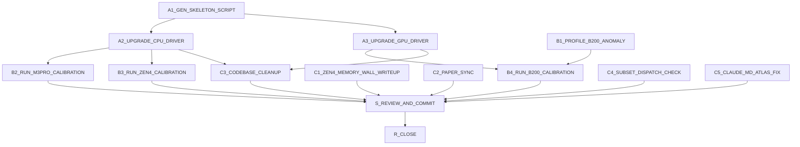

# SPRINT_CALIBRATION_AND_READINESS_DAG

<!--
Live strike board managed by the supervisor-dag skill.
Ephemeral -- DELETE at R_CLOSE. Not design or decisions law.
-->

## Context

Two work streams are merged into one board per explicit user instruction:
this is NOT a fresh start -- the standing production-readiness items
(paper sync, codebase cleanup, subset-dispatch check, Zen4 memory-wall
writeup, PR #7 merge decision) carry over unchanged from `HANDOFF.md`'s
"Next Steps", and the new calibration-methodology work is inserted
alongside them, not instead of them.

### New calibration methodology (this wave)

Both `select_best_B()` (CPU) and `gpu_select_best_B_est()` (GPU) now use
empirical lookup tables instead of summed analytical constants -- but the
CPU table (34 points) and GPU table (32 points) were both built from a
naive rectangular `n` x `k/n`-fraction grid. Agreed direction (user,
2026-07-23):

1. **Calibration POINT SET is adaptive; nothing is adaptive at runtime.**
   Runtime dispatch stays pure nearest-neighbor lookup, O(1), no probing,
   no re-timing -- unchanged. Only the *offline* set of calibrated points
   gets built adaptively (skeleton + off-grid validation + refinement),
   never sampled live in production.
2. **Skeleton `n` values biased to 7-smooth numbers** (reuse
   `build_smooth_table()` in `src/gpu/gpu_plan.cu` / `smooth_nums[]` in
   `src/icm.c` directly -- these are exactly the sizes with real
   calibrated FFT timings, so testing at them avoids interpolation noise
   from untested FFT sizes).
3. **Three `k`-anchor categories per skeleton `n`:**
   - Tiny, exhaustive: `{2,3,...,16}` (all integers, cheap regardless of n)
   - "Almost-7-smooth" (`k = s-1` for 7-smooth `s`, `16 < k <= 256`) --
     deliberately forces a small nonzero wrap-correction, since real `k`
     values almost never land exactly on a fast FFT size and the old
     grid's exactly-smooth `k` values under-sampled that code path
   - Relative fractions `{n/12, n/10, n/8, n/6, n/4}` (also happens to
     bracket realistic tournament payout percentages, 8%-25%, though
     that's a side benefit not the primary justification)
4. **Reduced-rep timing**: replace "median-of-N on every candidate" with
   1 rep to rank, confirm-only-if-top-2-within-~3% (2 more reps on just
   those two). User's observation: both platforms show low run-to-run
   noise, so this is a real cost reduction, not a robustness cut, but the
   confirm-if-close step keeps a floor of care.
5. **Off-grid validation drives refinement, not blind densification**:
   `tools/validate_best_b.c` (CPU) / `tools/validate_planner_gpu.cu`
   (GPU) already do forced-B-vs-auto-B comparison at a handful of fixed
   points -- upgrade both to probe *random/log-uniform points not on the
   skeleton*, and any probe with real cost-gap > ~2% gets promoted to an
   explicit calibration point.
6. **B200's large-n region (n=1,048,576 - 1,572,864) showed erratic,
   non-monotonic optimal B (32, then 96/192/112 depending on k)** --
   before adding density there, profile those specific cells (nsight or
   equivalent) the same way `perf stat` diagnosed the Zen4 parallel cliff.
   Precedent: BeBOP/Sparsity's register-blocking search (Demmel/Dongarra/
   Whaley et al., "Self-Adapting Linear Algebra Algorithms and Software",
   2004, section 4.2) hit the identical shape of surprise (best block
   size 4x2, not 8x8, on Itanium2) and their fix was finding the *physical
   variable* that explained it (fill ratio), not just sampling more block
   sizes. Note: their hybrid off-line/run-time formula approach doesn't
   transfer here (motivated by avoiding runtime re-benchmarking cost,
   which doesn't apply -- we calibrate fully offline).
7. **Correction to carry into docs**: `CLAUDE.md`'s crossover-table
   rationale currently cites "ATLAS's AEOS paradigm does the same [size-
   adaptive lookup]" -- checked against the actual paper this session;
   ATLAS's GEMM search tunes register-blocking/unrolling parameters for
   ONE fixed small kernel size and relies on blocking-induced size-
   invariance, it does NOT build a lookup table over problem size the way
   we do. The precise match is BeBOP/Sparsity's register-blocking search
   in the same paper. Fix the citation.
8. **Resumability**: neither `tools/calibrate_best_b.c` nor
   `tools/calibrate_gpu_best_b.cu` currently skip already-computed points
   on restart -- add it (ATLAS precedent: store results incrementally so
   an interrupted search doesn't restart from scratch; directly relevant
   after running an uninterrupted ~35-min B200 sweep with no safety net
   last session).
9. **Apply the same skeleton/refinement methodology to M3 Pro and Zen4
   too** -- no known anomaly on either (unlike B200), so no profiling
   detour needed there, just run the improved methodology directly.

## Graph

## Lanes

| Lane | Nodes | Default owner |
|---|---|---|
| calib-tooling | A1_GEN_SKELETON_SCRIPT, A2_UPGRADE_CPU_DRIVER, A3_UPGRADE_GPU_DRIVER | deepseek |
| calib-execution | B1_PROFILE_B200_ANOMALY, B3_RUN_ZEN4_CALIBRATION, B4_RUN_B200_CALIBRATION | supervisor (SSH/paid, DeepSeek workers cannot network) |
| calib-execution | B2_RUN_M3PRO_CALIBRATION | deepseek (local hardware, no network needed -- precedent: DeepSeek ran the M3 Pro results-regen this session) |
| readiness | C1_ZEN4_MEMORY_WALL_WRITEUP | supervisor (judgment call: document-as-limitation vs scope-a-fix) |
| readiness | C2_PAPER_SYNC, C3_CODEBASE_CLEANUP, C4_SUBSET_DISPATCH_CHECK | deepseek |
| readiness | C5_CLAUDE_MD_ATLAS_FIX | supervisor (CLAUDE.md is supervisor-only, never delegated) |
| review | S_REVIEW_AND_COMMIT | supervisor |
| close | R_CLOSE | supervisor |

## Conflicts

| Resource | Rule | Nodes touching |
|---|---|---|
| `tools/calibrate_best_b.c`, `tools/validate_best_b.c`, `devices/m3_pro/fft_config.h` | Serialized: A2 must land before B2 | A2, B2 |
| `tools/calibrate_gpu_best_b.cu`, `tools/validate_planner_gpu.cu`, `devices/b200/gpu_fft_config.h` | Serialized: A3 (and B1's findings) must land before B4 | A3, B1, B4 |
| `devices/zen4/fft_config.h` | Serialized: A2 must land before B3 | A2, B3 |
| Repo-wide comment cleanup (C3) vs. any node still editing source in the same wave | C3 must run in a LATER wave than A2/A3 to avoid touching files those nodes are mid-editing | A2, A3, C3 |
| `CLAUDE.md` | Supervisor-only, never delegated | C5 |
| `~/Documents/ICM_paper` | Separate repo, out of scope for all main-repo nodes except C2 | C2 |
| Tip git commit (main repo) | Supervisor only | S_REVIEW_AND_COMMIT |
| A1/A2/A3/C2/C3/C4 Allowed files (Model: deepseek) | Supervisor Read/Edit denied for the wave | A1, A2, A3, C2, C3, C4 |
| Paid instances (B200, Zen4) | Never start/stop without explicit go-ahead already on record; never destroy Zen4 (standing "never terminate" policy); B200 destroyed immediately after each session | B1, B3, B4 |

## Nodes

### [ ] A1_GEN_SKELETON_SCRIPT

- **Model:** `deepseek`
- **Depends:** none (ready now)
- **Allowed files:** `tools/gen_calib_skeleton.py` (new)
- **Task:** Write a shared Python skeleton-generator, parameterized by
  device, that produces the full calibration point list per this board's
  Context section (items 2-3). Concretely:
  1. Reuse the EXACT smooth-number logic already in the codebase --
     port `build_smooth_table()` (`src/gpu/gpu_plan.cu`, lines ~49-65) for
     GPU and the 7-smooth generation in `build_fftw_size_table()`
     (`src/icm.c`, search "smooth_nums") for CPU -- do not reimplement
     from scratch, copy the exact algorithm so the skeleton always uses
     numbers that match real calibrated FFT sizes.
  2. Given `(lo, hi, ratio)`, pick the skeleton `n` values by snapping
     each log-spaced target to the nearest 7-smooth number (log-distance,
     not linear-distance).
  3. For each skeleton `n`, emit the full k-anchor set: `{2..16}` union
     `{s-1 : s 7-smooth, 16 < s-1 <= 256, s-1 <= n}` union
     `{n/12, n/10, n/8, n/6, n/4}` (dedupe, drop k > n or k < 1).
  4. CLI: `python3 tools/gen_calib_skeleton.py --device {m3_pro,zen4,b200}
     --lo <n> --hi <n> --ratio <float> > skeleton_<device>.csv` with
     columns `n,k`.
  5. Reference skeleton parameters already worked out this session (put
     these in the script's `--help`/defaults, don't re-derive): CPU
     `lo=256 hi=131072 ratio=1.6` (~14 n-anchors, matches
     `smooth_nums[]`'s actual 131072 cap); GPU `lo=1024 hi=4194304
     ratio=1.8` (~15 n-anchors, reaches the published 1.5M+ frontier).
- **Exit criteria:** script runs standalone (no build dependencies beyond
  python3), produces a skeleton CSV for both `m3_pro`/`zen4` (identical
  smooth-number source, same skeleton) and `b200` params above; every
  emitted `n` is independently verified 7-smooth (script includes a
  self-check); point counts roughly match the estimates above (CPU
  ~14 n x ~35-40 valid k after dedup, GPU ~15 n x ~40-45 valid k)
- **Kill deadline:** 30 min

### [ ] A2_UPGRADE_CPU_DRIVER

- **Model:** `deepseek`
- **Depends:** A1_GEN_SKELETON_SCRIPT
- **Allowed files:** `tools/calibrate_best_b.c`, `tools/validate_best_b.c`
- **Task:**
  1. `calibrate_best_b.c`: read the skeleton CSV from A1 (path via CLI
     arg) instead of the current hardcoded grid; for each `(n,k)`, keep
     the existing full sweep over `{8,16,24,32,48,64}` (small candidate
     list, brute force is fine and matches ATLAS's "simple linear search
     suffices for small spaces" precedent) but replace "median of 7
     reps on every candidate" with: 1 rep per candidate to rank, then 2
     more reps ONLY on the top-2 if they're within ~3% of each other
     (read the existing median-of-7 logic first to match conventions
     exactly -- payout formula, Q=256, srand(42), etc., must stay
     identical, only the rep/candidate-search strategy changes).
  2. Add resumability: before starting, read any existing partial output
     CSV at the target path and skip `(n,k)` rows already present; append
     rather than overwrite.
  3. `validate_best_b.c`: currently probes a fixed hand-picked grid --
     change it to generate `N` (CLI arg, default 30) random/log-uniform
     `(n,k)` points EXCLUDING anything in the skeleton CSV (read the
     skeleton CSV to exclude), force every candidate B at each, and
     report both the match/mismatch AND the real percent cost-gap
     (auto_ms vs best_ms) -- not just a binary match flag. Emit a
     `points_to_add.csv` (n,k columns) for any probe with gap > 2%.
  4. Do NOT touch `devices/m3_pro/fft_config.h` or `devices/zen4/
     fft_config.h` -- this node only changes the tools, not calibrated
     data. Do not run these tools against real hardware as part of this
     node (that's B2/B3); a syntax/compile check with `-fsyntax-only` or
     a tiny smoke n,k is fine to confirm it builds.
- **Exit criteria:** both tools compile cleanly (`gcc -O3 -march=native
  -Isrc -Idevices/m3_pro -I/opt/homebrew/include -o /tmp/cb_test
  tools/calibrate_best_b.c src/icm.c -L/opt/homebrew/lib -lfftw3 -lm
  -framework Accelerate` and equivalent for validate_best_b.c); resumability
  logic demonstrated working on a tiny synthetic partial-CSV test case
  (paste the test transcript in the report)
- **Kill deadline:** 60 min

### [ ] A3_UPGRADE_GPU_DRIVER

- **Model:** `deepseek`
- **Depends:** A1_GEN_SKELETON_SCRIPT
- **Allowed files:** `tools/calibrate_gpu_best_b.cu`,
  `tools/validate_planner_gpu.cu`
- **Task:** Same shape as A2, GPU side:
  1. `calibrate_gpu_best_b.cu`: read the GPU skeleton CSV from A1 instead
     of the hardcoded `n_grid`/`k_grid` loops. Keep the existing candidate
     subset (`{16,24,...,1536}`) for skeleton points (full sweep, small
     space, brute force fine) but replace "median of 3 reps on every
     candidate" with the same 1-rep-rank + confirm-if-close-top-2 scheme
     as A2 (GPU timing is even lower-noise than CPU per this session's
     observation, so this is safe).
  2. ALSO add a narrowed/neighbor-seeded search mode (CLI flag, e.g.
     `--refine points_to_add.csv --seed-from <existing calibrated CSV>`):
     for each point in the refinement list, find its nearest already-
     calibrated `(n,k)` (same log-distance metric as
     `gpu_empirical_best_B()` in `src/gpu/gpu_plan.cu`), test only that
     neighbor's winning B plus its immediate neighbors in `kBCandidates`
     (not the full list) -- this is the cost-reduction for refinement
     points specifically, distinct from the skeleton pass.
  3. Add resumability identically to A2 (skip already-computed rows in
     the target output CSV on restart).
  4. `validate_planner_gpu.cu`: currently probes a fixed 12-point grid
     (`n_grid={65536,...,524288}`, `k_grid={n/4,n/2,n}`) -- generalize to
     random/log-uniform off-skeleton probes (same CLI shape as A2's
     validate_best_b.c change) with percent-gap reporting and a
     `points_to_add.csv` emitter.
  5. Do NOT touch `devices/b200/gpu_fft_config.h`. This node has no CUDA
     toolchain available to build/run against (no GPU on this machine) --
     supervisor will build and smoke-test on the real B200 in B4. Confirm
     via `gcc`/syntax inspection only that changes are structurally sound
     (matching includes, no obvious type errors) since nvcc isn't
     available here; be explicit about this limitation in your report,
     don't claim a successful build you couldn't actually run.
- **Exit criteria:** diffs are structurally consistent with the existing
  file conventions (same includes, same `icm_gpu.h`-only pattern, no
  `#include "icm_gpu.c"` mistakes); CLI argument parsing demonstrated via
  a dry run that just prints parsed args (no CUDA calls needed for that);
  clearly flagged in the report that a real B200 build/run is still needed
  before trusting this
- **Kill deadline:** 60 min

### [ ] B1_PROFILE_B200_ANOMALY

- **Model:** `supervisor`
- **Depends:** none (ready now, independent of A-lane)
- **Allowed files:** none (read/execute only, paid remote instance)
- **Task:** Rent a B200 instance (same class as prior sessions, ~$6.89/hr,
  CUDA 12.8 devel image). Rebuild `gpu_sample_plans`/`validate_planner_gpu`
  from the CURRENT committed code (pre-A3, since A3 may not have landed
  yet) and profile the specific cells that showed erratic B
  (n=1,048,576 through 1,572,864, all four k-fractions at n=1,572,864) with
  `nsight compute`/`ncu` (or `nvprof` if `ncu` unavailable on the image) --
  look specifically at occupancy, VRAM/memory-throughput, and kernel
  launch-count/overhead metrics across the candidate B values that won at
  each point (32, 96, 192, 112) vs. the ones that lost, to find what
  physically distinguishes them (mirrors how `perf stat` explained the
  Zen4 parallel cliff via IPC/cache-miss-rate). Destroy the instance
  immediately after downloading the profiling output, regardless of
  whether A3 has landed by then (if it's an efficient combined session,
  fine to also run B4's calibration pass in the same rental -- see B4).
- **Exit criteria:** a concrete physical explanation (or a documented
  "inconclusive, here's what was ruled out") for why B=96/192/112 win at
  n=1,572,864 instead of the B=64 that dominates everywhere smaller;
  written up in this board's context for R_CLOSE to fold into HANDOFF.md
- **Kill deadline:** 45 min of paid instance time

### [ ] B2_RUN_M3PRO_CALIBRATION

- **Model:** `deepseek`
- **Depends:** A2_UPGRADE_CPU_DRIVER
- **Allowed files:** `devices/m3_pro/fft_config.h`, plus scratch CSV/log
  output files in the repo root
- **Task:** Run A2's upgraded `calibrate_best_b.c` against the skeleton
  CSV for `m3_pro` (from A1) on this machine (real M3 Pro hardware, local
  -- no network/SSH needed). MANDATORY safety steps, given past incidents
  this session: (1) `cp devices/m3_pro/fftw_wisdom.dat fftw_wisdom.dat`
  BEFORE running anything, and re-verify the wisdom file's byte count is
  unchanged after (never let `wisdom_save()` silently degrade the
  committed PATIENT wisdom); (2) do NOT run `make clean` in a way that
  could affect files outside `devices/m3_pro/fft_config.h` without
  explicit note; (3) after the skeleton pass, run the upgraded
  `validate_best_b.c` for the off-grid refinement pass, and if it emits a
  non-empty `points_to_add.csv`, run those additional points through
  `calibrate_best_b.c` too (same tool, just a different input file) before
  finalizing; (4) inject the final combined result into
  `devices/m3_pro/fft_config.h`'s `bselect_n[]`/`bselect_k[]`/`bselect_B[]`
  arrays (update `N_BSELECT_POINTS`); (5) rebuild and run
  `./bench_grid verify` -- must show ALL TESTS PASSED before finishing.
- **Exit criteria:** `bench_grid verify` passes; `fft_config.h`'s bselect
  tables reflect the new skeleton+refinement point set (report the final
  point count and a sample of the data); wisdom file verified unchanged
  (paste byte-count before/after)
- **Kill deadline:** 90 min (CPU calibration runs took several minutes per
  point historically across dozens of points; budget generously)

### [ ] B3_RUN_ZEN4_CALIBRATION

- **Model:** `supervisor`
- **Depends:** A2_UPGRADE_CPU_DRIVER
- **Allowed files:** none additional (executes on remote Zen4 box via SSH)
- **Task:** Box `185.8.107.239` (see `reference_zen4_new_password.md`
  memory) is already up and has AOCL-FFTW built from this session's Zen4
  parallel-cliff investigation. Sync A2's upgraded tools, run the same
  skeleton + off-grid-refinement sequence as B2 (same safety steps: copy
  wisdom first, verify byte count, rebuild, `bench_grid verify` must
  pass), inject into `devices/zen4/fft_config.h`. Do NOT investigate or
  attempt to fix the parallel-scaling memory-bandwidth wall as part of
  this node -- that's C1, separately scoped, and out of bounds here.
- **Exit criteria:** same as B2, Zen4 side; `bench_grid verify` ALL TESTS
  PASSED
- **Kill deadline:** 90 min

### [ ] B4_RUN_B200_CALIBRATION

- **Model:** `supervisor`
- **Depends:** A3_UPGRADE_GPU_DRIVER, B1_PROFILE_B200_ANOMALY
- **Allowed files:** none additional (executes on remote paid instance)
- **Task:** Using B1's findings to decide whether/how to proceed in the
  erratic large-n region (e.g. if B1 finds a VRAM/occupancy explanation,
  that may inform whether more sample density there is even useful, or
  whether the region needs a different kind of fix entirely -- use
  judgment, this is exactly why B1 gates this node). Rent a B200 instance
  (reuse the same rental as B1 if still efficient to do so back-to-back),
  build A3's upgraded tools, run the skeleton pass + off-grid refinement
  pass (using the narrowed neighbor-seeded search for refinement points).
  Inject final result into `devices/b200/gpu_fft_config.h`'s
  `gbselect_n[]`/`gbselect_k[]`/`gbselect_B[]`. Rebuild, re-run
  `validate_planner_gpu` to confirm match rate, run `bench_gpu_fused
  verify` for correctness. Destroy the instance immediately after.
- **Exit criteria:** `validate_planner_gpu` match rate reported (compare
  against this session's 12/12 baseline on the OLD narrower grid);
  `bench_gpu_fused verify` all PASS; instance destroyed, confirmed via
  `vastai show instances`
- **Kill deadline:** 60 min of paid instance time (budget ~$7-9 given the
  larger skeleton than last session's 32 points)

### [ ] C1_ZEN4_MEMORY_WALL_WRITEUP

- **Model:** `supervisor`
- **Depends:** none (ready now)
- **Allowed files:** `HANDOFF.md`, `RESULTS.md` (Zen4 section only)
- **Task:** Judgment call, not delegated: decide whether the confirmed
  memory-bandwidth/cache-capacity wall at n>=16384 (parallel speedup
  collapses from ~10-14x to ~3.3-5x, root-caused via `perf stat` this
  session) gets (a) documented plainly as a known, real scaling limit in
  `RESULTS.md`'s Zen4 section, or (b) scoped as a fix attempt (reducing
  the hybrid engine's per-thread memory footprint at large n). Default
  recommendation carried over from `HANDOFF.md`: document it, since a
  footprint-reduction fix is a nontrivial separate undertaking with
  unclear payoff. Write up whichever is decided.
- **Exit criteria:** `RESULTS.md`'s Zen4 section accurately reflects the
  decision; if documenting-only, includes the actual root-cause finding
  (IPC/cache-miss data) rather than a vague "known limitation" note
- **Kill deadline:** 20 min

### [ ] C2_PAPER_SYNC

- **Model:** `deepseek`
- **Depends:** none (ready now) -- workspace: `~/Documents/ICM_paper`
- **Allowed files:** everything under `~/Documents/ICM_paper` (separate
  repo, no remote)
- **Task:** Full paper sync, all items from `HANDOFF.md`'s standing "Next
  Steps" item 3, unchanged: rework Table 1/2 to use post-fix numbers from
  the regenerated `results/bench_grid_*.txt`; recompute the real
  dispatch-accuracy figure (replacing the stale "95.5%" claim -- pull
  real numbers from `bench_grid crossover` matching the committed
  crossover tables); strip all 21 LaTeX em-dashes (`---`) to standard
  academic style; rewrite the cost-model/dispatch description sections to
  describe the empirical-table mechanism (not the old summed-analytical
  formula) -- there are roughly a dozen locations, search systematically
  rather than assuming a fixed count. ALSO fix the ATLAS citation
  (`\citep{whaley1998}` context around line ~1189, and the survey mention
  at line ~167): ATLAS's actual mechanism (register-blocking/unrolling
  parameter search for one fixed small kernel size, relying on blocking-
  induced size-invariance) is NOT the same as our size-indexed empirical
  lookup table -- if a precise analogy is wanted, BeBOP/Sparsity's
  register-blocking search (same Demmel/Dongarra/Whaley et al. 2004
  paper, section 4.2) is the closer match; otherwise just remove the
  overstated parallel rather than leave it inaccurate. Recompile the PDF,
  copy into `paper/icm_paper.pdf` in the main ICM repo per the established
  convention.
- **Exit criteria:** PDF recompiles cleanly; 0 em-dashes remain; no
  reference to "95.5%" or other pre-fix dispatch-accuracy claims; cost-
  model sections accurately describe the empirical-table mechanism; ATLAS
  citation corrected or removed; `paper/icm_paper.pdf` updated in the main
  repo
- **Kill deadline:** 90 min

### [ ] C3_CODEBASE_CLEANUP

- **Model:** `deepseek`
- **Depends:** A2_UPGRADE_CPU_DRIVER, A3_UPGRADE_GPU_DRIVER (sequencing
  only, to avoid touching files those nodes are mid-editing -- not a
  logical dependency)
- **Allowed files:** `src/**`, `tools/**`, `bench/**` (repo-wide comment
  pass; exclude `devices/**/*.h` data files and anything under
  `~/Documents/ICM_paper`)
- **Task:** Remove stray/AI-tell comments repo-wide per this project's
  CLAUDE.md conventions (no comments explaining WHAT code does when
  identifiers already say it; no references to "this session's fix" or
  similar task-framing that will rot; keep only comments explaining
  non-obvious WHY -- hidden constraints, subtle invariants, workarounds).
  Read CLAUDE.md's comment guidance first. This is a broad pass -- work
  file-by-file, don't touch logic, only comments/dead code obviously left
  over from iteration (e.g. commented-out old approaches).
- **Exit criteria:** `bench_grid verify` still passes (comment-only
  changes shouldn't affect behavior, but verify anyway); spot-check by
  the supervisor of a sample of changed files before trusting the full
  diff
- **Kill deadline:** 60 min

### [ ] C4_SUBSET_DISPATCH_CHECK

- **Model:** `deepseek`
- **Depends:** none (ready now)
- **Allowed files:** none (read/investigate only; report findings, no
  code changes in this node)
- **Task:** `icm_select_engine_ex()`/`select_best_B()`'s subset-query path
  (`n_targets > 0`) still uses the old analytical formula, never measured
  this session. Investigate whether it's actually wrong: write a small
  throwaway diagnostic (matching `validate_best_b.c`'s established
  methodology -- median-of-N reps, real `icm_equity_subset()` calls, NOT
  hardcoded engine/B values) that compares the analytical formula's
  choice against real measured timing at a handful of representative
  `(n, k, n_targets)` points. Do not modify `src/icm.c` in this node --
  report only.
- **Exit criteria:** a clear verdict -- "subset dispatch is measurably
  wrong by X%, same failure mode as the fixed full-equity bugs" or "subset
  dispatch matches real timing within noise, no fix needed" -- backed by
  real numbers, not a guess
- **Kill deadline:** 45 min

### [ ] C5_CLAUDE_MD_ATLAS_FIX

- **Model:** `supervisor`
- **Depends:** none (ready now, runs in parallel)
- **Allowed files:** `CLAUDE.md`
- **Task:** `CLAUDE.md`'s "Dispatch rule" section (~line 82) currently
  says "ATLAS's AEOS paradigm does the same [empirical measurement
  instead of modeling]" -- true in the general "measure, don't model"
  sense but imprecise for the specific size-indexed-lookup-table
  mechanism, which ATLAS's GEMM search doesn't do (see this board's
  Context, item 7). Tighten the wording so it doesn't overstate the
  parallel -- either drop the size-lookup-specific framing around the
  ATLAS mention, or add the more precise BeBOP/Sparsity register-blocking
  analogy alongside it.
- **Exit criteria:** `CLAUDE.md`'s ATLAS reference no longer implies
  ATLAS does size-indexed lookup-table dispatch
- **Kill deadline:** 15 min

### [ ] S_REVIEW_AND_COMMIT

- **Model:** `supervisor`
- **Depends:** B2_RUN_M3PRO_CALIBRATION, B3_RUN_ZEN4_CALIBRATION,
  B4_RUN_B200_CALIBRATION, C1_ZEN4_MEMORY_WALL_WRITEUP, C2_PAPER_SYNC,
  C3_CODEBASE_CLEANUP, C4_SUBSET_DISPATCH_CHECK, C5_CLAUDE_MD_ATLAS_FIX
- **Allowed files:** none additional (review + commit only)
- **Exit criteria:**
  - Review every diff line-by-line before committing, including the
    tooling upgrades (A1-A3) even though they landed in an earlier wave
    -- established discipline this whole project, do not trust "success"
    reports at face value (concrete precedent: a DeepSeek worker's
    `calibrate_full.sh` edit this session omitted `src/icm.c` from a
    build command, a real link-breaking bug caught only by actually
    compiling it)
  - `bench_grid verify` passes on both CPU platforms after B2/B3's
    fft_config.h changes
  - `bench_gpu_fused verify` passes after B4's gpu_fft_config.h change (if
    a B200 instance needs to be rented again briefly to re-verify after
    the fact, note the cost)
  - If C4 found the subset-dispatch path is measurably wrong, this is
    reported but NOT auto-fixed -- that's new scope requiring its own
    node/decision, flag it for R_CLOSE rather than silently expanding
  - Commit and push (separate commits per logical change, not one giant
    commit -- matches this session's established pattern)
- **Kill deadline:** 60 min

### [ ] R_CLOSE

- **Model:** `supervisor`
- **Depends:** S_REVIEW_AND_COMMIT
- **Allowed files:** `HANDOFF.md`, this board
- **Exit criteria:** `HANDOFF.md` updated with:
  - The widened/adaptive calibration methodology and its results on all
    three platforms (final point counts, any newly-discovered anomalies)
  - B1's physical explanation (or non-finding) for the B200 large-n
    irregularity
  - Whether C4 found the subset-dispatch path needs the same fix (as a
    new, explicitly-scoped Next Step if so, not silently dropped)
  - The Zen4 memory-wall decision (documented vs. fix-scoped) and its
    outcome
  - Paper sync status, codebase cleanup status
  - The standing, still-unresolved item: decide with the user whether to
    merge PR #7 -- carried forward unchanged, never auto-decided
  - Board deleted, no stale `.dag-active-lock.json`

## Wave log

| Wave | Nodes dispatched | Deny lock written at | Deny lock released at | Notes |
|------|------------------|----------------------|-----------------------|-------|
| W0 | A1, B1, C1, C2, C4, C5 | | | A1/C2/C4 are deepseek (lock needed); B1/C1/C5 are supervisor (no lock) |
| W1 | A2, A3 | | | depends on A1 |
| W2 | B2, B3, B4, C3 | | | depends on A2/A3 (and B1 for B4) |
