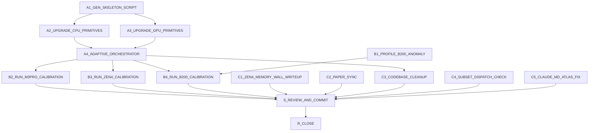

# SPRINT_CALIBRATION_AND_READINESS_DAG

<!--
Live strike board managed by the supervisor-dag skill.
Ephemeral -- DELETE at R_CLOSE. Not design or decisions law.
-->

## Context

Two work streams are merged into one board per explicit user instruction:
this is NOT a fresh start -- the standing production-readiness items
(paper sync, codebase cleanup, subset-dispatch check, Zen4 memory-wall
writeup, PR #7 merge decision) carry over unchanged from `HANDOFF.md`'s
"Next Steps", and the new calibration-methodology work is inserted
alongside them, not instead of them.

### New calibration methodology (this wave)

Both `select_best_B()` (CPU) and `gpu_select_best_B_est()` (GPU) now use
empirical lookup tables instead of summed analytical constants -- but the
CPU table (34 points) and GPU table (32 points) were both built from a
naive rectangular `n` x `k/n`-fraction grid. Agreed direction (user,
2026-07-23), revised after a second round of feedback (same day):

1. **Calibration POINT SET is adaptive; nothing is adaptive at runtime.**
   Runtime dispatch stays pure nearest-neighbor lookup, O(1), no probing,
   no re-timing -- unchanged. Only the *offline* set of calibrated points
   gets built adaptively (skeleton + off-grid validation + refinement),
   never sampled live in production.
2. **Skeleton `n` values biased to 7-smooth numbers** (reuse
   `build_smooth_table()` in `src/gpu/gpu_plan.cu` / `smooth_nums[]` in
   `src/icm.c` directly -- these are exactly the sizes with real
   calibrated FFT timings, so testing at them avoids interpolation noise
   from untested FFT sizes).
3. **Three `k`-anchor categories per skeleton `n`** (revised -- the
   relative-fraction category was too narrow):
   - Tiny, exhaustive: `{2,3,...,16}` (all integers, cheap regardless of n)
   - "Almost-7-smooth" (`k = s-1` for 7-smooth `s`, `16 < k <= 256`) --
     deliberately forces a small nonzero wrap-correction, since real `k`
     values almost never land exactly on a fast FFT size and the old
     grid's exactly-smooth `k` values under-sampled that code path
   - Relative fractions, **now spanning the full range a real tournament
     can be in, not just "typical payout %"**: `{n/12, n/10, n/8, n/6,
     n/4, n/3, n/2, n}`. Rationale (user correction): `n` here is
     *players/payouts remaining at the moment `icm_equity` is called*, not
     the original field size -- late in a tournament, most of the field is
     already eliminated, so `k` (fixed payout count) can be a LARGE
     fraction of the now-much-smaller `n`, up to and including `k=n`
     (min-cash/bubble situations where everyone left is paid something).
     Early-tournament, huge-field, small-percent-paid is the `n/12`..`n/4`
     end; late-tournament, mostly-paid-out is the `n/3`..`n` end. Both are
     real, common call patterns and both need calibration coverage.
4. **Reduced-rep timing**: replace "median-of-N on every candidate" with
   1 rep to rank, confirm-only-if-top-2-within-~3% (2 more reps on just
   those two). User's observation: both platforms show low run-to-run
   noise, so this is a real cost reduction, not a robustness cut, but the
   confirm-if-close step keeps a floor of care.
5. **Adaptive refinement algorithm -- fully specified (this was
   under-specified in the first pass; user flagged it explicitly).**
   Off-grid validation drives refinement, not blind densification, and
   the stopping rule is *convergence-based*, not a fixed point budget:

   ```
   Partition the n-axis into bands, one per skeleton n (band boundary =
   midpoint in log-space to each neighboring skeleton n).
   For each band, independently:
     clean_streak = 0
     probes_in_band = 0
     while clean_streak < CLEAN_STREAK_TARGET (default 25)
           and probes_in_band < MAX_PROBES_PER_BAND (default 150, a safety
           valve, NOT the intended stopping mechanism):
       draw (n, k) stratified-log-uniform within this band, excluding
         points already in the calibration set or already probed
       auto_B  = current_table_lookup(n, k)   # uses ALL points added so far,
                                                # including ones added earlier
                                                # in this same loop
       real_best_B, real_best_ms = narrow_search_near(auto_B, neighbor_B)
       auto_ms = measure(n, k, auto_B)
       gap = (auto_ms - real_best_ms) / real_best_ms
       probes_in_band += 1
       if gap > 0.02:                          # 2% threshold
         add (n, k, real_best_B) to the calibration set NOW (not batched
           at the end) so subsequent probes in this and other bands
           benefit from it immediately
         clean_streak = 0
       else:
         clean_streak += 1
   Stop when every band has independently reached its clean streak target
   (or hit its per-band safety cap). Report per-band probe counts, points
   added, and which bands (if any) hit the safety cap without converging
   (that's a signal the region needs human attention, not just more probes).
   ```

   Key points: (a) the stopping condition is "N consecutive clean probes,"
   not "M points examined" -- exactly the distinction the user drew; (b)
   per-band, not one global counter, so a lucky streak in an easy region
   can't mask a genuinely under-covered region elsewhere (this matters
   specifically because the B200 large-n region is already known to
   behave differently -- see item 6); (c) the safety cap exists purely to
   bound worst-case wall-clock if a region never converges, it is not the
   goal.
6. **B200's large-n region (n=1,048,576 - 1,572,864) showed erratic,
   non-monotonic optimal B (32, then 96/192/112 depending on k)** --
   before adding density there, profile those specific cells (nsight or
   equivalent) the same way `perf stat` diagnosed the Zen4 parallel cliff.
   Precedent: BeBOP/Sparsity's register-blocking search (Demmel/Dongarra/
   Whaley et al., "Self-Adapting Linear Algebra Algorithms and Software",
   2004, section 4.2) hit the identical shape of surprise (best block
   size 4x2, not 8x8, on Itanium2) and their fix was finding the *physical
   variable* that explained it (fill ratio), not just sampling more block
   sizes. Note: their hybrid off-line/run-time formula approach doesn't
   transfer here (motivated by avoiding runtime re-benchmarking cost,
   which doesn't apply -- we calibrate fully offline). If this band's
   clean-streak target is unreachable within the safety cap, that is
   itself a signal worth reporting, not a failure to paper over with more
   probes.
7. **Correction to carry into docs**: `CLAUDE.md`'s crossover-table
   rationale currently cites "ATLAS's AEOS paradigm does the same [size-
   adaptive lookup]" -- checked against the actual paper this session;
   ATLAS's GEMM search tunes register-blocking/unrolling parameters for
   ONE fixed small kernel size and relies on blocking-induced size-
   invariance, it does NOT build a lookup table over problem size the way
   we do. The precise match is BeBOP/Sparsity's register-blocking search
   in the same paper. Fix the citation.
8. **Resumability**: neither `tools/calibrate_best_b.c` nor
   `tools/calibrate_gpu_best_b.cu` currently skip already-computed points
   on restart -- add it (ATLAS precedent: store results incrementally so
   an interrupted search doesn't restart from scratch; directly relevant
   after running an uninterrupted ~35-min B200 sweep with no safety net
   last session).
9. **Apply the same skeleton/refinement methodology to M3 Pro and Zen4
   too** -- no known anomaly on either (unlike B200), so no profiling
   detour needed there, just run the improved methodology directly.
10. **The actual deliverable is ONE simple calibration script per device**,
    modeled on this repo's own `tools/calibrate.c`/`tools/calibrate_full.sh`
    conventions (and on other HPC libraries' single-command calibration
    flows generally) -- a user should be able to run one command per
    device and get a fully-populated, verified `fft_config.h`/
    `gpu_fft_config.h`. The C/CUDA timing binaries (`calibrate_best_b`,
    `validate_best_b`, and their GPU equivalents) are measurement
    *primitives*; a single top-level orchestrator script
    (`tools/calibrate_bselect.py`, shared logic parameterized by device)
    drives skeleton generation, the skeleton sweep, and the full adaptive
    refinement loop above, then injects the final result and re-verifies.
    Don't leave this as several tools a user has to chain by hand.

### Correction: DeepSeek workers CAN use SSH, with real caveats

Earlier version of this board assumed DeepSeek workers are always
network-blocked -- wrong. `deck spawn --allow-network` exists explicitly
for this ("let this worker run ssh/scp/curl/wget/rsync ... use only when
the supervisor has decided this worker legitimately needs to reach a
cloud resource directly"). User's guidance, with a real prior-session
constraint layered on top:

- **Zen4** (rented instance, staying up regardless): fine to delegate
  setup + SSH-based execution to DeepSeek with `--allow-network`.
- **M3 Pro** (this local machine, staying up regardless): user said fine
  to delegate, BUT a documented constraint from a prior session
  (`feedback_deepseek_deck_long_processes.md`) says DeepSeek workers
  reliably **cannot** keep a local background process alive past their
  own session/turn-cap boundary -- even `nohup`/`setsid`-style detachment
  got killed (`Terminated: 15`) when the sandbox tore down, observed
  directly during last week's M3 Pro PATIENT calibration run. This is a
  documented sandbox lifecycle fact, not a guess -- flagging the conflict
  rather than silently picking one: **the long adaptive-refinement RUN on
  M3 Pro is scoped to supervisor** (launched directly via supervisor's own
  backgroundable Bash, immune to Deck teardown); DeepSeek still does the
  bounded setup/skeleton-generation work.
- **B200**: never delegate to DeepSeek, full stop -- confirmed explicitly
  by the user (cost + destructive-action risk).
- **General rule for any long-running execution regardless of platform**:
  a DeepSeek node's job is to do bounded setup/build/kickoff work, verify
  a launch actually succeeded, and then **hand off to supervisor for
  monitoring** rather than sit and wait itself -- matches user's
  instruction ("if a task takes a lot of time, they can still execute
  code, but they should pass to you that you can monitor it for them...
  it's not really trustworthy enough to handle something that risks
  burning fifteen minutes for no outcome"). Supervisor then uses
  `Monitor`/`ScheduleWakeup`, same pattern already used for the B200
  sweeps this session.

## Graph



## Lanes

| Lane | Nodes | Default owner |
|---|---|---|
| calib-tooling | A1_GEN_SKELETON_SCRIPT, A2_UPGRADE_CPU_PRIMITIVES, A3_UPGRADE_GPU_PRIMITIVES, A4_ADAPTIVE_ORCHESTRATOR | deepseek |
| calib-execution | B1_PROFILE_B200_ANOMALY, B4_RUN_B200_CALIBRATION | supervisor (never delegate B200 work) |
| calib-execution | B2_RUN_M3PRO_CALIBRATION | split: deepseek does setup only; supervisor launches + monitors the actual long run (local background-process teardown constraint, see Context) |
| calib-execution | B3_RUN_ZEN4_CALIBRATION | deepseek (`--allow-network`) for setup + kickoff; supervisor monitors the long run once launched |
| readiness | C1_ZEN4_MEMORY_WALL_WRITEUP | supervisor (judgment call: document-as-limitation vs scope-a-fix) |
| readiness | C2_PAPER_SYNC, C3_CODEBASE_CLEANUP, C4_SUBSET_DISPATCH_CHECK | deepseek |
| readiness | C5_CLAUDE_MD_ATLAS_FIX | supervisor (CLAUDE.md is supervisor-only, never delegated) |
| review | S_REVIEW_AND_COMMIT | supervisor |
| close | R_CLOSE | supervisor |

## Conflicts

| Resource | Rule | Nodes touching |
|---|---|---|
| `tools/calibrate_best_b.c`, `tools/validate_best_b.c`, `devices/m3_pro/fft_config.h` | Serialized: A2 must land before A4/B2 | A2, A4, B2 |
| `tools/calibrate_gpu_best_b.cu`, `tools/validate_planner_gpu.cu`, `devices/b200/gpu_fft_config.h` | Serialized: A3 (and B1's findings) must land before A4/B4 | A3, B1, A4, B4 |
| `devices/zen4/fft_config.h` | Serialized: A2 must land before A4/B3 | A2, A4, B3 |
| `tools/calibrate_bselect.py` | Single owner: A4 | A4 |
| Repo-wide comment cleanup (C3) vs. any node still editing source in the same wave | C3 must run in a LATER wave than A2/A3/A4 to avoid touching files those nodes are mid-editing | A2, A3, A4, C3 |
| `CLAUDE.md` | Supervisor-only, never delegated | C5 |
| `~/Documents/ICM_paper` | Separate repo, out of scope for all main-repo nodes except C2 | C2 |
| Tip git commit (main repo) | Supervisor only | S_REVIEW_AND_COMMIT |
| A1/A2/A3/A4/C2/C3/C4 Allowed files (Model: deepseek) | Supervisor Read/Edit denied for the wave | A1, A2, A3, A4, C2, C3, C4 |
| Paid instances (B200, Zen4) | Never start/stop without explicit go-ahead already on record; never terminate Zen4 (standing policy); B200 destroyed immediately after each session | B1, B3, B4 |
| Long-running execution (any platform) | DeepSeek nodes do setup/kickoff + verify launch succeeded, then END their turn and report a monitoring handle (PID + log path) -- they do not wait/poll for completion themselves | B2, B3 |

## Nodes

### [ ] A1_GEN_SKELETON_SCRIPT

- **Model:** `deepseek`
- **Depends:** none (ready now)
- **Allowed files:** `tools/gen_calib_skeleton.py` (new)
- **Task:** Write a shared Python skeleton-generator, parameterized by
  device, that produces the full calibration point list per this board's
  Context section (items 2-3). Concretely:
  1. Reuse the EXACT smooth-number logic already in the codebase --
     port `build_smooth_table()` (`src/gpu/gpu_plan.cu`, lines ~49-65) for
     GPU and the 7-smooth generation in `build_fftw_size_table()`
     (`src/icm.c`, search "smooth_nums") for CPU -- do not reimplement
     from scratch, copy the exact algorithm so the skeleton always uses
     numbers that match real calibrated FFT sizes.
  2. Given `(lo, hi, ratio)`, pick the skeleton `n` values by snapping
     each log-spaced target to the nearest 7-smooth number (log-distance,
     not linear-distance).
  3. For each skeleton `n`, emit the full k-anchor set: `{2..16}` union
     `{s-1 : s 7-smooth, 16 < s-1 <= 256, s-1 <= n}` union
     `{n/12, n/10, n/8, n/6, n/4, n/3, n/2, n}` (dedupe, drop k > n or
     k < 1). Note `k=n` is intentionally included (see Context item 3 --
     represents near-bubble/min-cash tournament states).
  4. CLI: `python3 tools/gen_calib_skeleton.py --device {m3_pro,zen4,b200}
     --lo <n> --hi <n> --ratio <float> > skeleton_<device>.csv` with
     columns `n,k`.
  5. ALSO emit, for use by A4, the log-space band boundaries between
     consecutive skeleton `n` values (midpoint in log-space) as a second
     output file `bands_<device>.csv` (columns: `band_id, n_lo, n_hi,
     skeleton_n`) -- A4's per-band adaptive loop needs these.
  6. Reference skeleton parameters already worked out this session (put
     these in the script's `--help`/defaults, don't re-derive): CPU
     `lo=256 hi=131072 ratio=1.6` (~14 n-anchors, matches
     `smooth_nums[]`'s actual 131072 cap); GPU `lo=1024 hi=4194304
     ratio=1.8` (~15 n-anchors, reaches the published 1.5M+ frontier).
- **Exit criteria:** script runs standalone (no build dependencies beyond
  python3), produces a skeleton CSV and a bands CSV for both
  `m3_pro`/`zen4` (identical smooth-number source, same skeleton) and
  `b200` params above; every emitted `n` is independently verified
  7-smooth (script includes a self-check); point counts roughly match the
  estimates above (CPU ~14 n x ~45-50 valid k after the k-anchor
  expansion, GPU ~15 n x ~50-55 valid k)
- **Kill deadline:** 30 min

### [ ] A2_UPGRADE_CPU_PRIMITIVES

- **Model:** `deepseek`
- **Depends:** A1_GEN_SKELETON_SCRIPT
- **Allowed files:** `tools/calibrate_best_b.c`, `tools/validate_best_b.c`
- **Task:** These become measurement *primitives* called by A4's
  orchestrator -- not end-user-facing tools themselves.
  1. `calibrate_best_b.c`: accept a point-list CSV (path via CLI arg,
     format from A1) instead of the current hardcoded grid; for each
     `(n,k)`, keep the existing full sweep over `{8,16,24,32,48,64}`
     (small candidate list, brute force is fine) but replace "median of 7
     reps on every candidate" with: 1 rep per candidate to rank, then 2
     more reps ONLY on the top-2 if within ~3% of each other (read the
     existing median-of-7 logic first to match conventions exactly --
     payout formula, Q=256, srand(42), etc. must stay identical, only the
     rep/candidate-search strategy changes). Add a `--narrow-around
     B1,B2,...` flag: when given, only test the listed B values (plus
     their immediate neighbors in the candidate list) instead of the full
     sweep -- this is what A4 uses for single-point refinement additions,
     where a full sweep is unnecessary since a nearby point's answer is
     already a strong prior.
  2. Add resumability: before starting, read any existing partial output
     CSV at the target path and skip `(n,k)` rows already present; append
     rather than overwrite.
  3. `validate_best_b.c`: change from a fixed hand-picked grid to a
     single-point-probe mode: given ONE `(n,k)` via CLI args and the
     CURRENT `fft_config.h` (or a path to an in-progress candidate table),
     report `auto_B, auto_ms, best_B, best_ms, gap_pct` on one machine-
     readable line to stdout. This is the "oracle" A4's adaptive loop
     calls per probe -- it needs to be callable one point at a time, fast,
     with parseable output, not a batch report.
  4. Do NOT touch `devices/m3_pro/fft_config.h` or `devices/zen4/
     fft_config.h` -- this node only changes the tools, not calibrated
     data. Do not run these tools against real hardware as part of this
     node beyond a tiny syntax/smoke check to confirm they build and the
     single-point-probe output format is well-formed.
- **Exit criteria:** both tools compile cleanly (`gcc -O3 -march=native
  -Isrc -Idevices/m3_pro -I/opt/homebrew/include -o /tmp/cb_test
  tools/calibrate_best_b.c src/icm.c -L/opt/homebrew/lib -lfftw3 -lm
  -framework Accelerate` and equivalent for validate_best_b.c);
  resumability demonstrated on a tiny synthetic partial-CSV; single-point
  probe output format documented in the report (exact column order/units)
  since A4 depends on parsing it exactly
- **Kill deadline:** 60 min

### [ ] A3_UPGRADE_GPU_PRIMITIVES

- **Model:** `deepseek`
- **Depends:** A1_GEN_SKELETON_SCRIPT
- **Allowed files:** `tools/calibrate_gpu_best_b.cu`,
  `tools/validate_planner_gpu.cu`
- **Task:** Same shape as A2, GPU side:
  1. `calibrate_gpu_best_b.cu`: read the GPU skeleton CSV from A1 instead
     of the hardcoded `n_grid`/`k_grid` loops. Keep the existing candidate
     subset (`{16,24,...,1536}`) for skeleton points (full sweep, small
     space, brute force fine) but replace "median of 3 reps on every
     candidate" with the same 1-rep-rank + confirm-if-close-top-2 scheme
     as A2. Add the same `--narrow-around` flag for single-point
     refinement additions (used by A4).
  2. Add resumability identically to A2 (skip already-computed rows in
     the target output CSV on restart).
  3. `validate_planner_gpu.cu`: change to the same single-point-probe
     mode as A2's `validate_best_b.c` -- given ONE `(n,k)` via CLI args,
     output `auto_B, auto_ms, best_B, best_ms, gap_pct` on one line. This
     is the oracle A4 calls per GPU probe.
  4. Do NOT touch `devices/b200/gpu_fft_config.h`. This node has no CUDA
     toolchain available to build/run against (no GPU on this machine) --
     supervisor will build and smoke-test on the real B200 in B4. Confirm
     via `gcc`/syntax inspection only that changes are structurally sound
     (matching includes, no obvious type errors); be explicit in the
     report that a real B200 build/run is still needed before trusting
     this, don't claim a successful build you couldn't actually run.
- **Exit criteria:** diffs are structurally consistent with existing file
  conventions (same includes, same `icm_gpu.h`-only pattern); CLI argument
  parsing demonstrated via a dry run that just prints parsed args (no CUDA
  calls needed); single-point probe output format documented exactly in
  the report (A4 depends on parsing it)
- **Kill deadline:** 60 min

### [ ] A4_ADAPTIVE_ORCHESTRATOR

- **Model:** `deepseek`
- **Depends:** A1_GEN_SKELETON_SCRIPT, A2_UPGRADE_CPU_PRIMITIVES,
  A3_UPGRADE_GPU_PRIMITIVES
- **Allowed files:** `tools/calibrate_bselect.py` (new)
- **Task:** This is the actual end-user deliverable -- one command per
  device, matching this repo's existing `tools/calibrate_full.sh`
  simplicity convention. Implement the full algorithm from this board's
  Context item 5, verbatim:
  1. CLI: `python3 tools/calibrate_bselect.py --device {m3_pro,zen4,b200}
     [--clean-streak-target 25] [--max-probes-per-band 150]
     [--gap-threshold 0.02]`.
  2. Call A1's skeleton generator to get the skeleton + bands CSVs.
  3. Call the appropriate device's `calibrate_best_b`/`calibrate_gpu_best_b`
     binary (built by the caller -- this script assumes the binaries
     already exist at a path given via `--calibrate-bin`/`--validate-bin`
     CLI args, it does not compile anything itself) on the full skeleton
     to get the base table.
  4. Inject the base table into the device's `fft_config.h`/
     `gpu_fft_config.h` (reuse the injection logic pattern from
     `/tmp` scratch script `inject_gbselect.py` used earlier this session
     if accessible, otherwise reimplement equivalently -- array format
     must match exactly what `empirical_best_B()`/`gpu_empirical_best_B()`
     read).
  5. Implement the per-band adaptive loop exactly as specified in
     Context item 5: stratified-log-uniform probe drawing within each
     band (excluding already-tested points), call the validate binary in
     single-point mode as the oracle, on gap > threshold call the
     calibrate binary with `--narrow-around` for just that point and
     re-inject into the table IMMEDIATELY (so later probes in this and
     other bands see the updated table), track clean-streak per band
     independently, stop each band on (clean-streak target reached) OR
     (per-band probe cap hit) -- report clearly which outcome occurred
     per band.
  6. Final step: re-inject the complete final table, print a summary
     (per-band probe counts, points added, any bands that hit the safety
     cap without converging).
  7. This script does NOT itself rebuild the C library or run
     `bench_grid verify` / `bench_gpu_fused verify` -- that's the calling
     node's (B2/B3/B4's) job, after this script exits.
- **Exit criteria:** script runs end-to-end against a tiny synthetic
  fake-binary stand-in (a trivial shell script that returns canned
  `auto_B,auto_ms,best_B,best_ms,gap_pct` values) to prove the control
  flow (band partitioning, clean-streak tracking, immediate re-injection,
  per-band independent stopping) is correct without needing real
  hardware; report includes the synthetic test transcript
- **Kill deadline:** 60 min

### [ ] B1_PROFILE_B200_ANOMALY

- **Model:** `supervisor`
- **Depends:** none (ready now, independent of A-lane)
- **Allowed files:** none (read/execute only, paid remote instance)
- **Task:** Rent a B200 instance (same class as prior sessions, ~$6.89/hr,
  CUDA 12.8 devel image). Rebuild `gpu_sample_plans`/`validate_planner_gpu`
  from the CURRENT committed code (pre-A3, since A3 may not have landed
  yet) and profile the specific cells that showed erratic B
  (n=1,048,576 through 1,572,864, all four k-fractions at n=1,572,864) with
  `nsight compute`/`ncu` (or `nvprof` if `ncu` unavailable on the image) --
  look specifically at occupancy, VRAM/memory-throughput, and kernel
  launch-count/overhead metrics across the candidate B values that won at
  each point (32, 96, 192, 112) vs. the ones that lost, to find what
  physically distinguishes them (mirrors how `perf stat` explained the
  Zen4 parallel cliff via IPC/cache-miss-rate). Destroy the instance
  immediately after downloading the profiling output, regardless of
  whether A3 has landed by then (if it's an efficient combined session,
  fine to also run B4's calibration pass in the same rental -- see B4).
- **Exit criteria:** a concrete physical explanation (or a documented
  "inconclusive, here's what was ruled out") for why B=96/192/112 win at
  n=1,572,864 instead of the B=64 that dominates everywhere smaller;
  written up in this board's context for R_CLOSE to fold into HANDOFF.md
- **Kill deadline:** 45 min of paid instance time

### [ ] B2_RUN_M3PRO_CALIBRATION

- **Model:** split -- see sub-steps below
- **Depends:** A4_ADAPTIVE_ORCHESTRATOR
- **Allowed files:** `devices/m3_pro/fft_config.h`, plus scratch CSV/log
  output files in the repo root

- **Sub-step (a) -- Model: `deepseek`.** Setup only, bounded turn budget:
  build `calibrate_best_b`/`validate_best_b` locally, `cp
  devices/m3_pro/fftw_wisdom.dat fftw_wisdom.dat` (mandatory -- past
  incident this session, wisdom silently degrades if skipped), record the
  wisdom file's byte count for later comparison, then STOP -- do not
  invoke `tools/calibrate_bselect.py` itself. Report back: binary paths,
  confirmed build success, wisdom byte count baseline.

- **Sub-step (b) -- Model: `supervisor`.** Launch the actual adaptive run
  directly (per this board's Context section on the documented DeepSeek
  local-background-process teardown constraint): `python3
  tools/calibrate_bselect.py --device m3_pro ...` via supervisor's own
  Bash tool with `run_in_background`, monitored via `Monitor`/
  `ScheduleWakeup` exactly as done for the B200 sweeps this session. After
  it completes: verify the wisdom file's byte count is unchanged from
  sub-step (a)'s baseline; rebuild; run `./bench_grid verify` -- must show
  ALL TESTS PASSED.

- **Exit criteria:** `bench_grid verify` passes; `fft_config.h`'s bselect
  tables reflect the new skeleton+refinement point set (report final
  point count, per-band outcomes from A4's summary); wisdom file verified
  unchanged
- **Kill deadline:** sub-step (a) 20 min; sub-step (b) budget generously,
  90-120 min given the expanded k-anchor set (more points than last
  session's 34)

### [ ] B3_RUN_ZEN4_CALIBRATION

- **Model:** `deepseek` with `--allow-network` for setup + kickoff;
  supervisor takes over monitoring once launched (see below)
- **Depends:** A4_ADAPTIVE_ORCHESTRATOR
- **Allowed files:** none additional (executes on remote Zen4 box via SSH)
- **Task:** Box `185.8.107.239` (see `reference_zen4_new_password.md`
  memory) is already up with AOCL-FFTW built from this session's Zen4
  parallel-cliff investigation.
  1. SSH in, sync A4's orchestrator + A2's upgraded primitives, build
     `calibrate_best_b`/`validate_best_b` there, copy wisdom, verify byte
     count baseline (same mandatory safety steps as B2).
  2. Launch `tools/calibrate_bselect.py --device zen4 ...` on the REMOTE
     box as a genuinely detached process: `nohup ... < /dev/null >
     calib.log 2>&1 &` over SSH, then **explicitly verify detachment
     succeeded** before ending this node's turn -- e.g. disconnect and
     reconnect the SSH session and confirm the process is still running
     and the log file is still growing. This is a different, safer
     mechanism than local backgrounding (the process lives on a separate
     machine, independent of this worker's own session lifetime), but
     verify it anyway rather than assuming.
  3. Report back to supervisor: remote PID, log file path, confirmed-
     detached status. Do NOT wait for the calibration run to finish --
     end this node's turn once detachment is verified. Supervisor takes
     over monitoring via `Monitor`/`ScheduleWakeup`.
  4. Do NOT investigate or attempt to fix the parallel-scaling memory-
     bandwidth wall as part of this node -- that's C1, separately scoped.
- **Exit criteria (sub-step a, deepseek):** remote build succeeds, wisdom
  copied + baseline recorded, orchestrator launched and independently
  verified still running after an SSH disconnect/reconnect cycle, PID +
  log path reported
- **Exit criteria (sub-step b, supervisor, after handoff):** calibration
  completes (or a band hits its safety cap, reported); `devices/zen4/
  fft_config.h` updated; wisdom byte count re-verified unchanged; rebuild;
  `bench_grid verify` ALL TESTS PASSED
- **Kill deadline:** sub-step (a) 30 min (deepseek); sub-step (b) 90-120
  min (supervisor, monitored)

### [ ] B4_RUN_B200_CALIBRATION

- **Model:** `supervisor`
- **Depends:** A4_ADAPTIVE_ORCHESTRATOR, B1_PROFILE_B200_ANOMALY
- **Allowed files:** none additional (executes on remote paid instance)
- **Task:** Using B1's findings to decide whether/how to proceed in the
  erratic large-n region (if B1 finds a VRAM/occupancy explanation, that
  may inform whether more sample density there is even useful, or whether
  the region needs a different kind of fix entirely). Rent a B200
  instance (reuse the same rental as B1 if still efficient back-to-back),
  build A3's upgraded primitives, run `tools/calibrate_bselect.py --device
  b200 ...`. Inject final result into `devices/b200/gpu_fft_config.h`'s
  `gbselect_n[]`/`gbselect_k[]`/`gbselect_B[]`. Rebuild, re-run
  `validate_planner_gpu` to confirm match rate, run `bench_gpu_fused
  verify` for correctness. Destroy the instance immediately after.
- **Exit criteria:** `validate_planner_gpu` match rate reported (compare
  against this session's 12/12 baseline on the OLD narrower grid);
  per-band adaptive-loop outcomes reported, especially whether the known
  erratic n=1,048,576-1,572,864 bands converged or hit their safety cap;
  `bench_gpu_fused verify` all PASS; instance destroyed, confirmed via
  `vastai show instances`
- **Kill deadline:** 90 min of paid instance time (budget ~$10-13 given
  the larger skeleton + adaptive refinement pass vs. last session's flat
  32-point sweep)

### [ ] C1_ZEN4_MEMORY_WALL_WRITEUP

- **Model:** `supervisor`
- **Depends:** none (ready now)
- **Allowed files:** `HANDOFF.md`, `RESULTS.md` (Zen4 section only)
- **Task:** Judgment call, not delegated: decide whether the confirmed
  memory-bandwidth/cache-capacity wall at n>=16384 (parallel speedup
  collapses from ~10-14x to ~3.3-5x, root-caused via `perf stat` this
  session) gets (a) documented plainly as a known, real scaling limit in
  `RESULTS.md`'s Zen4 section, or (b) scoped as a fix attempt (reducing
  the hybrid engine's per-thread memory footprint at large n). Default
  recommendation carried over from `HANDOFF.md`: document it, since a
  footprint-reduction fix is a nontrivial separate undertaking with
  unclear payoff. Write up whichever is decided.
- **Exit criteria:** `RESULTS.md`'s Zen4 section accurately reflects the
  decision; if documenting-only, includes the actual root-cause finding
  (IPC/cache-miss data) rather than a vague "known limitation" note
- **Kill deadline:** 20 min

### [ ] C2_PAPER_SYNC

- **Model:** `deepseek`
- **Depends:** none (ready now) -- workspace: `~/Documents/ICM_paper`
- **Allowed files:** everything under `~/Documents/ICM_paper` (separate
  repo, no remote)
- **Task:** Full paper sync, all items from `HANDOFF.md`'s standing "Next
  Steps" item 3, unchanged: rework Table 1/2 to use post-fix numbers from
  the regenerated `results/bench_grid_*.txt`; recompute the real
  dispatch-accuracy figure (replacing the stale "95.5%" claim -- pull
  real numbers from `bench_grid crossover` matching the committed
  crossover tables); strip all 21 LaTeX em-dashes (`---`) to standard
  academic style; rewrite the cost-model/dispatch description sections to
  describe the empirical-table mechanism (not the old summed-analytical
  formula) -- there are roughly a dozen locations, search systematically
  rather than assuming a fixed count. ALSO fix the ATLAS citation
  (`\citep{whaley1998}` context around line ~1189, and the survey mention
  at line ~167): ATLAS's actual mechanism (register-blocking/unrolling
  parameter search for one fixed small kernel size, relying on blocking-
  induced size-invariance) is NOT the same as our size-indexed empirical
  lookup table -- if a precise analogy is wanted, BeBOP/Sparsity's
  register-blocking search (same Demmel/Dongarra/Whaley et al. 2004
  paper, section 4.2) is the closer match; otherwise just remove the
  overstated parallel rather than leave it inaccurate. Recompile the PDF,
  copy into `paper/icm_paper.pdf` in the main ICM repo per the established
  convention. If the wider calibration work (A/B lanes) has landed by the
  time this runs, prefer citing the FINAL post-refinement numbers; if not,
  use the current committed numbers and flag in the report that a
  follow-up pass may be needed once B2/B3/B4 land.
- **Exit criteria:** PDF recompiles cleanly; 0 em-dashes remain; no
  reference to "95.5%" or other pre-fix dispatch-accuracy claims; cost-
  model sections accurately describe the empirical-table mechanism; ATLAS
  citation corrected or removed; `paper/icm_paper.pdf` updated in the main
  repo
- **Kill deadline:** 90 min

### [ ] C3_CODEBASE_CLEANUP

- **Model:** `deepseek`
- **Depends:** A2_UPGRADE_CPU_PRIMITIVES, A3_UPGRADE_GPU_PRIMITIVES,
  A4_ADAPTIVE_ORCHESTRATOR (sequencing only, to avoid touching files those
  nodes are mid-editing -- not a logical dependency)
- **Allowed files:** `src/**`, `tools/**`, `bench/**` (repo-wide comment
  pass; exclude `devices/**/*.h` data files and anything under
  `~/Documents/ICM_paper`)
- **Task:** Remove stray/AI-tell comments repo-wide per this project's
  CLAUDE.md conventions (no comments explaining WHAT code does when
  identifiers already say it; no references to "this session's fix" or
  similar task-framing that will rot; keep only comments explaining
  non-obvious WHY -- hidden constraints, subtle invariants, workarounds).
  Read CLAUDE.md's comment guidance first. This is a broad pass -- work
  file-by-file, don't touch logic, only comments/dead code obviously left
  over from iteration (e.g. commented-out old approaches).
- **Exit criteria:** `bench_grid verify` still passes (comment-only
  changes shouldn't affect behavior, but verify anyway); spot-check by
  the supervisor of a sample of changed files before trusting the full
  diff
- **Kill deadline:** 60 min

### [ ] C4_SUBSET_DISPATCH_CHECK

- **Model:** `deepseek`
- **Depends:** none (ready now)
- **Allowed files:** none (read/investigate only; report findings, no
  code changes in this node)
- **Task:** `icm_select_engine_ex()`/`select_best_B()`'s subset-query path
  (`n_targets > 0`) still uses the old analytical formula, never measured
  this session. Investigate whether it's actually wrong: write a small
  throwaway diagnostic (matching `validate_best_b.c`'s established
  methodology -- median-of-N reps, real `icm_equity_subset()` calls, NOT
  hardcoded engine/B values) that compares the analytical formula's
  choice against real measured timing at a handful of representative
  `(n, k, n_targets)` points. Do not modify `src/icm.c` in this node --
  report only.
- **Exit criteria:** a clear verdict -- "subset dispatch is measurably
  wrong by X%, same failure mode as the fixed full-equity bugs" or "subset
  dispatch matches real timing within noise, no fix needed" -- backed by
  real numbers, not a guess
- **Kill deadline:** 45 min

### [ ] C5_CLAUDE_MD_ATLAS_FIX

- **Model:** `supervisor`
- **Depends:** none (ready now, runs in parallel)
- **Allowed files:** `CLAUDE.md`
- **Task:** `CLAUDE.md`'s "Dispatch rule" section (~line 82) currently
  says "ATLAS's AEOS paradigm does the same [empirical measurement
  instead of modeling]" -- true in the general "measure, don't model"
  sense but imprecise for the specific size-indexed-lookup-table
  mechanism, which ATLAS's GEMM search doesn't do (see this board's
  Context, item 7). Tighten the wording so it doesn't overstate the
  parallel -- either drop the size-lookup-specific framing around the
  ATLAS mention, or add the more precise BeBOP/Sparsity register-blocking
  analogy alongside it.
- **Exit criteria:** `CLAUDE.md`'s ATLAS reference no longer implies
  ATLAS does size-indexed lookup-table dispatch
- **Kill deadline:** 15 min

### [ ] S_REVIEW_AND_COMMIT

- **Model:** `supervisor`
- **Depends:** B2_RUN_M3PRO_CALIBRATION, B3_RUN_ZEN4_CALIBRATION,
  B4_RUN_B200_CALIBRATION, C1_ZEN4_MEMORY_WALL_WRITEUP, C2_PAPER_SYNC,
  C3_CODEBASE_CLEANUP, C4_SUBSET_DISPATCH_CHECK, C5_CLAUDE_MD_ATLAS_FIX
- **Allowed files:** none additional (review + commit only)
- **Exit criteria:**
  - Review every diff line-by-line before committing, including the
    tooling upgrades (A1-A4) even though they landed in an earlier wave
    -- established discipline this whole project, do not trust "success"
    reports at face value (concrete precedent: a DeepSeek worker's
    `calibrate_full.sh` edit this session omitted `src/icm.c` from a
    build command, a real link-breaking bug caught only by actually
    compiling it)
  - Specifically re-verify A4's control-flow claims against real
    hardware output (not just its synthetic-binary test), since the
    per-band clean-streak logic is the crux of the whole approach
  - `bench_grid verify` passes on both CPU platforms after B2/B3's
    fft_config.h changes
  - `bench_gpu_fused verify` passes after B4's gpu_fft_config.h change
  - If C4 found the subset-dispatch path is measurably wrong, this is
    reported but NOT auto-fixed -- that's new scope requiring its own
    node/decision, flag it for R_CLOSE rather than silently expanding
  - Commit and push (separate commits per logical change, not one giant
    commit -- matches this session's established pattern)
- **Kill deadline:** 60 min

### [ ] R_CLOSE

- **Model:** `supervisor`
- **Depends:** S_REVIEW_AND_COMMIT
- **Allowed files:** `HANDOFF.md`, this board
- **Exit criteria:** `HANDOFF.md` updated with:
  - The widened/adaptive calibration methodology and its results on all
    three platforms (final point counts per band, any bands that hit
    their safety cap without converging)
  - B1's physical explanation (or non-finding) for the B200 large-n
    irregularity
  - Whether C4 found the subset-dispatch path needs the same fix (as a
    new, explicitly-scoped Next Step if so, not silently dropped)
  - The Zen4 memory-wall decision (documented vs. fix-scoped) and its
    outcome
  - Paper sync status, codebase cleanup status
  - The standing, still-unresolved item: decide with the user whether to
    merge PR #7 -- carried forward unchanged, never auto-decided
  - Board deleted, no stale `.dag-active-lock.json`

## Wave log

| Wave | Nodes dispatched | Deny lock written at | Deny lock released at | Notes |
|------|------------------|----------------------|-----------------------|-------|
| W0 | A1, B1, C1, C2, C4, C5 | | | A1/C2/C4 are deepseek (lock needed); B1/C1/C5 are supervisor (no lock) |
| W1 | A2, A3 | | | depends on A1 |
| W2 | A4 | | | depends on A2, A3 |
| W3 | B2(a), B3(a), C3 | | | deepseek setup sub-steps; depends on A4 |
| W4 | B2(b), B3(b), B4 | | | supervisor-run long calibration passes; depends on W3 sub-steps (and B1 for B4) |
