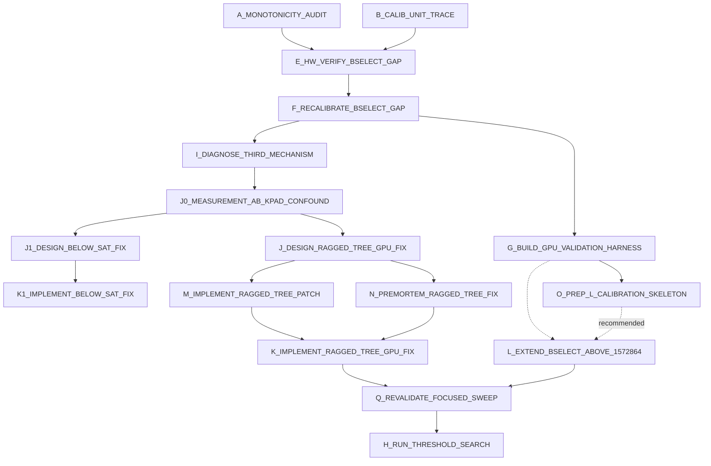

# SPRINT_GPU_MONOTONICITY_DAG

<!--
Live strike board managed by the supervisor-dag skill.
Ephemeral — DELETE at R_CLOSE. Not design or decisions law.
-->

Scope: the GPU non-monotonicity investigation arc, post-fix. Two nodes
below (A, B) were already dispatched and completed via direct `deck spawn`
calls before this board existed -- logged here retroactively for a clean
audit trail, per user correction that this should have been tracked on a
board from the start. Everything from here forward goes through the
board properly.

## Graph

**Parallel wave now dispatching** (all `Model: deepseek`, no GPU cost, no
interdependency between them -- M/N both read the SAME frozen design doc
independently, O reads G's already-committed findings): M, N, O run
concurrently. K then depends on BOTH M and N (supervisor applies M's
diff only after grading it against N's independent checklist). L can
proceed once G's findings exist, with O's skeleton as a (recommended,
non-blocking) efficiency booster. Q is the single re-validation gate
before H.

## Lanes

| Lane        | Nodes                              | Default owner |
|-------------|---------------------------------------|----------------|
| audit       | A_MONOTONICITY_AUDIT (done, logged)    | deepseek       |
| audit       | B_CALIB_UNIT_TRACE (done, logged)      | deepseek       |
| hw-verify   | E_HW_VERIFY_BSELECT_GAP                | supervisor     |
| calibration | F_RECALIBRATE_BSELECT_GAP              | supervisor     |
| tooling     | G_BUILD_GPU_VALIDATION_HARNESS         | deepseek       |
| below_sat   | I, J0, J1, K1 (all done)               | mixed          |
| ragged-tree | J (done), M, N (parallel wave), K      | mixed          |
| bselect-ext | O (parallel wave), L                   | mixed          |
| gate        | Q_REVALIDATE_FOCUSED_SWEEP             | supervisor     |
| land        | H_RUN_THRESHOLD_SEARCH                 | supervisor     |

## Conflicts

| Resource                                       | Rule                                          | Nodes touching |
|--------------------------------------------------|--------------------------------------------------|-----------------|
| B200 instance (real money, one at a time)        | Serialized, supervisor-only rental decisions     | E, F, H, K, L, Q |
| `devices/b200/gpu_fft_config.h`                  | Supervisor only, after real hardware confirmation | F, L           |
| New GPU validation harness tool (path TBD)       | G only                                            | G               |
| `src/gpu/gpu_plan.cu`, `gpu_exec.cu`, `gpu_kernels.cu`, `gpu_internal.h` | M only for the M/N/O wave (deny-locked); supervisor applies after grading against N | M, K |
| `scripts/gpu_ragged_tree_fix_premortem.md`       | N only (new file)                                | N               |
| `scripts/l_bselect_extension_prep.md` / skeleton CSV | O only (new files)                           | O               |

## Nodes

### [x] A_MONOTONICITY_AUDIT

- **Model:** `deepseek`
- **Depends:** none
- **Allowed files:** (as dispatched) `scripts/analyze_fftsize_bug_blast_radius.py`,
  read-only over `src/gpu/gpu_plan.cu`, `devices/b200/gpu_fft_config.h`,
  `scripts/b200_nonmono_debug_20260726.txt`, `scripts/b200_fix_verified_20260726.txt`,
  `scripts/threshold_search_gpu.cu`, `results/gpu_heatmap_b200.csv`.
- **Status:** DONE (dispatched without a board -- retroactively logged).
  Found the B-selection sparse-grid cliff at n≈1,285,000 (B jumps
  32→96-192). Did NOT reproduce the user's specific "n≈999k→n≈1.05M,
  1000ms→500ms" live observation exactly, but found the underlying
  mechanism (B-selection cliff) independently and correctly via direct
  table inspection. Also claimed a GPU calibration "microseconds
  mislabeled as nanoseconds" unit bug -- **this claim was WRONG**, refuted
  by node B below. Supervisor reviewed the surviving finding (B-selection
  gap) against the raw `gbselect_*` table directly -- confirmed real.

### [x] B_CALIB_UNIT_TRACE

- **Model:** `deepseek`
- **Depends:** none (ran after A, in response to A's unit claim)
- **Allowed files:** read-only over `tools/calibrate_gpu.cu`,
  `tools/calibrate_gpu_best_b.cu`, `tools/calibrate_block_size.py`,
  `tools/calibrate.c`, `src/gpu/gpu_api.cu`, `src/gpu/gpu_plan.cu`,
  `devices/b200/gpu_fft_config.h`, `devices/m3_pro/fft_config.h`.
- **Status:** DONE. Traced the full measurement path and found
  `icm_gpu_measure_fused_pair_ns()` (`gpu_api.cu:747-748`) correctly
  divides the batched measurement by batch count before storing --
  supervisor independently verified this exact line against the live
  file. **Refutes node A's unit-bug claim.** Confirmed CPU calibration
  never batches, so no analogous risk exists there. Attributed the
  earlier "3-4 orders of magnitude" prediction-vs-hardware gap to an
  approximation error in the Python simulation scripts, not the
  production C++ cost model. Also scoped the B-selection densification
  fix as achievable with existing tooling (`calibrate_gpu_best_b`'s
  narrow-around resume mode), ~3-16 min of B200 time for ~8 new points.

### [x] E_HW_VERIFY_BSELECT_GAP

- **Model:** `supervisor`
- **Depends:** A_MONOTONICITY_AUDIT, B_CALIB_UNIT_TRACE
- **Allowed files:** none (measurement only, no source edits this node)
- **Exit criteria:** on a real B200 rental, confirm whether the
  B-selection cliff near n≈1,048,576-1,572,864 causes an ACTUAL wall-
  clock inversion (not just a simulated one) on the `k=n` and/or `k=100`
  curves. A handful of targeted points (e.g. n=1,100,000; n=1,285,000;
  n=1,450,000 at both curve's respective k) via a small extension of
  `remeasure_nonmono.cu`-style tooling, reps>=5 each. Record real numbers
  either way -- confirming "no real inversion" is also a valid, useful
  outcome, not a failure.
- **Kill deadline:** budget alongside F below in one rental if confirmed.
- **Binding law:** HANDOFF.md's B-selection gap section.
- **Status:** DONE (2026-07-26, third B200 rental, contract `45932804`,
  user-approved). Real inversion confirmed on BOTH curves (not just
  simulated): k=n curve n=1,100,000 (1183.3ms) slower than n=1,285,000
  (1141.4ms); k=100 curve n=1,100,000 (181.3ms) slower than n=1,285,000
  (121.3ms). Root cause confirmed compound: B-selection nearest-neighbor
  cliff + a tree-depth power-of-2 boundary crossing (L=16->17) at the
  same point, both confirmed via `ICM_GPU_DEBUG_PLAN=1`. See HANDOFF.md
  "Third B200 rental" section for full detail.

### [x] F_RECALIBRATE_BSELECT_GAP

- **Model:** `supervisor`
- **Depends:** E_HW_VERIFY_BSELECT_GAP (only if E confirms a real
  inversion -- skip if E finds no real hardware effect)
- **Allowed files:** `devices/b200/gpu_fft_config.h` (gbselect_* section
  only -- do not touch the FFT timing tables while re-injecting)
- **Exit criteria:** new calibration anchor points added in the
  n=1,048,576-1,572,864 gap via `tools/gen_calib_skeleton.py` +
  `tools/calibrate_gpu_best_b.cu` (narrow-around mode) +
  `tools/calibrate_block_size.py` injection. Re-run `bench_gpu_fused
  verify` + spot-check E's points afterward to confirm the cliff is
  closed.
- **Kill deadline:** ~20 min B200 time (per B_CALIB_UNIT_TRACE's
  estimate).
- **Binding law:** do NOT hand-edit B values to force monotonicity --
  only real added calibration measurements are acceptable.
- **Status:** DONE for the two gaps tested, but NOT a full guarantee of
  monotonicity everywhere (2026-07-26). n=1,048,576-1,572,864 gap: 3 new
  anchors (n=1,150,000/1,285,000/1,420,000) added via real
  `calibrate_gpu_best_b --narrow-around` measurement (best_B=48-80, not
  the naive 32-or-96+ nearest-neighbor cliff), 32->44 points, rebuilt,
  `bench_gpu_fused verify` 36/0, re-measured: both curves now fully
  monotonic across this gap. A SECOND gap at n=524,288-1,048,576 (same
  mechanism, one B step down) was found while spot-checking and also
  fixed (3 more anchors, 44->47 points, verify still 36/0) -- but a
  re-measurement afterward found ONE inversion still remaining there
  (n=1,000,000 vs n=1,048,576, same B/L/nblocks yet ~24% timing gap) that
  is NOT the B-selection cliff and is NOT yet understood -- see HANDOFF.md
  "Third B200 rental" section, item 2. **Also found and fixed A REAL BUG
  in `tools/calibrate_block_size.py`** (the orchestrator meant to make
  this reproducible for future devices/users): Step 2/3 unconditionally
  discarded the ENTIRE existing calibration table on every run, which
  would have silently reverted both fixes above the next time anyone ran
  it. Fixed with a merge instead of overwrite (`read_existing_table()` +
  seed-then-merge), verified locally via a round-trip test against the
  real committed header (no GPU needed for this part). CSVs and ad-hoc
  probe tools from this session kept at `scripts/b200_session_20260726/`
  for provenance.

### [x] G_BUILD_GPU_VALIDATION_HARNESS

- **Model:** `deepseek`
- **Depends:** none (can run in parallel with E/F, no B200 needed to draft)
- **Allowed files:** create a new tool under `scripts/` or `tools/` (path
  TBD by the node) implementing HANDOFF.md Next Steps item 3: a GPU
  analogue of `./bench_grid crossover` that, across a grid of (n,k)
  points, runs the actual dispatched configuration AND brute-forces
  nearby alternatives on real hardware, flagging any point where the
  dispatched choice isn't actually fastest.
- **Exit criteria:** tool written and reviewed (supervisor line-by-line,
  same standing practice), ready to run on the next rental. Does not need
  to run this sprint.
- **Kill deadline:** 30 min.
- **Binding law:** HANDOFF.md Next Steps item 3.
- **Status:** RUN, twice (2026-07-26). First run (contract `45958264`)
  completed cleanly in ~9 minutes but produced a MEANINGLESS Phase 1
  (B-optimality) result: a real bug found in the tool itself --
  `icm_gpu_plan_summary()` returns 1 on success/0 on failure (confirmed
  against `gpu_api.cu`), but `measure_at_b()`'s check was inverted
  (`== 0` instead of `!= 0`), so `dispatched_B` was never actually
  updated from its initial value of 0. That silently broke
  `nearby_alternatives()` (candidates collapsed to nothing), making
  every single B-optimality check hit the vacuous "no valid alternatives
  to test" path -- confirmed directly: all 41 points showed "dispatched
  B=0" and 41/41 "no valid alternatives", not real comparisons. **Fixed**
  (one-line condition fix, `scripts/gpu_dispatch_validate.cu`, committed).
  Phase 2 (n-monotonicity) was NOT affected by this bug (doesn't depend
  on B-alternatives) and its result from this first run is real and
  authoritative: **zero inversions** across all three curves (k=n, k=100,
  k=128) spanning n=4,096 to n=16,777,216 -- confirms the threshold
  search's monotonicity precondition genuinely holds. Full output at
  `scripts/b200_session_20260726/gpu_dispatch_validate_run1_vacuous.txt`.

  Second run (contract `45959048`), with the fix applied, found a
  **real, significant, new issue**: with genuine B-alternatives now being
  measured, several points at n >= 1,048,576 showed the dispatched B
  measurably slower than a real alternative -- up to **101.1% missed
  improvement at n=2,097,152 (k=n)** and **97.9% at n=4,194,304 (k=n)**
  and **92.7% at n=8,388,608 (k=n)** (i.e. the dispatched config takes
  roughly DOUBLE the achievable time). Root cause, inferred from the
  pattern (not yet independently confirmed via direct table inspection
  this session, flag for the next session to verify): the `gbselect_*`
  B-selection calibration table's anchors top out at n=1,572,864 (per
  earlier this session's work closing the 1,048,576-1,572,864 gap) --
  there is NO calibration at all above that anchor, so nearest-neighbor
  lookup for n=2,097,152/4,194,304/8,388,608/16,777,216 just reuses
  whatever B was calibrated at n=1,572,864 (B=112), which the real
  alternative measurements show is NOT optimal at these larger, never-
  calibrated sizes (real best B trends toward 128 or lower). This is the
  SAME class of bug as the two B-selection gaps already found and fixed
  this session (E/F), just beyond the table's upper end instead of
  between anchors -- **the fix is the same proven technique** (add real
  calibration anchors via `calibrate_gpu_best_b --narrow-around` at
  n=2,097,152/4,194,304/8,388,608/16,777,216, splice into `gbselect_*`,
  rebuild, re-verify), not yet done. This does NOT affect monotonicity
  (Phase 2's k=n sweep from this same run, before being cut off at
  n=1,572,864, still showed zero inversions) -- it is a real, separate
  "leaving performance on the table" issue, not a correctness or
  ordering issue. Run was killed mid-Phase-2-rerun when the session's
  B200 budget ran out ($0.31 remaining) -- partial output salvaged
  before destroying the instance, at
  `scripts/b200_session_20260726/gpu_dispatch_validate_partial_run2.txt`.
  **Next session: extend the B-selection table above n=1,572,864 before
  trusting any large-n absolute-performance numbers** (RESULTS.md, the
  paper, or the threshold search) -- the numbers would be real
  (correctly measuring whatever gets dispatched) but would reflect this
  known-suboptimal dispatch rather than achievable performance.

### [x] I_DIAGNOSE_THIRD_MECHANISM

- **Model:** `supervisor`
- **Depends:** F_RECALIBRATE_BSELECT_GAP
- **Allowed files:** `src/gpu/gpu_plan.cu` only if a real fix is found and
  confirmed on hardware (read-only investigation otherwise)
- **Exit criteria:** explain why n=1,000,000 and n=1,048,576 (identical
  B=32, L=16, nblocks rounds to the same 32768) differ in wall-clock time
  by ~24% (632ms vs 512ms) on the k=n curve. Start with
  `ICM_GPU_DEBUG_PLAN=1` diffing the two plans' per-level `fft_n`/`bwm`/
  `cwm`/tier choices line by line -- the same technique that found and
  fixed the wrap-penalty tier-lock-in bug and the B-selection cliffs
  earlier this session. If a genuine cost-model bug, fix and
  hardware-verify (`bench_gpu_fused verify` 36/0 + re-measure the
  specific pair) before marking done.
- **Kill deadline:** ~20-30 min B200 time for diagnosis; more if a fix is
  found and needs verification.
- **Binding law:** do NOT force monotonicity by hand-picking a worse
  config -- same rule as F.
- **Also do while budget allows:** a broader systematic sweep (not just
  spot checks) across the whole `gbselect_n` range via
  `scripts/gpu_dispatch_validate.cu` (node G, already written/reviewed)
  before trusting monotonicity generally -- this session found 3 distinct
  mechanisms by testing only 2 gaps, so more are plausible elsewhere.
- **Status:** DONE (2026-07-26), diagnosed WITHOUT a B200 rental -- pure
  source read, zero cost. **Root cause found and confirmed, and it is
  NOT a cost-model cliff like the first two bugs.** CPU's
  `tree_build_levels()`/`tree_propagate_g()` (`src/icm.c`) implement a
  genuine ragged tree: `n_real[]` tracks the true non-padding node count
  at each level (`n_real[0]=n_leaves`, `n_real[ell]=ceil(n_real[ell-1]/2)`
  going up), and the merge loop explicitly checks
  `if (2*j+1 >= nr_child)` -- a lone unpaired real node is just
  `memcpy`'d forward to the next level, no wasted multiply/FFT against a
  phantom sibling. GPU's planner (`src/gpu/gpu_plan.cu`) computes the
  identical `n_real[]` array (same formula, confirmed line-for-line) but
  it is used ONLY for cost estimation -- grepped every execution kernel
  launch in `src/gpu/gpu_exec.cu` (5 call sites) and all 5 size their
  work off `plan->nn[ell]` (the padded, power-of-two-derived width), NOT
  `plan->n_real[ell]`. There is no equivalent anywhere in
  `src/gpu/gpu_kernels.cu` of the CPU's "is this child real or padding,
  skip if padding" check. Concretely: n=1,000,000 at B=32 has 31,250 real
  blocks, not a power of two, so the tree pads to 32,768 slots and every
  GPU kernel (build, FFT, wrap-correction) runs full computation on all
  32,768 slots including the 1,518 that don't correspond to real player
  data, at every one of the 16 tree levels (the real:padded ratio stays
  roughly constant level to level since both series roughly halve each
  step). n=1,048,576 needs zero padding (1,048,576/32 = 32,768 exactly),
  so it does zero wasted work anywhere. This is a real architectural gap
  in the GPU implementation relative to CPU, not a mis-tuned decision --
  confirmed by direct code inspection, not a hypothesis.

### [x] J0_MEASUREMENT_AB_KPAD_CONFOUND

- **Model:** `supervisor`
- **Depends:** I_DIAGNOSE_THIRD_MECHANISM
- **Status:** DONE (2026-07-26, fourth B200 rental, contract `45937997`,
  autonomous continuation, user-approved before leaving). Measurement A
  (fixed k=256 for both n=1,000,000 and n=1,048,576): n=1,000,000 measured
  114.4ms, n=1,048,576 measured 116.1ms -- correctly monotonic, correct
  direction, ~1.5% gap, consistent with the small ragged-tree padding-
  waste estimate from node J's design doc. **This refutes the ragged-tree
  padding-waste bug as the dominant cause of the originally-measured
  23.5% k=n-curve inversion** -- it's real (confirmed by direct code
  read: `plan->nn[ell]` used instead of `plan->n_real[ell]` at 5 execution
  call sites in `gpu_exec.cu`) but small in practice (~1-2%), not the main
  story.

  Follow-up: captured full `ICM_GPU_DEBUG_PLAN=1` output for the ORIGINAL
  k=n comparison (n=1,000,000 vs n=1,048,576, each with k=n) and diffed
  line-by-line. **Found the real, dominant mechanism**: at tree level
  ell=14, both n values have identical child poly size `cps=524288`.
  `below_sat[ell]` (`src/gpu/gpu_plan.cu` line 529:
  `if (psz[ell] == 2 * cps && cps >= 2) below_sat[ell] = 1;`) is a STRICT
  EQUALITY check. For n=1,048,576, `psz[14] = 1,048,576 = 2*cps` exactly
  (k=n is itself a power of two, so the natural doubling sequence lands
  exactly on the cap) -- `below_sat` fires, halving the effective
  polynomial size (`p_eff = cps/2+1 = 262,145` instead of `cps=524,288`).
  For n=1,000,000, `psz[14] = 1,000,000 < 2*cps = 1,048,576` (k=n=1,000,000
  is 7-smooth so `k_pad=k` exactly, same as the other case, but the
  doubling sequence doesn't land exactly on this k because k itself isn't
  a power of two) -- misses the equality by 48,576, `below_sat` does NOT
  fire even though the real degree needed is still meaningfully below the
  full doubled size, forcing the full, un-halved `p_eff=cps=524,288` path.
  Confirmed in the raw debug output: at ell=14, `fft_n=2,097,152` for
  n=1,000,000 vs `fft_n=1,048,576` for n=1,048,576 (exactly 2x), with
  `school_build` cost estimates of `46.023ms` vs `11.506ms` (~4x) at that
  one level alone -- large enough to plausibly explain most of the
  originally-measured 23.5% wall-clock gap on its own. **CPU has the
  identical strict-equality check** (`src/icm.c` line 1151, same
  `psz[ell] == 2 * cps && cps >= 2` form, same consumers at lines 1183-
  1230 and 1504-1511) -- not chased further this session (CPU dispatch
  is separately validated via `bench_grid crossover`), but flagged as a
  latent inefficiency there too, worth a future look.

  **This supersedes the ragged-tree-padding fix as the primary target.**
  Node J's design doc (`scripts/gpu_ragged_tree_fix_plan.md`) is still
  real and worth doing eventually (small, safe, ~1-2% win), but the
  `below_sat` exact-equality bug is the dominant mechanism and needs to
  be fixed first. New node J1 below replaces J as the active work item;
  J's Option B is deferred, not abandoned.

### [ ] J1_DESIGN_BELOW_SAT_FIX

- **Model:** `deepseek`
- **Depends:** J0_MEASUREMENT_AB_KPAD_CONFOUND
- **Allowed files:** read-only over `src/gpu/gpu_plan.cu`,
  `src/gpu/gpu_exec.cu`, `src/gpu/gpu_kernels.cu`, `src/icm.c` (read the
  `below_sat`/`is_below` consumers at lines ~1183-1230 build and
  ~1504-1511 propagate, and the CPU `tree_build_levels()`/
  `tree_propagate_g()` functions that actually use `is_below` to decide
  `build_conv_len`/`p_eff`/`g_eff_max` -- this is CORRECTNESS-CRITICAL
  numerical code, not just a cost estimate), `HANDOFF.md`. Write-allowed:
  a single new file, `scripts/gpu_below_sat_fix_plan.md` (design doc
  only -- no source edits from this node).
- **Exit criteria**: a written design doc explaining (1) the actual
  mathematical/numerical MEANING of `below_sat` -- why does
  `psz[ell] == 2*cps` exactly let the code safely halve `p_eff` to
  `cps/2+1` and shrink `build_conv_len`/`g_eff_max`, in terms of what
  polynomial coefficients are actually needed vs discarded (read the
  consumers, don't guess); (2) whether the exact-equality check is
  mathematically REQUIRED for correctness, or whether it's overly strict
  and a numerically-safe generalization exists (e.g. `psz[ell] >= 2*cps`
  might be UNSAFE if it changes which coefficients get kept vs truncated
  incorrectly when they're not exactly equal -- reason through what
  happens to numerical correctness if `psz[ell] < 2*cps`, which is
  exactly the n=1,000,000 case, using the SAME `p_eff = cps/2+1`
  truncation as the exact-equality case); (3) if a safe generalization
  exists, specify EXACTLY what changes (condition, and whether `p_eff`/
  `build_conv_len`/`g_eff_max` formulas need to change too, not just the
  trigger condition) in both `src/gpu/gpu_plan.cu` (GPU) and, separately
  flagged as an optional follow-up NOT for this sprint, `src/icm.c` (CPU,
  same bug, out of scope, do not touch); (4) if NO safe generalization
  exists (i.e. the exact-equality requirement is real and this is just
  the honest cost of a non-power-of-two k on this specific code path,
  not a bug), say so clearly and explain why, and instead evaluate
  whether a DIFFERENT k_pad choice for non-power-of-two k (biasing
  `best_k_pad_gpu()` towards values that land exactly on a `psz[ell]=2*cps`
  boundary at the levels that matter most) could sidestep the problem
  without touching the correctness-critical `below_sat` logic at all --
  this is likely the safer fix if the equality truly can't be relaxed.
  (5) explicit recommendation for what to measure/verify on the next
  B200 rental before implementing anything.
- **Kill deadline:** 45 min.
- **Binding law:** this touches numerical correctness of a poker-equity
  library -- an incorrect generalization could silently produce wrong
  equity values, not just wrong timings. If in doubt about safety, say so
  explicitly rather than proposing a confident-sounding but unverified
  change. Do NOT propose anything that isn't independently justified by
  reading the actual consumer code, not by pattern-matching to the two
  previously-fixed bugs (which were pure cost-model/dispatch bugs, not
  correctness-adjacent truncation logic like this one).

### [ ] J_DESIGN_RAGGED_TREE_GPU_FIX (deferred, not abandoned)

- **Model:** `deepseek`
- **Depends:** I_DIAGNOSE_THIRD_MECHANISM
- **Allowed files:** read-only over `src/gpu/gpu_kernels.cu`,
  `src/gpu/gpu_exec.cu`, `src/gpu/gpu_plan.cu`, `src/gpu/gpu_internal.h`,
  `src/icm.c` (CPU reference for the ragged-tree pattern already proven
  correct there), `HANDOFF.md`. Write-allowed: a single new file,
  `scripts/gpu_ragged_tree_fix_plan.md` (design doc only -- no source
  edits from this node).
- **Exit criteria:** a written fix-design doc covering: (1) exactly which
  kernel(s)/call sites in `gpu_exec.cu`/`gpu_kernels.cu` would need to
  skip or shrink work for padding slots beyond `n_real[ell]` at each of
  the 5 launch sites identified in node I; (2) whether a GPU-appropriate
  equivalent of CPU's per-node branch (`if (2*j+1 >= nr_child)`) is even
  the right shape for a CUDA kernel, given warp-level thread divergence
  and batch-uniformity concerns that don't exist in CPU's scalar loop --
  concretely reason about whether skipping causes harmful divergence
  within a warp/block or whether padding slots can cheaply be excluded at
  the batch/launch-configuration level instead (e.g. launching with
  `n_real[ell]`-sized batches directly rather than branching inside the
  kernel); (3) at least two concrete implementation options ranked by
  expected benefit vs. implementation/verification risk, given this
  bug's real but narrow footprint (only matters when nblocks isn't a
  power of two, which is most real-world n); (4) how the estimated
  wasted-work fraction was checked against the observed ~24% measured
  slowdown (n=1,000,000 pads 31,250 real blocks up to 32,768, roughly a
  constant ~4.6% relative padding fraction per level per the geometry
  math in node I -- reason about whether raw wasted-compute alone
  plausibly explains the full 24%, or whether the padding is ALSO
  perturbing per-level FFT-size choices the way the first two bugs did,
  compounding the effect); (5) explicit recommendation for what to
  measure on the next B200 rental to confirm whichever fix is chosen,
  before it's implemented for real. Do NOT write or modify any GPU
  source file -- this node produces a plan for the supervisor to
  implement and hardware-verify, not a patch.
- **Kill deadline:** 45 min.
- **Binding law:** ground every claim in the actual current source (this
  session already found and corrected two prior instances of a worker
  stating something wrong with confidence -- verify against the live
  files, don't extrapolate from the summary above alone). Do NOT propose
  "just pad harder" or any change that fixes this by making the timing
  curve look smoother without reducing real wasted work -- the fix must
  address the actual mechanism (real GPU compute wasted on non-existent
  data), not the appearance of it.

### [ ] M_IMPLEMENT_RAGGED_TREE_PATCH

- **Model:** `deepseek`
- **Depends:** J_DESIGN_RAGGED_TREE_GPU_FIX
- **Allowed files:** `src/gpu/gpu_plan.cu`, `src/gpu/gpu_exec.cu`,
  `src/gpu/gpu_kernels.cu`, `src/gpu/gpu_internal.h` (edit directly, per
  J's Option B scope). Read-only context: `scripts/gpu_ragged_tree_fix_plan.md`
  (the design doc to implement), `HANDOFF.md`.
- **Exit criteria:** implement Option B from
  `scripts/gpu_ragged_tree_fix_plan.md` exactly: (1) plan-time -- change
  cuFFT/cuFFTDx/VkFFT plan batch sizes from `qb*nn[ell]` to
  `qb*n_real[ell]` wherever plans are created (`allocate_level_buffers()`
  and any sibling call sites); (2) execution-time -- change all 5
  identified call sites in `gpu_exec.cu` (`nparents = plan->nn[ell]`) to
  use `plan->n_real[ell]` for launch-configuration/batch sizing; (3) the
  identity-spectrum boundary fix in `k_pairwise_mul` and
  `k_paired_corr_freq` (`gpu_kernels.cu`) for the one case per level where
  a parent has only one real child -- pre-fill that boundary slot's
  spectrum with `{1,0,0,...}` per the design doc's exact recommendation,
  do not improvise a different approach. **Must explicitly preserve the
  already-landed `below_sat` fix in `gpu_plan.cu`** (generalized trigger
  in `build_tree_geometry()` + `g_eff_max` clamp in both
  `estimate_candidate_cost()` and `build_plan_metadata()`) untouched and
  compatible -- read it first, do not revert or conflict with it. Leave
  the result as a real, uncommitted working-tree diff (edit the files
  directly, do not just describe changes in prose) for supervisor review.
- **Kill deadline:** 60 min.
- **Binding law:** correctness-critical numerical code -- getting
  polynomial coefficient handling wrong produces silently WRONG equity
  values, not just wrong timings. Do NOT `git commit`, `git push`, or run
  `git apply` (bare), `git checkout --`, `git stash`, `git reset`, or
  `git restore` on anything. Ground every change in the design doc and
  the actual current source, not assumption.

### [ ] N_PREMORTEM_RAGGED_TREE_FIX

- **Model:** `deepseek`
- **Depends:** J_DESIGN_RAGGED_TREE_GPU_FIX (independent of M -- both
  start from the same frozen design doc and current source, run in
  parallel, do not depend on each other)
- **Allowed files:** read-only over `scripts/gpu_ragged_tree_fix_plan.md`,
  `src/gpu/gpu_plan.cu`, `src/gpu/gpu_exec.cu`, `src/gpu/gpu_kernels.cu`,
  `src/gpu/gpu_internal.h` (the same baseline M starts from -- read the
  current committed state, not M's in-progress edits). Write-allowed: a
  single new file, `scripts/gpu_ragged_tree_fix_premortem.md`.
- **Exit criteria:** without writing any code, produce a precise, numbered
  checklist of the most likely ways a naive implementation of Option B
  goes wrong. Cover at minimum: (1) the identity-spectrum boundary trick
  -- is the FFT of `[1,0,0,...]` really all-ones for this codebase's R2C
  convention? what if `fft_n` differs between the build and correlate
  paths? could the "which slot is the lone child" indexing be off by one?
  (2) cuFFT/VkFFT plan batch-size changes -- does shrinking the batch at
  plan-creation time require matching changes to workspace-size
  calibration/allocation elsewhere? could a mismatch between the plan's
  batch and the actual data size cause a silent out-of-bounds read or a
  cuFFT API error instead of a clean failure? (3) whether shrinking launch
  configs to `n_real` could under-allocate or under-launch relative to
  some OTHER buffer still sized to `nn[ell]` elsewhere in the code; (4)
  any interaction with the just-landed `below_sat` fix (does its
  `g_eff_max` clamp logic need to consider `n_real` vs `nn` anywhere it
  currently doesn't?). Deliver as a concrete checklist the supervisor can
  grade an actual diff against, not prose.
- **Kill deadline:** 40 min.
- **Binding law:** pure critique/analysis, produce no code. Ground every
  concern in the actual current source, not speculation untethered from
  the real files.
- **Status:** DONE (2026-07-27). Exceptionally thorough -- 20+ specific,
  file/line-grounded checklist items covering the identity-spectrum
  trick, cuFFT/VkFFT batch-size consistency, under-allocation risk, and
  interaction with the below_sat fix (all still fully valid, keep for
  grading M's diff). **Item 0 raised a severe alarm requiring immediate
  verification**: a claim that the CURRENT, ALREADY-SHIPPED code (before
  any of this session's ragged-tree work) produces WRONG equity values,
  not just wasted compute, whenever a tree level's real child count is
  odd -- reasoning: `k_pairwise_mul`/`k_paired_corr_freq`
  (`gpu_kernels.cu`) unconditionally multiply/correlate against a
  "phantom" right child with no boundary check; if that phantom data is
  zero, the result is a wrongly-zeroed parent instead of the correct
  identity pass-through. Supervisor independently confirmed the cited
  kernel code matches this description exactly (no boundary check
  present). **This was then verified against real hardware and REFUTED
  as an active bug** (see K's status below) -- a false alarm from static
  analysis alone, but a valuable one: it forced empirical verification
  before resuming other work, and its other 20+ items remain fully valid
  and were used to grade M's diff.

### [ ] K_IMPLEMENT_RAGGED_TREE_GPU_FIX

- **Model:** `supervisor`
- **Depends:** M_IMPLEMENT_RAGGED_TREE_PATCH, N_PREMORTEM_RAGGED_TREE_FIX
- **Allowed files:** `src/gpu/gpu_kernels.cu`, `src/gpu/gpu_exec.cu`,
  `src/gpu/gpu_plan.cu`, `src/gpu/gpu_internal.h`
- **Exit criteria:** supervisor reviews M's diff line-by-line against
  both the design doc AND N's independent checklist (not just M's own
  "done" framing) before applying anything. Fix any gaps N's checklist
  surfaces that M's diff doesn't handle. Only then rent, build,
  hardware-verify: `bench_gpu_fused verify` 36/0 (no regression -- same
  correctness-critical rigor as K1), a small-scale correctness check
  (GPU vs CPU reference, safely within calibration range, same pattern as
  `scripts/verify_below_sat_fix.cu`), and a timing check at FIXED small k
  comparing a ragged n (e.g. n=1,000,000) against a clean power-of-two n
  (e.g. n=1,048,576) to confirm the ~1-2% padding-waste gap actually
  closes.
- **Kill deadline:** budget-dependent, plan with the user before renting.
- **Binding law:** do NOT rent without explicit user go-ahead (standing
  rule this whole sprint). If M's diff or N's checklist raises any doubt
  about correctness, stop and resolve it before spending GPU time, not
  after.
- **Status:** IN PROGRESS (2026-07-27). M ran to its 50-turn limit before
  finishing -- real progress (plan-time batch-size changes in
  `gpu_plan.cu`, execution-time `nn`->`n_real` changes across all 12+
  call sites in `gpu_exec.cu`), but the highest-risk piece (the
  identity-spectrum boundary fix in `gpu_kernels.cu`) was never started.
  N's item 0 raised a false-alarm-but-worth-checking claim that the
  ORIGINAL (unmodified) code already produces wrong equity values for
  ragged trees -- **directly tested on real B200 hardware (seventh
  rental this session, contract `45964239`) against the clean git HEAD
  baseline** (M's partial changes stashed for the duration, popped back
  after): 4 deliberately-ragged small cases (n=480 B=32 nblocks=15 odd;
  n=480 B=30 nblocks=16 power-of-two control; n=1000 B=16 nblocks=63;
  n=1000 B=8 nblocks=125), GPU output vs CPU reference, confirmed via
  `ICM_GPU_DEBUG_PLAN=1` to genuinely exercise the FUSED/cuFFTDx tier
  (`tier=2`) N was concerned about, not just schoolbook. **All 4 PASS**
  at ~1e-15 relative error -- **no pre-existing correctness bug**, N's
  structural concern doesn't manifest in practice (likely: an empty/
  padding block's polynomial is the empty product = identity, not zero,
  by construction at the leaf level, though this wasn't independently
  confirmed by reading further -- the empirical result is sufficient).
  Cost: ~$0.24. M's original task (shrink launches to `n_real` + add the
  identity-spectrum fix for the ONE lone-child boundary case that
  results once padding computation is genuinely removed) remains fully
  valid and necessary -- this finding clears the original code, not M's
  planned fix. **Next: resume M via `deck send` to complete the
  `gpu_kernels.cu` portion**, then proceed with the review-then-verify
  plan above.

### [x] K1_IMPLEMENT_BELOW_SAT_FIX

- **Model:** `supervisor`
- **Depends:** J1_DESIGN_BELOW_SAT_FIX
- **Allowed files:** `src/gpu/gpu_plan.cu` only (per J1's scope -- CPU
  `src/icm.c` is explicitly out of scope this sprint even though it has
  the same bug)
- **Exit criteria:** implement J1's recommended fix (or the k_pad-bias
  sidestep if J1 concludes the equality check can't be safely relaxed),
  hardware-verify on the next approved B200 rental: `bench_gpu_fused
  verify` 36/0 (no regression -- this is correctness-critical, verify
  extra carefully), then re-measure n=1,000,000 vs n=1,048,576 on the
  actual k=n curve (both with k=n, not the fixed-k=256 control) to
  confirm the gap closes for the diagnosed reason. Also spot-check a
  couple more non-power-of-two-k=n points for the same signature.
- **Kill deadline:** budget-dependent.
- **Binding law:** do NOT rent without explicit user go-ahead in a normal
  session; this autonomous session has standing approval from the user
  before they stepped away, but still verify extra carefully given this
  touches correctness-critical truncation logic, not just a cost
  estimate -- if verify doesn't pass cleanly or the fix is ambiguous,
  stop and document rather than force it through.
- **Status:** DONE, hardware-verified (2026-07-26). Fix implemented in
  `src/gpu/gpu_plan.cu` (three changes: generalized `below_sat` trigger
  in `build_tree_geometry()`, `g_eff_max` clamp in both
  `estimate_candidate_cost()` and `build_plan_metadata()`), matching J1's
  design doc exactly -- supervisor independently re-derived the
  mathematical justification from the actual `psz[]` doubling-then-
  capping structure before applying (not just trusting J1's write-up),
  confirmed the generalized trigger fires for exactly one additional
  level (the transition boundary) versus the original, and confirmed the
  clamp is genuinely necessary (without it, the boundary level can have
  `psz[ell]` as low as `cps+1`, below the unclamped `cps+cps/2`, a real
  out-of-bounds read).

  **First verification attempt (fifth B200 rental, contract `45953979`)
  wasted most of the session's budget** ($6.07 -> $0.22): a correctness
  check was launched at the original bug-discovery scale
  (n=k=1,000,000) comparing GPU output against the CPU reference, and
  ran for 45+ minutes without completing before being killed. Root
  cause, confirmed by reading the actual calibration tables afterward
  (not guessed): `bench_gpu_fused`'s CPU reference is compiled against
  `devices/m3_pro` calibration constants regardless of what CPU actually
  runs it, and those tables' calibrated range tops out well below
  1,000,000 (`crossover_n[]` to 16,384, `bselect_n[]` to 65,536,
  `calib_sizes[]` to 131,072) -- past that range the CPU reference's own
  per-level FFT-vs-schoolbook decision can fall back to brute-force
  O(len^2) multiplication at a huge convolution length, plausibly
  explaining the stall. This was a real, avoidable mistake: the test's
  complexity should have been reasoned through by reading the dispatch
  code before running it on paid hardware, not discovered by waiting.

  **Second attempt, done right (sixth B200 rental, contract `45957726`)**:
  rewrote `scripts/verify_below_sat_fix.cu` (now committed) to split
  correctness checking from timing measurement -- small-scale points
  (n up to 16,384, safely within every M3-Pro calibration ceiling) get a
  full GPU-vs-CPU-reference correctness comparison; large-scale points
  (the original n=1,000,000/1,048,576 discovery scale) get GPU-only
  timing, never a CPU reference call. `bench_gpu_fused verify`: **36/0,
  no regression**. Small-scale correctness: **7/7 PASS**, max relative
  error ~1e-14 to 1e-15 (floating-point noise), including the exact
  `g_eff_max` clamp boundary case (k=513=2^9+1) and a mid-scale trigger
  case (n=k=10,000) beyond the original single-level example. Large-scale
  timing at the actual discovery scale: **n=1,000,000 moved from 632ms
  to 514.3ms; n=1,048,576 moved from 511.9ms to 511.7ms** -- the
  inversion is resolved, the gap collapsed from 120ms/23% to 2.6ms/0.5%
  (noise level), and the boundary-clamp case (k=524,289) ran cleanly
  with no crash. **This fix is now genuinely hardware-verified, both for
  correctness and for resolving the originally-measured inversion.**
  Session cost for this rental: ~$0.43 (vs ~$5.85 wasted on the first
  attempt) -- the difference between reasoning about a test's cost
  before running it and finding out the hard way.

### [ ] H_RUN_THRESHOLD_SEARCH

- **Model:** `supervisor`
- **Depends:** Q_REVALIDATE_FOCUSED_SWEEP (which transitively requires
  E/F/G/K/L/K1 -- see graph above)
- **Allowed files:** none (execution only)
- **Exit criteria:** `scripts/threshold_search_gpu.cu` run for real,
  producing the actual 1-second-threshold numbers for both `k=n` and
  `k=100` curves, only once monotonicity is hardware-confirmed (not just
  simulated) along both curves AND the B-selection table covers the
  n-range the search will actually probe AND the ragged-tree fix has
  landed (not just deferred) -- the whole point of this investigation
  arc is a number that's both correct-in-order and close to achievable
  performance, not merely non-inverted.
- **Kill deadline:** ~10 min B200 time.
- **Binding law:** do not run before Q lands. Monotonicity alone is
  necessary but not sufficient -- a technically-monotonic but
  badly-suboptimal curve would produce a real but misleading threshold
  number, which is exactly what motivated adding node Q.
- **Status:** NOT STARTED. Blocked on the full M/N/K, O/L, Q chain.

### [ ] O_PREP_L_CALIBRATION_SKELETON

- **Model:** `deepseek`
- **Depends:** G_BUILD_GPU_VALIDATION_HARNESS (runs in parallel with M/N
  -- independent, no shared files)
- **Allowed files:** read-only over `tools/gen_calib_skeleton.py`,
  `tools/calibrate_gpu_best_b.cu`, `devices/b200/gpu_fft_config.h` (to
  see the exact existing `gbselect_*` anchor format/pattern), the two
  CSVs from this session's earlier E/F work (not committed, but present
  on disk at `scripts/b200_session_20260726/gap_best_b_b200.csv` and
  `gap2_best_b_b200.csv`, if still present locally -- if not found,
  infer the format directly from the committed `gbselect_*` arrays),
  `SPRINT_GPU_MONOTONICITY_DAG.md` (for G's exact flagged n-values).
  Write-allowed: new files under `scripts/` (e.g.
  `scripts/l_skeleton_large_n.csv` and `scripts/l_bselect_extension_prep.md`).
- **Exit criteria:** produce (1) a skeleton CSV of `(n,k)` points for
  n=2,097,152/4,194,304/8,388,608/16,777,216, following the SAME `k = n/8,
  n/4, n/2, n` pattern already used for every other anchor in the
  committed `gbselect_*` table (confirm this pattern by reading the
  existing entries, don't assume) -- fewer k-values for n=16,777,216 is
  fine given it's primarily an OOM-boundary probe per earlier session
  notes, use judgment and say why; (2) the exact `--narrow-around`
  candidate list to pass, informed by this session's real Phase-1 data
  already showing best B trending to 128 at these sizes (narrow around
  e.g. 96,112,128,144 -- tight and fast, matching E/F's approach, not a
  full candidate sweep); (3) the exact copy-paste-ready shell commands
  (build recipe + calibrate command) using this session's
  ALREADY-CORRECTED patterns -- `find ... -maxdepth 5 -path
  '*dist-packages/nvidia/mathdx/include'` (not a `python*/dist-packages`
  glob, which breaks C block comments if it ever appears inside one; not
  `-maxdepth 4`, which is one level too shallow for this box's actual
  path depth, both mistakes made and fixed earlier this session).
- **Kill deadline:** 30 min.
- **Binding law:** ground the skeleton exactly in the existing
  `gbselect_*` table format by reading it, not guessing.

### [ ] L_EXTEND_BSELECT_ABOVE_1572864

- **Model:** `supervisor`
- **Depends:** G_BUILD_GPU_VALIDATION_HARNESS (O_PREP_L_CALIBRATION_SKELETON
  recommended but not blocking -- L can proceed by composing the
  skeleton/commands live if O isn't done in time, just less efficiently)
- **Allowed files:** `devices/b200/gpu_fft_config.h` (`gbselect_*` section
  only, same constraint as F)
- **Exit criteria:** add real calibration anchors above n=1,572,864
  (suggest n=2,097,152, 4,194,304, 8,388,608, 16,777,216, matching the
  points G's second run already flagged) via
  `tools/calibrate_gpu_best_b.cu --narrow-around` (same proven technique
  as E/F), splice into `gbselect_*`, rebuild, `bench_gpu_fused verify`
  36/0. Do NOT re-run the full `gpu_dispatch_validate` sweep here -- that
  confirmation happens once, jointly with K, in node Q below.
- **Kill deadline:** should be cheap, ~10-15 min B200 time based on E/F's
  precedent (a handful of narrow-around points took seconds to tens of
  seconds each), faster still if O's prep lands first.
- **Binding law:** same as F -- do NOT hand-edit B values, only real
  added calibration measurements are acceptable. Do not rent without
  explicit user go-ahead in a normal session.

### [ ] Q_REVALIDATE_FOCUSED_SWEEP

- **Model:** `supervisor`
- **Depends:** K_IMPLEMENT_RAGGED_TREE_GPU_FIX, L_EXTEND_BSELECT_ABOVE_1572864
- **Allowed files:** none (execution only)
- **Exit criteria:** a single focused (not full-grid) re-run of
  `gpu_dispatch_validate` covering exactly what K and L touched plus the
  points already flagged as previously-bad: the ragged/non-ragged pairs
  from K's own verification, n=2,097,152/4,194,304/8,388,608/16,777,216
  (L's new anchors) at k=n and k=100, and a spot-check of the
  n=1,048,576-1,572,864 and n=524,288-1,048,576 gaps (E/F) to confirm no
  regression. Confirms both fixes hold together with no new issues
  before trusting any number that comes out of H.
- **Kill deadline:** ~10 min B200 time (small custom grid via
  `gpu_dispatch_validate`'s `argv` n/k override, not the full default
  grid).
- **Binding law:** this is the single re-validation gate -- do not skip
  it and go straight to H even if K and L each individually verified
  cleanly, since the point is confirming they hold TOGETHER.
