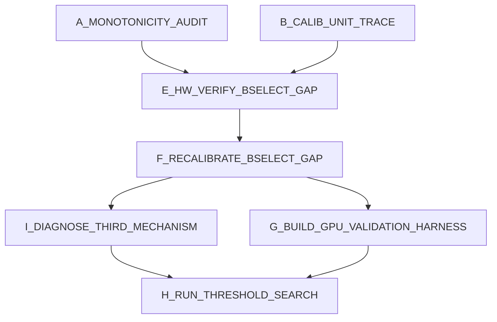

# SPRINT_GPU_MONOTONICITY_DAG

<!--
Live strike board managed by the supervisor-dag skill.
Ephemeral — DELETE at R_CLOSE. Not design or decisions law.
-->

Scope: the GPU non-monotonicity investigation arc, post-fix. Two nodes
below (A, B) were already dispatched and completed via direct `deck spawn`
calls before this board existed -- logged here retroactively for a clean
audit trail, per user correction that this should have been tracked on a
board from the start. Everything from here forward goes through the
board properly.

## Graph

## Lanes

| Lane        | Nodes                              | Default owner |
|-------------|---------------------------------------|----------------|
| audit       | A_MONOTONICITY_AUDIT (done, logged)    | deepseek       |
| audit       | B_CALIB_UNIT_TRACE (done, logged)      | deepseek       |
| hw-verify   | E_HW_VERIFY_BSELECT_GAP                | supervisor     |
| calibration | F_RECALIBRATE_BSELECT_GAP              | supervisor     |
| tooling     | G_BUILD_GPU_VALIDATION_HARNESS         | deepseek       |
| land        | H_RUN_THRESHOLD_SEARCH                 | supervisor     |

## Conflicts

| Resource                                       | Rule                                          | Nodes touching |
|--------------------------------------------------|--------------------------------------------------|-----------------|
| B200 instance (real money, one at a time)        | Serialized, supervisor-only rental decisions     | E, F, H         |
| `devices/b200/gpu_fft_config.h`                  | Supervisor only, after real hardware confirmation | F               |
| New GPU validation harness tool (path TBD)       | G only                                            | G               |

## Nodes

### [x] A_MONOTONICITY_AUDIT

- **Model:** `deepseek`
- **Depends:** none
- **Allowed files:** (as dispatched) `scripts/analyze_fftsize_bug_blast_radius.py`,
  read-only over `src/gpu/gpu_plan.cu`, `devices/b200/gpu_fft_config.h`,
  `scripts/b200_nonmono_debug_20260726.txt`, `scripts/b200_fix_verified_20260726.txt`,
  `scripts/threshold_search_gpu.cu`, `results/gpu_heatmap_b200.csv`.
- **Status:** DONE (dispatched without a board -- retroactively logged).
  Found the B-selection sparse-grid cliff at n≈1,285,000 (B jumps
  32→96-192). Did NOT reproduce the user's specific "n≈999k→n≈1.05M,
  1000ms→500ms" live observation exactly, but found the underlying
  mechanism (B-selection cliff) independently and correctly via direct
  table inspection. Also claimed a GPU calibration "microseconds
  mislabeled as nanoseconds" unit bug -- **this claim was WRONG**, refuted
  by node B below. Supervisor reviewed the surviving finding (B-selection
  gap) against the raw `gbselect_*` table directly -- confirmed real.

### [x] B_CALIB_UNIT_TRACE

- **Model:** `deepseek`
- **Depends:** none (ran after A, in response to A's unit claim)
- **Allowed files:** read-only over `tools/calibrate_gpu.cu`,
  `tools/calibrate_gpu_best_b.cu`, `tools/calibrate_block_size.py`,
  `tools/calibrate.c`, `src/gpu/gpu_api.cu`, `src/gpu/gpu_plan.cu`,
  `devices/b200/gpu_fft_config.h`, `devices/m3_pro/fft_config.h`.
- **Status:** DONE. Traced the full measurement path and found
  `icm_gpu_measure_fused_pair_ns()` (`gpu_api.cu:747-748`) correctly
  divides the batched measurement by batch count before storing --
  supervisor independently verified this exact line against the live
  file. **Refutes node A's unit-bug claim.** Confirmed CPU calibration
  never batches, so no analogous risk exists there. Attributed the
  earlier "3-4 orders of magnitude" prediction-vs-hardware gap to an
  approximation error in the Python simulation scripts, not the
  production C++ cost model. Also scoped the B-selection densification
  fix as achievable with existing tooling (`calibrate_gpu_best_b`'s
  narrow-around resume mode), ~3-16 min of B200 time for ~8 new points.

### [x] E_HW_VERIFY_BSELECT_GAP

- **Model:** `supervisor`
- **Depends:** A_MONOTONICITY_AUDIT, B_CALIB_UNIT_TRACE
- **Allowed files:** none (measurement only, no source edits this node)
- **Exit criteria:** on a real B200 rental, confirm whether the
  B-selection cliff near n≈1,048,576-1,572,864 causes an ACTUAL wall-
  clock inversion (not just a simulated one) on the `k=n` and/or `k=100`
  curves. A handful of targeted points (e.g. n=1,100,000; n=1,285,000;
  n=1,450,000 at both curve's respective k) via a small extension of
  `remeasure_nonmono.cu`-style tooling, reps>=5 each. Record real numbers
  either way -- confirming "no real inversion" is also a valid, useful
  outcome, not a failure.
- **Kill deadline:** budget alongside F below in one rental if confirmed.
- **Binding law:** HANDOFF.md's B-selection gap section.
- **Status:** DONE (2026-07-26, third B200 rental, contract `45932804`,
  user-approved). Real inversion confirmed on BOTH curves (not just
  simulated): k=n curve n=1,100,000 (1183.3ms) slower than n=1,285,000
  (1141.4ms); k=100 curve n=1,100,000 (181.3ms) slower than n=1,285,000
  (121.3ms). Root cause confirmed compound: B-selection nearest-neighbor
  cliff + a tree-depth power-of-2 boundary crossing (L=16->17) at the
  same point, both confirmed via `ICM_GPU_DEBUG_PLAN=1`. See HANDOFF.md
  "Third B200 rental" section for full detail.

### [x] F_RECALIBRATE_BSELECT_GAP

- **Model:** `supervisor`
- **Depends:** E_HW_VERIFY_BSELECT_GAP (only if E confirms a real
  inversion -- skip if E finds no real hardware effect)
- **Allowed files:** `devices/b200/gpu_fft_config.h` (gbselect_* section
  only -- do not touch the FFT timing tables while re-injecting)
- **Exit criteria:** new calibration anchor points added in the
  n=1,048,576-1,572,864 gap via `tools/gen_calib_skeleton.py` +
  `tools/calibrate_gpu_best_b.cu` (narrow-around mode) +
  `tools/calibrate_block_size.py` injection. Re-run `bench_gpu_fused
  verify` + spot-check E's points afterward to confirm the cliff is
  closed.
- **Kill deadline:** ~20 min B200 time (per B_CALIB_UNIT_TRACE's
  estimate).
- **Binding law:** do NOT hand-edit B values to force monotonicity --
  only real added calibration measurements are acceptable.
- **Status:** DONE for the two gaps tested, but NOT a full guarantee of
  monotonicity everywhere (2026-07-26). n=1,048,576-1,572,864 gap: 3 new
  anchors (n=1,150,000/1,285,000/1,420,000) added via real
  `calibrate_gpu_best_b --narrow-around` measurement (best_B=48-80, not
  the naive 32-or-96+ nearest-neighbor cliff), 32->44 points, rebuilt,
  `bench_gpu_fused verify` 36/0, re-measured: both curves now fully
  monotonic across this gap. A SECOND gap at n=524,288-1,048,576 (same
  mechanism, one B step down) was found while spot-checking and also
  fixed (3 more anchors, 44->47 points, verify still 36/0) -- but a
  re-measurement afterward found ONE inversion still remaining there
  (n=1,000,000 vs n=1,048,576, same B/L/nblocks yet ~24% timing gap) that
  is NOT the B-selection cliff and is NOT yet understood -- see HANDOFF.md
  "Third B200 rental" section, item 2. **Also found and fixed A REAL BUG
  in `tools/calibrate_block_size.py`** (the orchestrator meant to make
  this reproducible for future devices/users): Step 2/3 unconditionally
  discarded the ENTIRE existing calibration table on every run, which
  would have silently reverted both fixes above the next time anyone ran
  it. Fixed with a merge instead of overwrite (`read_existing_table()` +
  seed-then-merge), verified locally via a round-trip test against the
  real committed header (no GPU needed for this part). CSVs and ad-hoc
  probe tools from this session kept at `scripts/b200_session_20260726/`
  for provenance.

### [x] G_BUILD_GPU_VALIDATION_HARNESS

- **Model:** `deepseek`
- **Depends:** none (can run in parallel with E/F, no B200 needed to draft)
- **Allowed files:** create a new tool under `scripts/` or `tools/` (path
  TBD by the node) implementing HANDOFF.md Next Steps item 3: a GPU
  analogue of `./bench_grid crossover` that, across a grid of (n,k)
  points, runs the actual dispatched configuration AND brute-forces
  nearby alternatives on real hardware, flagging any point where the
  dispatched choice isn't actually fastest.
- **Exit criteria:** tool written and reviewed (supervisor line-by-line,
  same standing practice), ready to run on the next rental. Does not need
  to run this sprint.
- **Kill deadline:** 30 min.
- **Binding law:** HANDOFF.md Next Steps item 3.

### [ ] I_DIAGNOSE_THIRD_MECHANISM

- **Model:** `supervisor`
- **Depends:** F_RECALIBRATE_BSELECT_GAP
- **Allowed files:** `src/gpu/gpu_plan.cu` only if a real fix is found and
  confirmed on hardware (read-only investigation otherwise)
- **Exit criteria:** explain why n=1,000,000 and n=1,048,576 (identical
  B=32, L=16, nblocks rounds to the same 32768) differ in wall-clock time
  by ~24% (632ms vs 512ms) on the k=n curve. Start with
  `ICM_GPU_DEBUG_PLAN=1` diffing the two plans' per-level `fft_n`/`bwm`/
  `cwm`/tier choices line by line -- the same technique that found and
  fixed the wrap-penalty tier-lock-in bug and the B-selection cliffs
  earlier this session. If a genuine cost-model bug, fix and
  hardware-verify (`bench_gpu_fused verify` 36/0 + re-measure the
  specific pair) before marking done.
- **Kill deadline:** ~20-30 min B200 time for diagnosis; more if a fix is
  found and needs verification.
- **Binding law:** do NOT force monotonicity by hand-picking a worse
  config -- same rule as F.
- **Also do while budget allows:** a broader systematic sweep (not just
  spot checks) across the whole `gbselect_n` range via
  `scripts/gpu_dispatch_validate.cu` (node G, already written/reviewed)
  before trusting monotonicity generally -- this session found 3 distinct
  mechanisms by testing only 2 gaps, so more are plausible elsewhere.

### [ ] H_RUN_THRESHOLD_SEARCH

- **Model:** `supervisor`
- **Depends:** E_HW_VERIFY_BSELECT_GAP, F_RECALIBRATE_BSELECT_GAP,
  I_DIAGNOSE_THIRD_MECHANISM, G_BUILD_GPU_VALIDATION_HARNESS
- **Allowed files:** none (execution only)
- **Exit criteria:** `scripts/threshold_search_gpu.cu` run for real,
  producing the actual 1-second-threshold numbers for both `k=n` and
  `k=100` curves, only once monotonicity is hardware-confirmed (not just
  simulated) along both curves.
- **Kill deadline:** ~10 min B200 time.
- **Binding law:** do not run before E/F/G land -- this was the whole
  point of this investigation arc.
