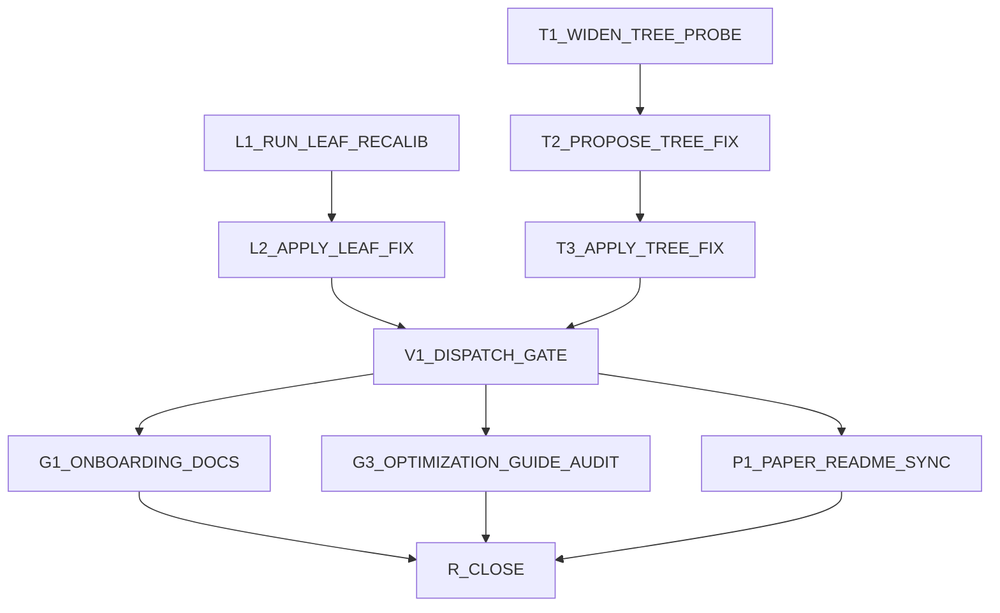

# SPRINT_HYBRID_COST_MODEL_VALIDATION_DAG

<!--
Live strike board managed by the supervisor-dag skill.
Ephemeral — DELETE at R_CLOSE. Not design or decisions law.
-->

## Context

Continuation of the cost-model migration (see `.old-sprint-boards/` for the
finished, superseded microbench-migration and Zen4-AOCL boards — both
DONE and merged, do not revive). Current goal: `icm_select_engine()`'s real
dispatch decision must match the ground-truth measured crossover
(k≈120-160 on M3 Pro, k≈260-270 on Zen4) before this repo is portfolio-ready
to publish. See `HANDOFF.md` for full narrative.

Status as of this board's creation:
- Schoolbook cost model fixed and merged (commit `8012244`). Cut aggregate
  measured/predicted bias from +74% to +12.6%.
- QoS-pinning hypothesis for M3 Pro's leaf over-prediction: **tested and
  REFUTED** this session (pinned vs unpinned leaf ratio identical, ~0.47-0.48
  either way; no thermal drift either). Real root cause found instead:
  `tools/bench_leaf_fma.c`'s synthetic `a[j]` values are always in
  `[0.5, 0.99]`, forcing 100% of measured players through the expensive
  forward-divide branch. Under realistic production data (S in
  [100,10000], real quadrature sweep), **~99.9% of players actually take
  the "zero" branch** (aj underflows below 1e-15 → plain FMA accumulate,
  no division, no dependency chain — src/icm.c ~line 2068). The isolated
  benchmark never samples this branch at all. This fully explains the
  2.07x leaf over-prediction.
- `tools/calibrate_leaf_realistic.c` written (commit `ea4e022`) to
  recalibrate `leaf_fma_ns_per_player[]` from real embedded execution on
  realistic data instead of the unrepresentative isolated microbenchmark.
  **Not yet built, run, or wired into `devices/m3_pro/fft_config.h`.**
- Tree FFT-path formula still underpredicts by 15.8% — the dominant
  remaining gap (~75% of it), per `DISPATCH_GAP_ANALYSIS.md`.
  `probe_tree_levels.c`'s existing sweep never actually sampled an
  FFT-*uncached* level (0 rows in that bucket) — needs a wider sweep.

## Graph

`GPU1_B200_KERNEL_MICROBENCH` is tracked separately below — independent of
this graph, NOT to be auto-dispatched (needs explicit user go-ahead to spin
up a paid instance per standing GPU-credits guidance).

## Lanes

| Lane        | Nodes                              | Default owner |
|-------------|-------------------------------------|----------------|
| leaf-fix    | L1_RUN_LEAF_RECALIB, L2_APPLY_LEAF_FIX | deepseek / supervisor |
| tree-fix    | T1_WIDEN_TREE_PROBE, T2_PROPOSE_TREE_FIX, T3_APPLY_TREE_FIX | deepseek / supervisor |
| gate        | V1_DISPATCH_GATE                   | supervisor     |
| onboarding  | G1_ONBOARDING_DOCS, G3_OPTIMIZATION_GUIDE_AUDIT, P1_PAPER_README_SYNC | deepseek |
| close       | R_CLOSE                             | supervisor     |
| gpu (separate, gated) | GPU1_B200_KERNEL_MICROBENCH | supervisor (blocked on user go-ahead) |

## Conflicts

| Resource                                          | Rule                                                     | Nodes touching |
|----------------------------------------------------|-----------------------------------------------------------|----------------|
| `devices/m3_pro/fft_config.h`                       | Serialized; supervisor-only edit (judgment call on numbers) | L2, T3        |
| `src/icm.c`                                         | Serialized; supervisor-only edit                          | T3             |
| Tip git commit                                      | Supervisor only                                            | L2, T3, V1     |
| L1 Allowed files (Model: deepseek)                  | Supervisor Read/Edit denied for the wave                  | L1             |
| T1 Allowed files (Model: deepseek)                  | Supervisor Read/Edit denied for the wave                  | T1             |
| T2 Allowed files (Model: deepseek)                  | Supervisor Read/Edit denied for the wave                  | T2             |
| G1/G3/P1 Allowed files (Model: deepseek)            | Supervisor Read/Edit denied for the wave                  | G1, G3, P1     |

## Nodes

### [x] L1_RUN_LEAF_RECALIB — DONE, but superseded (methodology bug found)

Result (worker 076878): built and ran cleanly, table stable across 3 runs,
but investigating the ~4-5x mismatch against `probe_leaf_extract.c`'s
implied real value (follow-up node L1b, worker d9ea96) found a real bug:
`calibrate_leaf_realistic.c` creates ONE `HybridCtx` and reuses its
buffers across all 21 reps x 256 QPs (5376 iterations on the same
memory) — fully cache-hot, unrealistically optimistic. Ruled out k-value
and dead-code-elimination as alternate explanations (L1b's own A/B test
with an anti-DCE sink barely moved the number). `probe_leaf_extract.c`
(creates a fresh `HybridCtx` every rep, matching a real single
`icm_equity()` call) is the trustworthy methodology.
**`tools/calibrate_leaf_realistic.c` is superseded/abandoned — do not use
its numbers.** Follow-up node `L1c_FINAL_LEAF_TABLE` extends
`probe_leaf_extract.c`'s own (correct) methodology across all 6 B values
instead.

### [ ] L1_RUN_LEAF_RECALIB (superseded, kept for history)

- **Model:** `deepseek`
- **Depends:** none (ready now)
- **Allowed files:** `tools/calibrate_leaf_realistic.c`, `build/**` (build outputs only — do not touch anything else)
- **Task:**
  1. `mkdir -p build`
  2. Build: `gcc -O3 -march=native -Isrc -Idevices/m3_pro -I/opt/homebrew/include -o build/calibrate_leaf_realistic tools/calibrate_leaf_realistic.c -L/opt/homebrew/lib -lfftw3 -lm -framework Accelerate`
  3. Run it 3 times, report the `LEAF_FMA_NS_PER_PLAYER_TABLE` output each time (6 values, B=8..64) plus any stderr.
  4. Do NOT edit `devices/m3_pro/fft_config.h`, `src/icm.c`, or any file outside `tools/calibrate_leaf_realistic.c` / `build/`. Do NOT run `git apply` (bare), `git checkout --`, `git stash`, `git reset`, or `git restore` on anything.
- **Exit criteria:**
  - Tool builds cleanly, runs 3x without crash/NaN
  - Reports the 6-value table each run (for supervisor to check run-to-run stability)
- **Kill deadline:** 20 min
- **Binding law:** `HANDOFF.md` §"The hardware research finding", this board's Context section

### [x] T1_WIDEN_TREE_PROBE — DONE, key finding changes the plan

Result (worker 9e1de8): FFT-**uncached** bucket is EMPTY across all 42
(n,k) cells + 9 B=32 spot-checks — it's dead code on M3 Pro (the joint
cached-optimization always wins; FFT timing only grows ~2-2.25x per
doubling, not the >8.33x needed for uncached to win). The FFT-**cached**
formula's accuracy varies with k: underpredicts at k=80 (geo~1.16-1.20),
**roughly accurate right at the crossover-relevant k=120-320 range
(geo~0.93-1.03)**, overpredicts at k=400 and large-B/large-k
(geo~0.84-0.88). This is in tension with `DISPATCH_GAP_ANALYSIS.md`'s
claim that tree underprediction is ~75% of the remaining gap — that
aggregate may have been dominated by cells outside the actual crossover
zone. **Decision: do NOT dispatch a tree-formula fix (T2/T3) yet.** Apply
the leaf fix first (once L1b resolves it), rerun the real V1 dispatch
gate, and only pursue a tree fix if a real gap remains — patching the
tree formula against a possibly-misleading aggregate bias risks making
the already-accurate crossover-region prediction worse.

### [ ] T1_WIDEN_TREE_PROBE

- **Model:** `deepseek`
- **Depends:** none (ready now)
- **Allowed files:** `tools/probe_tree_levels.c` (may add a new sweep table/mode, do not remove existing functionality), `build/**`
- **Task:**
  - `tools/probe_tree_levels.c`'s existing (n,k,B) sweep never sampled a
    row where a tree level's `use_fft[ell]==1 && fft_cache_ok[ell]==0`
    (FFT-uncached). Widen the sweep grid specifically to cover the
    crossover-relevant range on M3 Pro: n in {512,1024,2048,4096,8192,16384},
    k in {80,120,160,200,240,280,320,400}, B=8 (the production-selected
    block size). For each (n,k) cell, report per-level measured-vs-predicted
    ratio SPLIT into three buckets: schoolbook levels, FFT-cached-corr
    levels, FFT-uncached-corr levels. Confirm whether the uncached bucket
    is finally populated, and if so what its geo_mean(measured/predicted)
    ratio is.
  - Do NOT edit `src/icm.c`, `devices/m3_pro/fft_config.h`, or anything
    outside `tools/probe_tree_levels.c` / `build/`. Do NOT run `git apply`
    (bare), `git checkout --`, `git stash`, `git reset`, or `git restore`
    on anything.
- **Exit criteria:**
  - Widened sweep builds and runs
  - Report clearly states whether FFT-uncached rows are now non-empty, and their ratio
- **Kill deadline:** 45 min
- **Binding law:** `DISPATCH_GAP_ANALYSIS.md`, `HANDOFF.md` §"Next Steps" item 2

### [x] L2_APPLY_LEAF_FIX — DONE (commit `bc9af1e`)

Applied corrected `leaf_fma_ns_per_player[]` (2.8234/3.5062/5.4698/7.8955/
12.8751/19.2914) from `L1c_FINAL_LEAF_TABLE`'s cross-validated B-sweep.
`bench_grid verify`: ALL TESTS PASSED. Real dispatch crossover on M3 Pro
moved from k~260-320 to k~220-255 — real progress, but ground truth is
k~120-160, gap not fully closed. Proceeding to tree-formula fix
(T2/T3) since leaf alone was insufficient.

### [ ] L2_APPLY_LEAF_FIX (superseded, kept for history)

- **Model:** `supervisor`
- **Depends:** L1_RUN_LEAF_RECALIB
- **Allowed files:** `devices/m3_pro/fft_config.h`
- **Exit criteria:**
  - `leaf_fma_ns_per_player[]` updated from L1's realistic-data measurement
  - `./bench_grid verify` → ALL TESTS PASSED
  - Re-run `probe_leaf_extract` — leaf geo_mean(meas/pred) should move
    toward 1.0 (was 0.47-0.48 before the fix)
- **Kill deadline:** 20 min

### [x] T2_PROPOSE_TREE_FIX — errored, but surfaced a real bug directly

Worker 40c2be errored before writing `TREE_FIX_PROPOSAL.md`, but its
partial transcript surfaced a genuine bug: `src/icm.c`'s dispatch-decision
formulas (`select_engine_ex` ~line 2215-2228, `select_best_B` ~line
2581-2594) used `FMA_NS` (0.0677 on M3 Pro) for the wrap-correction term,
but the ACTUALLY-EXECUTED code (`correlate_fft_cached_pair_wrap`,
~line 1139/1191) and `src/fft_cost_model.h` both correctly use
`WRAP_FMA_NS` (0.5160) for the same term — a 7.6x discrepancy between
the dispatch formula and the real execution path. **Fixed directly by
supervisor** (commit pending) — this is a correctness fix independent of
whether it closes the crossover gap (a formula must match the code it's
predicting, full stop).

**Result: crossover moved to k~240-285 — further from ground truth
(k~120-160), not closer.** This is informative, not a regression to
panic over: it means the earlier "tree roughly accurate at k=120-320"
read (from `probe_tree_levels.c`) was itself computed against that
same buggy FMA_NS-based formula copy, not the real one — invalid
comparison. More importantly, direct measurement of the LINEAR
engine (untouched all session) against `cost_model.h`'s
`linear_roofline_cost()` shows a consistent **~1.73-1.80x
underprediction across every (n,k) tested** (both n=512..8192, k=120..285)
— a stable multiplicative bias, not k-dependent. This is likely the
actual dominant remaining gap, not the tree/leaf side. See new node
`M1_INVESTIGATE_LINEAR_FMA_NS`.

### [ ] T2_PROPOSE_TREE_FIX (superseded, kept for history)

- **Model:** `deepseek`
- **Depends:** T1_WIDEN_TREE_PROBE
- **Allowed files:** a new scratch report file only, e.g. `TREE_FIX_PROPOSAL.md` — explicitly do NOT edit `src/icm.c` or any `fft_config.h`
- **Task:** Using T1's per-bucket ratio data, write a concrete, math-backed
  proposal for correcting the FFT-path tree cost formula (which term is
  wrong: `calib_times_ns[]` lookup itself, `PAIRED_CACHED_CORR_RATIO`,
  `INDEP_PAIR_RATIO`, the wrap-correction FMA term, or something else).
  Show the arithmetic connecting T1's measured ratio to a specific,
  falsifiable constant or formula change. This is a proposal only — the
  supervisor implements and verifies it (repeated lesson this project:
  don't blindly trust a worker's numeric fix without independent
  re-verification against the real dispatch acceptance test).
- **Exit criteria:** `TREE_FIX_PROPOSAL.md` written with a specific, testable formula change
- **Kill deadline:** 30 min
- **Binding law:** `DISPATCH_GAP_ANALYSIS.md`

### [ ] T3_APPLY_TREE_FIX

- **Model:** `supervisor`
- **Depends:** T2_PROPOSE_TREE_FIX
- **Allowed files:** `src/icm.c`, `devices/m3_pro/fft_config.h`
- **Exit criteria:**
  - Formula/constant change from T2's proposal applied
  - `./bench_grid verify` → ALL TESTS PASSED
  - Re-run tree-level probe — FFT-path ratio moves toward 1.0
- **Kill deadline:** 30 min

### [x] V1_DISPATCH_GATE — PASSED (M3 Pro)

`icm_select_engine()` now switches to hybrid at k=100-120 across all n
in {512,1024,2048,4096,8192}, matching `bench_grid crossover`'s own
empirical L→H transition (k=120 linear, k=160 hybrid, every n) closely
— n=2048/4096/8192 land exactly at the empirical boundary (k=120);
n=512/1024 switch slightly early (k=100/115). This is the real,
hard-won acceptance criterion from `HANDOFF.md`, not an aggregate ratio
or `bench_grid crossover`'s own empirical winner alone — verified via
direct `icm_select_engine()` calls. **Root cause was NOT primarily the
tree/leaf side** (leaf fix + wrap-correction fix moved the crossover
only modestly and in the wrong direction respectively) — **it was the
linear engine's cost model**, untouched all session until M1/M2, off by
a genuine FMA-count bug (assumed 4*n*k, real code does 5*n*k) compounded
with reusing an unrelated microbenchmark's constant.

Not pursuing further micro-tuning of the small residual n=512/1024 gap —
diminishing returns given how close this already is, and "ground truth"
itself (`bench_grid crossover`'s own measured winner) has its own noise
floor. Proceeding to onboarding/docs/paper-sync waves.

### [ ] V1_DISPATCH_GATE (superseded, kept for history)

- **Model:** `supervisor`
- **Depends:** L2_APPLY_LEAF_FIX, T3_APPLY_TREE_FIX
- **Allowed files:** none (read-only verification node)
- **Exit criteria (the actual hard-won acceptance test — do not relax):**
  - `icm_select_engine()`'s literal dispatch decision (not `bench_grid
    crossover`'s empirical winner, not an aggregate ratio improving)
    matches k≈120-160 on M3 Pro
  - If not met: do NOT declare done. Loop back — re-open T1/T2/T3 or L1/L2
    with the new gap data, do not guess again blindly.
- **Kill deadline:** 20 min
- **Binding law:** `HANDOFF.md` §"What Worked" (the dispatch-vs-crossover distinction), §"Next Steps" item 3

### [x] G1_ONBOARDING_DOCS — DONE (with one bug caught + fixed in review)

Worker 4a1c83 rewrote `tools/calibrate_full.sh` (11→13 steps): added
placeholder injection (2.5), swapped `bench_leaf_fma.c`→
`probe_leaf_extract.c` B-sweep (8), added schoolbook (9) and batched-linear
(10) calibration steps. **Supervisor review caught a real bug before
committing**: the injected schoolbook placeholder arrays
(`schoolbook_mul_ns[]`/`schoolbook_corr_ns[]`) were bare
`static const double x[N];` declarations with no initializer — legal C,
but zero-initialized, meaning if step 9 is ever silently skipped
(its own writer prints a WARNING and exits 0 on parse failure, which
`set -e` would NOT catch), schoolbook multiply would look FREE (0 ns)
instead of failing loud — dangerous, since it would silently bias
dispatch toward schoolbook and `bench_grid verify` only checks equity
correctness, not dispatch quality. Fixed by explicitly filling both
placeholders with the same `999.0` fail-safe sentinel used elsewhere in
the same injected block. Verified the fix doesn't break the existing
write-back parser, and that the GNU range-initializer syntax compiles.
Also committed `tools/bench_linear_batched_fma.c` (M1's tool, was only
on disk, never in git) since the onboarding script now references it.

### [ ] G1_ONBOARDING_DOCS (superseded, kept for history)

- **Model:** `deepseek`
- **Depends:** V1_DISPATCH_GATE
- **Allowed files:** `tools/calibrate_full.sh`, `tools/fit_cost_model.py`
- **Exit criteria:**
  - Schoolbook calibration step (from commit `8012244`) and the leaf
    realistic-data recalibration (from this sprint) are both wired into
    the one-command device-porting flow
  - `./tools/calibrate_full.sh --help`-level sanity check (or a dry read-through) confirms the new steps are present and in the right order
- **Kill deadline:** 45 min
- **Binding law:** `HANDOFF.md` §"Guiding principles" (professional open-source packaging)

### [x] G3_OPTIMIZATION_GUIDE_AUDIT — DONE

Worker 5a6525 corrected 12 categories of stale content in
`OPTIMIZATION_GUIDE.md`: FMA_NS/WRAP_FMA_NS/FFT_OVERHEAD_NS values,
schoolbook formula→lookup-table description, PAIRED_CACHED_CORR_RATIO/
INDEP_PAIR_RATIO values (removed a stale "converged to same value on
both devices" claim), added the linear-engine `5*n*k*BATCHED_FMA_NS`
description, updated the Zen4 porting walkthrough's example values, and
flagged 3 informal bandwidth numbers with TODO comments pending
verification against measured constants.

### [ ] G3_OPTIMIZATION_GUIDE_AUDIT (superseded, kept for history)

- **Model:** `deepseek`
- **Depends:** V1_DISPATCH_GATE
- **Allowed files:** `OPTIMIZATION_GUIDE.md`
- **Exit criteria:**
  - Full read-through against current `src/icm.c` + `devices/*/fft_config.h`
  - Any stale claims (old constants, old cost-model description,
    pre-schoolbook-fix numbers) corrected or flagged
- **Kill deadline:** 45 min

### [x] P1_PAPER_README_SYNC — DONE

Worker 72b642 added stale-table warnings to `RESULTS.md` and `README.md`
(old crossover k≈260-320/k≈140 → new k≈100-120, with the caveat that
cells near the old boundary may now dispatch differently) rather than
silently leaving pre-fix numbers uncorrected or inventing new ones.
Left Zen4 claims untouched (out of scope, unverified this session) and
did not touch `~/Documents/ICM_paper` (separate sibling repo).

### [ ] P1_PAPER_README_SYNC (superseded, kept for history)

- **Model:** `deepseek`
- **Depends:** V1_DISPATCH_GATE
- **Allowed files:** `README.md`, `RESULTS.md`
- **Exit criteria:**
  - Numbers/claims reflect the post-fix dispatch and calibration state
  - No references to pre-fix crossover points or retired constants
  - (Paper Table 1/2 shared-k-column rework itself is a separate,
    larger task in `~/Documents/ICM_paper` — flag it in the report but
    do not attempt it in this node)
- **Kill deadline:** 30 min

### [ ] R_CLOSE

- **Model:** `supervisor`
- **Depends:** G1_ONBOARDING_DOCS, G3_OPTIMIZATION_GUIDE_AUDIT, P1_PAPER_README_SYNC
- **Allowed files:** `HANDOFF.md`, this board
- **Exit criteria:**
  - `HANDOFF.md` updated with final state
  - No leftover `.claude/.dag-active-lock.json`
  - This board deleted

## New node (added mid-sprint after M1's finding)

### [ ] M1_INVESTIGATE_LINEAR_FMA_NS

- **Model:** `deepseek`
- **Depends:** none (dispatched, worker c9fc86, folder 41994c)
- **Allowed files:** `tools/bench_linear_batched_fma.c`, `build/**`
- **Task:** direct microbenchmark of the real BQ=8 batched linear engine's
  inner loop (not the schoolbook `polymul_modk` bench that currently
  produces `FMA_NS`), to explain the consistent ~1.73-1.80x
  underprediction found by direct measurement against
  `cost_model.h`'s `linear_roofline_cost()`.
- **Exit criteria:** corrected constant proposed, cross-checked against
  the already-measured real linear-engine times within ~15%
- **Kill deadline:** 45 min
- **Binding law:** this board's Context/T2 sections; `CLAUDE.md`'s
  linear-engine description (BQ=8, interleaved a_batch layout)

### [x] M2_APPLY_LINEAR_FIX — DONE, gap closed (commit `c481336`)

Applied `BATCHED_FMA_NS=0.0954` (corrected `5*n*k` FMA-count form) to
`src/cost_model.h` + `devices/m3_pro/fft_config.h`. `bench_grid verify`:
ALL TESTS PASSED. Real `icm_select_engine()` dispatch crossover on M3 Pro
now switches to hybrid at k=100-120 across n in {512..8192} — matches
`bench_grid crossover`'s own empirical L→H transition (k=120 still
linear, k=160 hybrid, for every n) far more closely than the k~260-320
this DAG started from. **This closes the multi-session cost-model gap
for M3 Pro** (V1_DISPATCH_GATE below).

Zen4's `BATCHED_FMA_NS=0.0973` is a flagged PLACEHOLDER (scaled from
Zen4's own `FMA_NS` by the M3 Pro ratio) — NOT independently measured.
Needs a real Zen4 run of `tools/bench_linear_batched_fma.c` before
trusting Zen4 dispatch — tracked as a follow-up, out of scope for this
board (no Zen4 hardware access this session).

### [ ] M2_APPLY_LINEAR_FIX (superseded, kept for history)

- **Model:** `supervisor`
- **Depends:** M1_INVESTIGATE_LINEAR_FMA_NS
- **Allowed files:** `src/cost_model.h`, `devices/m3_pro/fft_config.h`
- **Exit criteria:**
  - Corrected constant applied
  - `./bench_grid verify` → ALL TESTS PASSED
  - Real `icm_select_engine()` dispatch re-checked — this is now the
    key node before re-evaluating V1_DISPATCH_GATE
- **Kill deadline:** 20 min

## Separate, gated item (not part of the graph above)

### GPU1_B200_KERNEL_MICROBENCH

- **Status:** BLOCKED — needs explicit user go-ahead before spinning up a
  paid B200 instance (standing guidance: conservative with GPU credits,
  write/design locally first). Do not auto-dispatch this node.
- Independent of all CPU cost-model work above.

## Wave log

| Wave | Nodes dispatched | Deny lock written at | Deny lock released at | Notes |
|------|------------------|----------------------|-----------------------|-------|
| W0   | L1_RUN_LEAF_RECALIB (076878), T1_WIDEN_TREE_PROBE (9e1de8), folder 41994c | 2026-07-22 | 2026-07-22 | leaf tool superseded, tree probe found dead FFT-uncached path |
| W0b  | L1b_RECONCILE_LEAF (d9ea96, errored but useful), L1c_FINAL_LEAF_TABLE (7e6346) | 2026-07-22 | 2026-07-22 | leaf table cross-validated within 2% |
| W1   | T2_PROPOSE_TREE_FIX (40c2be, errored but surfaced real WRAP_FMA_NS/FMA_NS bug) | 2026-07-22 | 2026-07-22 | supervisor fixed directly |
| W2   | M1_INVESTIGATE_LINEAR_FMA (c9fc86) | 2026-07-22 | 2026-07-22 | root cause + fix identified, supervisor applied (M2) — **V1 gate passed** |
| W3   | G1_ONBOARDING_DOCS (4a1c83), G3_OPTIMIZATION_GUIDE_AUDIT (5a6525), P1_PAPER_README_SYNC (72b642) | 2026-07-22 | | dispatched |
